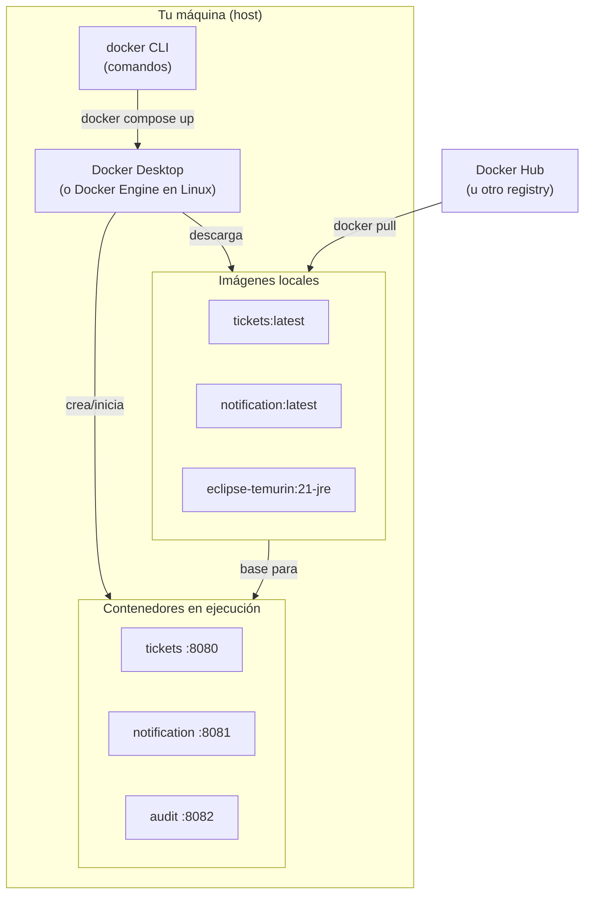
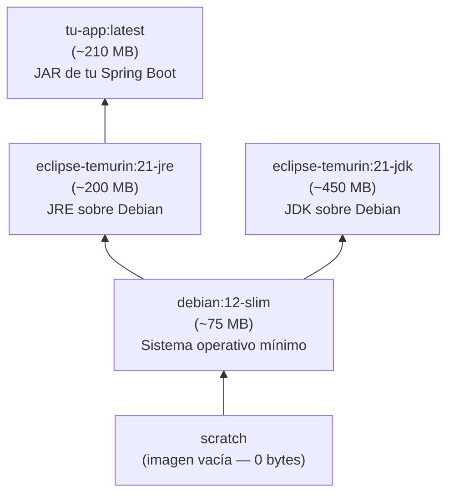
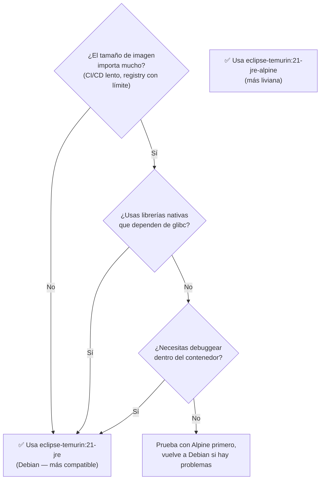
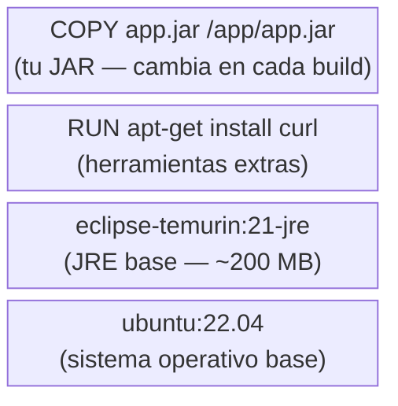
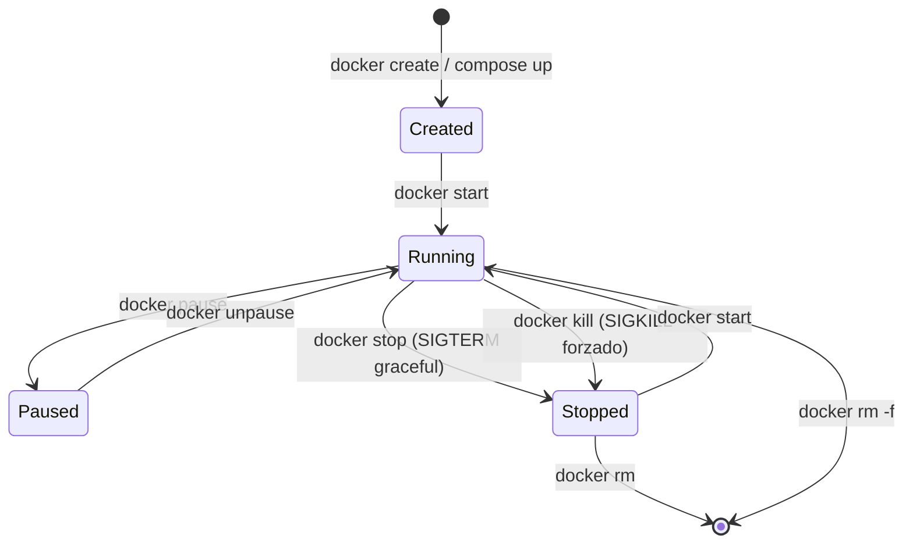
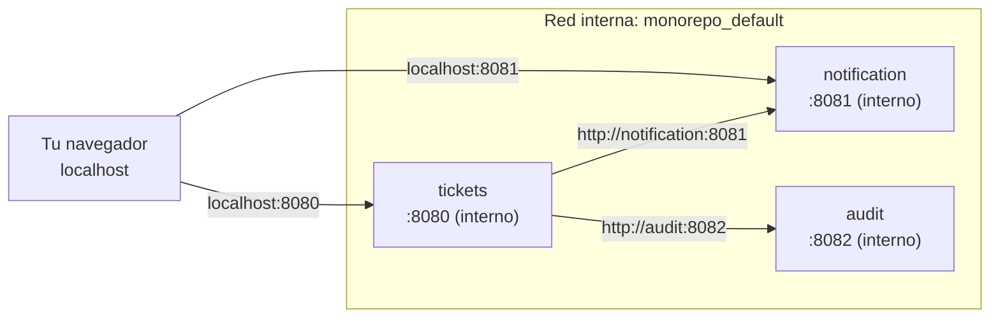

# 01 — Conceptos básicos de Docker

> Material complementario para DSY1103. Docker no es parte del currículo oficial.

---

## La arquitectura general

Antes de escribir un solo archivo, conviene entender qué elementos existen y cómo se relacionan.



---

## Imagen vs Contenedor

La diferencia más importante, y la que más confunde al principio:

| Concepto | Analogía | Descripción |
|---|---|---|
| **Imagen** | Receta de cocina / Clase en Java | Plantilla estática. Define el sistema de archivos, los comandos, el punto de entrada. Solo lectura. |
| **Contenedor** | Plato cocinado / Instancia de objeto | Imagen en ejecución. Tiene su propio proceso, su propia red, su propio sistema de archivos temporal. |

Una misma imagen puede generar múltiples contenedores simultáneos. Por eso se puede escalar: `docker compose up --scale notification=3` crea 3 contenedores del mismo servicio.

---

## Imagen base

Toda imagen Docker se construye **a partir de otra imagen** — eso es la imagen base, la instrucción `FROM` del `Dockerfile`. Las imágenes forman una cadena jerárquica:



Cuando haces `FROM eclipse-temurin:21-jre`, tu imagen hereda todo el sistema de archivos de esa imagen: el sistema operativo (Debian), las librerías de sistema y el JRE completo. Solo agregas encima tu JAR.

### ¿Por qué `eclipse-temurin` y no `openjdk`?

Las imágenes `openjdk:*` en Docker Hub fueron **deprecadas oficialmente en 2022** y ya no reciben actualizaciones de seguridad. Siguieron existiendo en el registry pero sin mantenimiento.

**`eclipse-temurin`** es el sucesor oficial, mantenido por [Eclipse Adoptium](https://adoptium.net/) (fundación Eclipse). Razones para elegirlo:

| Aspecto | `openjdk` (deprecado) | `eclipse-temurin` (actual) |
|---|---|---|
| Mantenimiento | ❌ Abandonado desde 2022 | ✅ Actualizaciones regulares |
| Organización | Oracle / comunidad | Eclipse Foundation |
| Certificación TCK | ✅ | ✅ |
| Parches de seguridad | ❌ | ✅ |
| Distribución | OpenJDK builds | Adoptium Temurin builds |

> **Regla simple:** si en algún tutorial ves `FROM openjdk:17` o `FROM openjdk:21`, reemplázalo por `FROM eclipse-temurin:21-jre` (o `-jdk` si necesitas compilar).

### Alpine Linux — imágenes más pequeñas

Algunas imágenes tienen el sufijo `-alpine`, por ejemplo `eclipse-temurin:21-jre-alpine`. Alpine Linux es una distribución minimalista diseñada específicamente para contenedores:

| Característica | Debian (base regular) | Alpine Linux |
|---|---|---|
| Tamaño base | ~75 MB | ~5 MB |
| Librería C | `glibc` (GNU) | `musl libc` (alternativa liviana) |
| Package manager | `apt` | `apk` |
| Shell | `bash` | `sh` (BusyBox) |
| Imagen JRE resultante | ~200 MB | ~130 MB |

**¿Cuándo usar Alpine?**



**Para esta asignatura:** usa `eclipse-temurin:21-jre` (Debian). Es más simple, más compatible y la diferencia de 70 MB no es relevante en un entorno de aprendizaje local.

**Alpine para producción/CI:** es una buena elección cuando las imágenes se suben a un registry y se despliegan frecuentemente. El ahorro de ~70 MB por servicio se multiplica con decenas de deployments.

---

## Las capas (layers)

Docker almacena las imágenes como **capas apiladas**. Cada instrucción en el `Dockerfile` genera una capa nueva.



**¿Por qué importa?** Las capas se cachean. Si la instrucción no cambió ni cambiaron sus entradas, Docker reutiliza la capa guardada. Una capa invalidada invalida **todas las capas encima de ella**.

Por eso el orden en el `Dockerfile` importa: pon las instrucciones que menos cambian **primero** (dependencias de Maven) y las que cambian frecuentemente **al final** (el JAR de tu aplicación).

---

## Ciclo de vida de un contenedor



Con `docker compose`, `up` = create + start. `down` = stop + rm.

---

## Redes (networks)

Por defecto, Docker Compose crea una **red virtual privada** para todos los servicios del mismo `compose.yaml`. Dentro de esa red:

- Los servicios **se comunican por nombre de servicio**, no por `localhost`
- Cada contenedor tiene su propia dirección IP interna
- El host solo puede acceder a los **puertos publicados** (`ports:`)



> **Importante para los microservicios:** si `tickets` necesita llamar a `notification`, la URL dentro de la red Docker es `http://notification:8081`, **no** `http://localhost:8081`. Esto significa que tu configuración de Spring (`application.yml`) debe cambiar si corres los servicios con Docker vs. de forma local.

Una forma limpia de manejarlo es con **profiles** de Spring Boot:

```yaml
# application.yml (local)
notification:
  url: http://localhost:8081

# application-docker.yml (dentro de contenedor)
notification:
  url: http://notification:8081
```

```yaml
# compose.yaml
services:
  tickets:
    build: ./Tickets
    environment:
      SPRING_PROFILES_ACTIVE: docker
```

---

## Volúmenes (volumes)

Los contenedores son **efímeros**: cuando se eliminan con `docker rm`, todo su sistema de archivos desaparece. Para **persistir datos** (una base de datos, logs, archivos subidos) se usan volúmenes.

```yaml
services:
  mysql:
    image: mysql:8
    volumes:
      - mysql_data:/var/lib/mysql   # ← datos persisten aunque el contenedor se borre

volumes:
  mysql_data:   # Docker crea y gestiona este volumen
```

Para los microservicios de esta asignatura (que usan almacenamiento en memoria) no son necesarios, pero son esenciales en cuanto se agrega una base de datos real.

---

## Registry: Docker Hub y alternativas

Las imágenes se distribuyen a través de **registries**. El más común es [Docker Hub](https://hub.docker.com/). Cuando haces:

```bash
FROM eclipse-temurin:21-jre
```

Docker descarga automáticamente esa imagen desde Docker Hub si no la tiene en caché local.

Alternativas empresariales:
- **GitHub Container Registry** (`ghcr.io`) — integrado con GitHub Actions
- **AWS ECR**, **Google Artifact Registry**, **Azure Container Registry**
- **Registry privado propio** — para entornos sin acceso a internet

---

## Resumen rápido de comandos de imágenes y contenedores

```bash
# Imágenes
docker images                        # lista imágenes locales
docker pull eclipse-temurin:21-jre   # descarga imagen sin crear contenedor
docker rmi nombre:tag                # elimina imagen local
docker image prune                   # elimina imágenes sin usar

# Contenedores individuales (sin Compose)
docker run -p 8080:8080 tickets:latest     # crea y arranca contenedor
docker run -d -p 8080:8080 tickets:latest  # en segundo plano (detached)
docker ps                                  # contenedores en ejecución
docker ps -a                               # todos (incluye detenidos)
docker stop <id_o_nombre>                  # detiene gracefully (SIGTERM)
docker rm <id_o_nombre>                    # elimina contenedor detenido
docker logs <id_o_nombre>                  # ver logs
docker logs -f <id_o_nombre>               # logs en tiempo real
docker exec -it <id_o_nombre> bash         # terminal dentro del contenedor
docker inspect <id_o_nombre>               # toda la info del contenedor (JSON)
```

---

## Siguiente paso

- [`02_dockerfile.md`](./02_dockerfile.md) — Dockerfile en profundidad para Spring Boot
- [`03_compose_avanzado.md`](./03_compose_avanzado.md) — compose.yaml avanzado: healthchecks, profiles, .env y más
