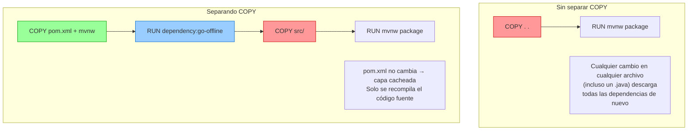

# 02 — Dockerfile en profundidad para Spring Boot

> Material complementario para DSY1103. Docker no es parte del currículo oficial.

---

## Anatomía de un Dockerfile

Un `Dockerfile` es una lista de instrucciones que Docker ejecuta en orden para construir una imagen. Cada instrucción genera una capa nueva.

```dockerfile
# Instrucción  argumento(s)
FROM           eclipse-temurin:21-jre
WORKDIR        /app
COPY           target/app.jar app.jar
EXPOSE         8080
ENTRYPOINT     ["java", "-jar", "app.jar"]
```

### Instrucciones principales

| Instrucción | Uso | Ejemplo |
|---|---|---|
| `FROM` | Imagen base. Siempre primera (o después de `ARG`). | `FROM eclipse-temurin:21-jre` |
| `WORKDIR` | Crea y establece el directorio de trabajo | `WORKDIR /app` |
| `COPY` | Copia archivos del host a la imagen | `COPY target/*.jar app.jar` |
| `ADD` | Como COPY pero además extrae `.tar` y soporta URLs. Preferir COPY salvo que necesites esas funciones. | `ADD https://... /tmp/` |
| `RUN` | Ejecuta un comando durante el build (instalar paquetes, compilar). | `RUN ./mvnw package -DskipTests` |
| `ENV` | Variable de entorno disponible en build y en runtime | `ENV PORT=8080` |
| `ARG` | Variable de build (solo disponible durante `docker build`, no en runtime) | `ARG JAR_FILE=target/*.jar` |
| `EXPOSE` | Documenta el puerto que usa el contenedor (informativo, no lo publica automáticamente) | `EXPOSE 8080` |
| `ENTRYPOINT` | Comando principal del contenedor. No se sobreescribe fácilmente. | `ENTRYPOINT ["java", "-jar", "app.jar"]` |
| `CMD` | Argumentos por defecto para ENTRYPOINT, o comando por defecto si no hay ENTRYPOINT. Se puede sobreescribir en `docker run`. | `CMD ["--spring.profiles.active=prod"]` |
| `USER` | Cambia al usuario con el que se ejecutan las instrucciones siguientes | `USER appuser` |
| `VOLUME` | Declara un punto de montaje (informativo, como EXPOSE) | `VOLUME /tmp` |
| `LABEL` | Metadatos de la imagen | `LABEL maintainer="yo@duoc.cl"` |

---

## Build simple (una etapa)

El enfoque más rápido de entender: copias el JAR ya compilado y lo empaquetas.

```dockerfile
FROM eclipse-temurin:21-jre
WORKDIR /app
COPY target/mi-app.jar app.jar
EXPOSE 8080
ENTRYPOINT ["java", "-jar", "app.jar"]
```

**Flujo de trabajo:**
```bash
mvnw.cmd package -DskipTests       # genera target/mi-app.jar en el host
docker build -t mi-app .            # construye imagen usando el JAR ya generado
docker run -p 8080:8080 mi-app      # corre el contenedor
```

**Desventaja:** el JAR tiene que existir antes de llamar a `docker build`. Si tienes Maven instalado en el host no hay problema, pero si quieres que Docker compile solo (ej. en CI/CD), necesitas el build multi-stage.

---

## Build multi-stage (recomendado para producción)

Dos etapas en el mismo archivo: una con JDK para compilar, otra con JRE solo para ejecutar.

```dockerfile
# ─────────────────────────────────────────────
# Etapa 1: compilación
# ─────────────────────────────────────────────
FROM eclipse-temurin:21-jdk AS build
WORKDIR /app

# Primero copiar solo los archivos de dependencias (pom.xml + wrapper)
# para aprovechar el cache de capas: si el pom.xml no cambió,
# Docker reutiliza la capa de descarga de dependencias.
COPY .mvn/ .mvn/
COPY mvnw pom.xml ./
RUN ./mvnw dependency:go-offline -q   # descarga dependencias y las cachea

# Ahora sí copiar el código fuente
COPY src/ src/
RUN ./mvnw package -DskipTests --no-transfer-progress

# ─────────────────────────────────────────────
# Etapa 2: imagen final (solo lo necesario)
# ─────────────────────────────────────────────
FROM eclipse-temurin:21-jre
WORKDIR /app

# Copiar solo el JAR del paso de compilación
COPY --from=build /app/target/*.jar app.jar

# Opcional pero recomendado: no correr como root
RUN addgroup --system appgroup && adduser --system --ingroup appgroup appuser
USER appuser

EXPOSE 8080
ENTRYPOINT ["java", "-jar", "app.jar"]
```

### Por qué separar `COPY pom.xml` del `COPY src/`



---

## .dockerignore

Al igual que `.gitignore`, este archivo le dice a Docker qué ignorar al enviar el contexto de build. Sin él, Docker envía toda la carpeta (incluyendo `target/` que puede pesar cientos de MB).

```
# .dockerignore (en la raíz del proyecto Spring Boot)

# Compilados de Maven
target/

# Archivos de IDE
.idea/
*.iml
.vscode/
*.class

# Git
.git/
.gitignore

# Logs
*.log
logs/

# Archivos de SO
.DS_Store
Thumbs.db
```

> **Regla práctica:** si usas build multi-stage, ignora `target/` porque Docker va a compilar desde el código fuente. Si usas build simple (copias el JAR), **no** ignores `target/`.

---

## Variantes de imagen base

> Para entender **por qué se elige `eclipse-temurin`** sobre `openjdk` y qué es Alpine, ver [`01_conceptos_basicos.md` — Imagen base](./01_conceptos_basicos.md#imagen-base).

### JDK vs JRE — qué incluye cada uno

| Componente | JRE | JDK |
|---|---|---|
| Máquina virtual Java (JVM) | ✅ | ✅ |
| Librerías de runtime (`rt.jar`, módulos) | ✅ | ✅ |
| Compilador `javac` | ❌ | ✅ |
| Herramientas de desarrollo (`jdb`, `jmap`, `jstack`) | ❌ | ✅ |
| Maven, Gradle | ❌ | ❌ (van aparte) |
| **Uso en Docker** | Imagen final | Solo etapa de build |

El JRE es suficiente para **ejecutar** un JAR ya compilado. El JDK es necesario para **compilarlo**. Por eso el multi-stage build usa JDK en etapa 1 y JRE en etapa 2.

### Comparativa de imágenes disponibles

| Imagen | Base OS | Tamaño aprox. | Uso recomendado |
|---|---|---|---|
| `eclipse-temurin:21-jdk` | Debian 12 | ~450 MB | Etapa de build (multi-stage) |
| `eclipse-temurin:21-jre` | Debian 12 | ~200 MB | ✅ **Imagen final** — recomendado para aprendizaje |
| `eclipse-temurin:21-jdk-alpine` | Alpine 3 | ~350 MB | Etapa de build cuando el tamaño importa |
| `eclipse-temurin:21-jre-alpine` | Alpine 3 | ~130 MB | Imagen final liviana (producción/CI) |

**Para esta asignatura:** usa `eclipse-temurin:21-jre`. Es la opción más simple y compatible.

**Alpine en producción:** reduce ~70 MB por imagen. Relevante cuando hay decenas de deployments en CI/CD o límites de tamaño en el registry. Puede tener problemas de compatibilidad con librerías nativas que asumen `glibc` (la librería C de GNU, que usa Debian pero no Alpine).

### Ejemplo: cambiar a Alpine sin tocar el resto del Dockerfile

```dockerfile
# Solo cambia esta línea en la etapa 2:
FROM eclipse-temurin:21-jre-alpine   # en lugar de eclipse-temurin:21-jre

# El resto del Dockerfile es idéntico
WORKDIR /app
COPY --from=build /app/target/*.jar app.jar
EXPOSE 8080
ENTRYPOINT ["java", "-jar", "app.jar"]
```

> Si hay problemas con Alpine (errores de librería nativa, herramientas de debug ausentes), vuelve a `eclipse-temurin:21-jre` y el problema desaparece — todo lo demás del Dockerfile permanece igual.

---

## Pasar variables de configuración al contenedor

Spring Boot lee variables de entorno y las mapea a propiedades. Por ejemplo, `SPRING_DATASOURCE_URL` sobreescribe `spring.datasource.url` en `application.yml`.

### En Dockerfile (valor fijo, para defaults)
```dockerfile
ENV SERVER_PORT=8080
ENV SPRING_PROFILES_ACTIVE=production
```

### En compose.yaml (valor configurable por entorno)
```yaml
services:
  tickets:
    build: ./Tickets
    environment:
      SERVER_PORT: "8080"
      SPRING_PROFILES_ACTIVE: docker
      JAVA_TOOL_OPTIONS: "-Xmx128m -Xms64m"
```

### Con archivo .env (buena práctica — no commitear el .env con datos reales)
```bash
# .env (en la misma carpeta que compose.yaml)
TICKETS_PORT=8080
DB_PASSWORD=secreto123
```

```yaml
# compose.yaml
services:
  tickets:
    ports: ["${TICKETS_PORT}:8080"]
    environment:
      DB_PASSWORD: ${DB_PASSWORD}
```

---

## CMD vs ENTRYPOINT — la diferencia práctica

```dockerfile
# Solo ENTRYPOINT: el contenedor siempre corre exactamente esto
ENTRYPOINT ["java", "-jar", "app.jar"]

# Solo CMD: se puede sobreescribir con el comando en docker run
CMD ["java", "-jar", "app.jar"]

# Combinados: ENTRYPOINT fijo, CMD como argumentos por defecto
ENTRYPOINT ["java", "-jar", "app.jar"]
CMD ["--spring.profiles.active=default"]
```

Sobreescribir `CMD` en runtime:
```bash
# Usa el ENTRYPOINT del Dockerfile pero con otro perfil de Spring
docker run mi-app --spring.profiles.active=production
```

---

## Dockerfile para los microservicios de esta asignatura

Como todos los microservicios (`NotificationService`, `AuditService`, `SearchService`, `SLAService`) tienen la misma estructura, el mismo `Dockerfile` aplica a todos sin cambios:

```dockerfile
# Dockerfile (copiar igual en cada servicio)
FROM eclipse-temurin:21-jdk AS build
WORKDIR /app
COPY .mvn/ .mvn/
COPY mvnw pom.xml ./
RUN chmod +x mvnw && ./mvnw dependency:go-offline -q
COPY src/ src/
RUN ./mvnw package -DskipTests --no-transfer-progress

FROM eclipse-temurin:21-jre
WORKDIR /app
COPY --from=build /app/target/*.jar app.jar
EXPOSE 8080
ENTRYPOINT ["java", "-jar", "app.jar"]
```

> En Windows el `mvnw` puede tener problemas de permisos de ejecución. El `RUN chmod +x mvnw` lo soluciona dentro del contenedor Linux.

---

## Verificar la imagen construida

```bash
docker build -t tickets-test .
docker images tickets-test              # ver tamaño
docker history tickets-test             # ver las capas y sus tamaños
docker run --rm -p 8080:8080 tickets-test   # correr y eliminar al detener (--rm)
```

---

## Siguiente paso

- [`03_compose_avanzado.md`](./03_compose_avanzado.md) — compose.yaml avanzado: healthchecks, profiles, .env, watch y más
