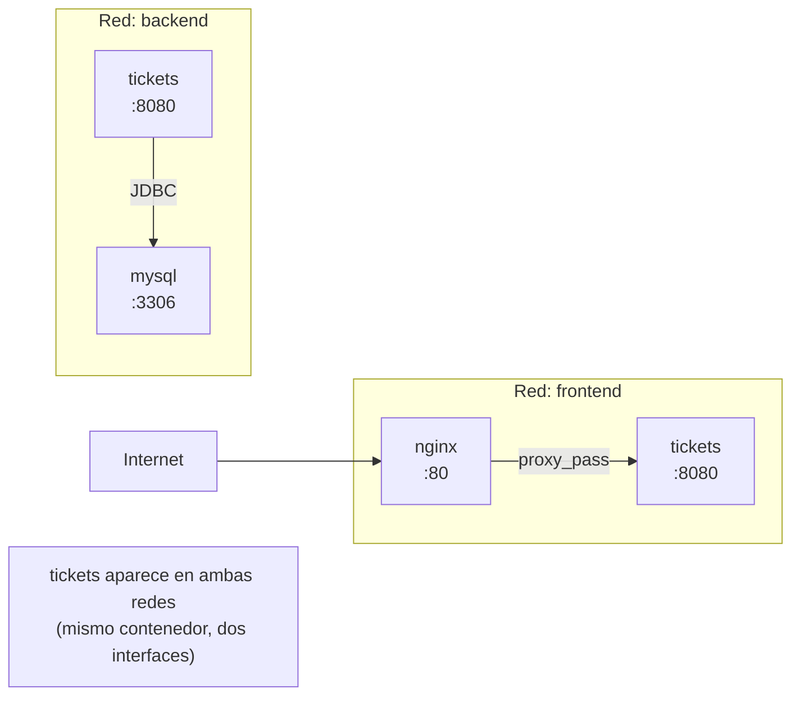

# 03 — compose.yaml avanzado

> Material complementario para DSY1103. Docker no es parte del currículo oficial.

---

## Estructura completa de un servicio en compose.yaml

```yaml
services:
  nombre-servicio:
    build:
      context: ./MiServicio          # directorio con el Dockerfile
      dockerfile: Dockerfile          # nombre del Dockerfile (por defecto "Dockerfile")
      args:
        BUILD_ENV: production          # ARGs disponibles durante docker build
    image: mi-org/mi-servicio:latest  # nombre de la imagen resultante
    container_name: mi-servicio        # nombre fijo del contenedor (no recomendado si escalas)
    ports:
      - "8080:8080"                    # "puerto_host:puerto_contenedor"
    environment:
      SPRING_PROFILES_ACTIVE: docker
      JAVA_TOOL_OPTIONS: "-Xmx128m"
    env_file:
      - .env                           # cargar variables desde archivo
    volumes:
      - ./logs:/app/logs               # montar carpeta del host
      - datos_volume:/var/lib/data     # volumen gestionado por Docker
    depends_on:
      mysql:
        condition: service_healthy     # espera hasta que mysql esté healthy
    healthcheck:
      test: ["CMD", "curl", "-f", "http://localhost:8080/actuator/health"]
      interval: 10s
      timeout: 5s
      retries: 5
      start_period: 30s                # esperar 30s antes de empezar a chequear
    restart: unless-stopped            # reiniciar si el proceso falla
    networks:
      - red-interna
    profiles:
      - full                           # solo se levanta si se activa el perfil "full"
```

No todos los campos son necesarios. El siguiente es el mínimo para los microservicios de la asignatura:

```yaml
services:
  tickets:
    build: ./Tickets
    ports: ["8080:8080"]
    environment:
      JAVA_TOOL_OPTIONS: "-Xmx128m"
```

---

## depends_on y healthchecks

`depends_on` solo garantiza el **orden de inicio**, no que el servicio esté listo para recibir peticiones. Con `condition: service_healthy` espera a que el contenedor declare `healthy`.

```yaml
services:
  mysql:
    image: mysql:8
    environment:
      MYSQL_ROOT_PASSWORD: root
      MYSQL_DATABASE: ticketdb
    healthcheck:
      test: ["CMD", "mysqladmin", "ping", "-h", "localhost", "-uroot", "-proot"]
      interval: 5s
      timeout: 3s
      retries: 10
      start_period: 20s

  tickets:
    build: ./Tickets
    ports: ["8080:8080"]
    depends_on:
      mysql:
        condition: service_healthy    # tickets no arranca hasta que mysql esté healthy
    environment:
      SPRING_DATASOURCE_URL: jdbc:mysql://mysql:3306/ticketdb
      SPRING_DATASOURCE_USERNAME: root
      SPRING_DATASOURCE_PASSWORD: root
```

> `condition: service_healthy` requiere Compose V2. Con V1 (`docker-compose`) no funciona.

Para Spring Boot sin MySQL (servicios en memoria como los de esta asignatura) no se necesita `depends_on`. Es útil solo cuando un servicio depende de otro que tarda en iniciar.

---

## Variables de entorno y .env

### Tres formas de pasar variables

```yaml
services:
  tickets:
    environment:
      # 1. Valor literal
      SERVER_PORT: "8080"

      # 2. Desde variable de entorno del host (si existe, si no, error)
      DB_PASSWORD: ${DB_PASSWORD}

      # 3. Con valor por defecto
      SPRING_PROFILES_ACTIVE: ${PROFILE:-docker}
```

### Archivo .env (forma recomendada para datos sensibles)

Docker Compose carga automáticamente el archivo `.env` del mismo directorio que `compose.yaml`:

```bash
# .env  (NO commitear si tiene contraseñas reales)
TICKETS_PORT=8080
NOTIFICATION_PORT=8081
DB_PASSWORD=mi_contraseña_local
```

```yaml
# compose.yaml
services:
  tickets:
    ports: ["${TICKETS_PORT}:8080"]
    environment:
      DB_PASSWORD: ${DB_PASSWORD}
```

> Agrega `.env` a `.gitignore`. Puedes commitear un `.env.example` con valores ficticios como referencia para otros desarrolladores.

---

## Redes personalizadas

Por defecto Compose crea una red automática. Para más control:

```yaml
services:
  tickets:
    networks: [backend, frontend]

  mysql:
    networks: [backend]          # mysql NO es accesible desde frontend

  nginx:
    networks: [frontend]         # nginx solo ve a tickets (por frontend)

networks:
  backend:
  frontend:
```



Para la asignatura, la red por defecto es suficiente.

---

## Volúmenes

```yaml
services:
  mysql:
    image: mysql:8
    volumes:
      - mysql_data:/var/lib/mysql     # volumen named (persistente entre down/up)
      - ./init.sql:/docker-entrypoint-initdb.d/init.sql  # bind mount (archivo del host)

  tickets:
    volumes:
      - ./logs:/app/logs              # bind mount: carpeta local → dentro del contenedor

volumes:
  mysql_data:    # Docker gestiona dónde guardar esto en el host
```

### Tipos de montaje

| Tipo | Sintaxis | Descripción |
|---|---|---|
| **Named volume** | `vol_name:/ruta` | Docker gestiona la ubicación. Persiste entre `down/up`. |
| **Bind mount** | `./local:/ruta` | Carpeta real del host. Útil para logs, archivos de config. |
| **tmpfs** | (en la clave `tmpfs:`) | Solo en memoria, se borra al parar el contenedor. |

---

## Profiles: levantar subconjuntos de servicios

Con muchos servicios, no siempre quieres levantar todo. Los profiles permiten agrupar:

```yaml
services:
  tickets:
    build: ./Tickets
    ports: ["8080:8080"]
    # sin profile → siempre se levanta

  notification:
    build: ./NotificationService
    ports: ["8081:8081"]
    profiles: [notificaciones]     # solo si se activa el perfil

  audit:
    build: ./AuditService
    ports: ["8082:8082"]
    profiles: [auditoría]

  search:
    build: ./SearchService
    ports: ["8084:8084"]
    profiles: [búsqueda]

  sla:
    build: ./SLAService
    ports: ["8085:8085"]
    profiles: [sla]
```

```bash
docker compose up                                   # solo tickets
docker compose --profile notificaciones up          # tickets + notification
docker compose --profile notificaciones --profile sla up  # tickets + notification + sla
COMPOSE_PROFILES=notificaciones,sla docker compose up     # misma cosa, via variable
```

---

## compose.yaml completo para la asignatura

Este archivo cubre los 5 servicios actuales del proyecto. Guárdalo en la raíz del monorepo:

```yaml
# compose.yaml — DSY1103 Fullstack I
# Requisito: cada carpeta listada en "build:" debe tener un Dockerfile

services:
  tickets:
    build: ./Tickets
    ports: ["8080:8080"]
    environment:
      JAVA_TOOL_OPTIONS: "-Xmx128m -Xms64m"
    healthcheck:
      test: ["CMD-SHELL", "curl -sf http://localhost:8080/ticket-app/tickets || exit 1"]
      interval: 15s
      timeout: 5s
      retries: 5
      start_period: 40s
    restart: on-failure

  notification:
    build: ./NotificationService
    ports: ["8081:8081"]
    environment:
      JAVA_TOOL_OPTIONS: "-Xmx64m -Xms32m"
    restart: on-failure

  audit:
    build: ./AuditService
    ports: ["8082:8082"]
    environment:
      JAVA_TOOL_OPTIONS: "-Xmx64m -Xms32m"
    restart: on-failure

  search:
    build: ./SearchService
    ports: ["8084:8084"]
    environment:
      JAVA_TOOL_OPTIONS: "-Xmx64m -Xms32m"
    restart: on-failure

  sla:
    build: ./SLAService
    ports: ["8085:8085"]
    environment:
      JAVA_TOOL_OPTIONS: "-Xmx64m -Xms32m"
    restart: on-failure
```

Uso:
```bash
docker compose up --build    # primera vez: compila e inicia
docker compose up -d         # en background (detached)
docker compose down          # detiene y elimina contenedores
docker compose ps            # estado de todos los servicios
docker compose logs -f tickets   # logs en tiempo real de tickets
```

---

## Restart policies

| Política | Comportamiento |
|---|---|
| `no` (default) | No reinicia nunca |
| `on-failure` | Reinicia si el proceso termina con error (código ≠ 0) |
| `always` | Siempre reinicia, incluso si se detuvo manualmente |
| `unless-stopped` | Igual que `always` pero no reinicia si se detuvo con `docker stop` |

Para desarrollo: `on-failure` o sin `restart`. Para producción: `unless-stopped`.

---

## docker compose watch (hot-reload, V2 only)

Compose V2 incluye un modo de desarrollo que observa cambios en el código fuente y reconstruye/sincroniza automáticamente:

```yaml
services:
  tickets:
    build: ./Tickets
    develop:
      watch:
        - action: rebuild              # reconstruye imagen completa
          path: ./Tickets/src
        - action: sync                 # sincroniza archivos sin reconstruir
          path: ./Tickets/src/main/resources
          target: /app/resources
        - action: rebuild
          path: ./Tickets/pom.xml
```

```bash
docker compose watch    # activa el modo watch
```

> Para Spring Boot, el ciclo rebuild puede tardar 30-60 segundos. Es más práctico usar `spring-boot-devtools` con ejecución local (`mvnw spring-boot:run`) para hot-reload rápido.

---

## Comandos de referencia completos

```bash
# Construcción
docker compose build                 # construye todas las imágenes
docker compose build tickets         # construye solo una
docker compose build --no-cache      # construye sin usar caché

# Ciclo de vida
docker compose up                    # crea y arranca
docker compose up -d                 # en background
docker compose up --build            # construye y arranca
docker compose up --build tickets    # solo un servicio
docker compose start                 # arranca contenedores ya creados
docker compose stop                  # detiene sin eliminar contenedores
docker compose down                  # detiene y elimina contenedores
docker compose down -v               # también elimina volúmenes
docker compose down --rmi all        # también elimina imágenes

# Estado y logs
docker compose ps                    # estado de todos
docker compose ps tickets            # estado de uno
docker compose logs                  # todos los logs
docker compose logs -f               # en tiempo real
docker compose logs -f --tail=50 tickets  # últimas 50 líneas de uno

# Ejecución dentro de contenedor
docker compose exec tickets bash         # terminal dentro del contenedor
docker compose exec tickets sh           # si no tiene bash (Alpine)
docker compose run --rm tickets bash     # nuevo contenedor temporal

# Escalado
docker compose up --scale notification=3  # 3 instancias de notification

# Limpieza
docker compose down -v --rmi all          # limpieza completa
```
