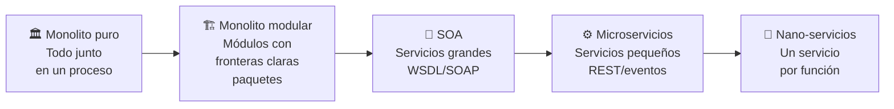

# 01 — ¿Por qué dividir un monolito?

← [Volver al índice](./README.md)

---

## El monolito no es el enemigo

Antes de hablar de cuándo migrar, hay que desmitificar el monolito. La mayoría de las empresas de tecnología más exitosas del mundo **empezaron con un monolito**:

- **Amazon** era un monolito hasta 2002 — Jeff Bezos emitió el famoso "API Mandate" que inició la separación.
- **Netflix** empezó como un monolito de DVD rental; migró a microservicios entre 2008 y 2016.
- **Uber** tenía un único monolito Python hasta 2014, cuando empezó su migración.
- **Twitter** siguió siendo un monolito Ruby on Rails por muchos años, incluso siendo masivamente exitoso.

Martin Fowler, uno de los arquitectos de software más influyentes, acuñó el concepto **"MonolithFirst"**:

> *"Don't start with microservices. Build a monolith first to understand the domain, then extract services when you know where the real boundaries are."*

### ¿Por qué el monolito es una buena primera opción?

| Ventaja del monolito | Razón |
|----------------------|-------|
| **Deploy simple** | Una sola unidad para desplegar, no 15 |
| **Debugging fácil** | Un stack trace, un proceso, una BD |
| **Sin latencia de red** | Las llamadas entre módulos son llamadas a métodos en memoria |
| **Transacciones ACID** | Una base de datos, rollback garantizado |
| **Equipo pequeño** | No necesitas equipos separados por servicio |
| **Feedback rápido** | Cambiar una feature no requiere coordinar 5 equipos |

---

## Entonces, ¿cuándo sí migrar?

El problema no es el monolito — es el **monolito que ha crecido más allá de su punto de manejabilidad**. Ese es el **Big Ball of Mud**: un sistema sin estructura clara donde todo depende de todo.

### Señales de alerta concretas

#### 🔴 Señales de proceso

| Señal | Descripción | Umbral preocupante |
|-------|-------------|-------------------|
| Tiempo de build | Cuánto tarda en compilar y pasar tests | > 20 minutos |
| Frecuencia de deploy | Cuántas veces se despliega a producción por semana | < 1 vez/semana |
| Lead time | Desde que un commit está listo hasta producción | > 3 días |
| Incidentes por deploy | Cuántos deploys causan un incidente | > 20% |
| Tiempo de onboarding | Cuánto tarda un nuevo dev en hacer su primer PR útil | > 2 semanas |

#### 🔴 Señales técnicas

| Señal | En FabriTech |
|-------|-------------|
| Módulos que se afectan entre sí sin relación lógica | Un bug en el módulo de reportes tira el sistema de ventas |
| Clases con > 500 líneas que tocan múltiples dominios | `OrderService.java` con 1200 líneas que llama a inventario, clientes, emails, PDF y fidelización |
| Tests que fallan aleatoriamente por dependencias ocultas | Los tests de fabricación fallan si la BD tiene datos de ventas del día |
| Nadie entiende una parte del sistema completo | "No toques el módulo de nóminas, siempre se rompe algo" |
| Rollbacks frecuentes porque un cambio pequeño rompió algo no relacionado | Actualizar el campo `address` de `Customer` rompe la generación de facturas |

#### 🔴 Señales de escalabilidad

```
El módulo de e-commerce tiene picos de tráfico en temporada alta.
Para escalar ese módulo, hay que escalar el MONOLITO COMPLETO:
  - Fabricación (no necesita más instancias)
  - Backoffice (no necesita más instancias)
  - Bodegas (no necesita más instancias)
  - E-commerce ← el único que realmente necesita escalar

Resultado: se paga 10x más infraestructura de lo necesario.
```

---

## El espectro de arquitecturas

No es "monolito o microservicios". Existe un espectro:



### El monolito modular como paso intermedio

Antes de ir directo a microservicios, considera el **monolito modular**:

- El código está en un solo proyecto y se despliega junto.
- Los módulos tienen **fronteras claras** (paquetes Java, interfaces explícitas).
- Los módulos no se acceden directamente entre sí — solo a través de interfaces.
- La base de datos puede tener **schemas separados por módulo**.

```
fabritech-monolito/
├── modules/
│   ├── catalog/
│   │   ├── api/        ← interfaz pública del módulo
│   │   ├── internal/   ← implementación privada
│   │   └── CatalogModule.java
│   ├── inventory/
│   │   ├── api/
│   │   ├── internal/
│   │   └── InventoryModule.java
│   └── orders/
│       ├── api/
│       ├── internal/
│       └── OrderModule.java
```

**Ventaja:** cuando decidas extraer un módulo como microservicio, las fronteras ya están definidas. El trabajo de DDD ya está hecho.

---

## El caso real de Netflix

Netflix es el ejemplo más citado de migración exitosa de monolito a microservicios.

| Año | Evento |
|-----|--------|
| 2007 | Netflix streaming empieza como monolito Java (llamado "the Monolith") |
| 2008 | Corrupción de BD, 3 días sin poder enviar DVDs. Deciden migrar a AWS |
| 2009 | Empiezan a extraer servicios uno a uno |
| 2012 | La arquitectura tiene ~100 microservicios |
| 2016 | Migración completada. > 700 microservicios en producción |
| Hoy | > 1000 microservicios. Herramientas propias: Eureka, Hystrix, Ribbon, Zuul |

**Lo que aprendieron:**
- La migración tomó **7 años**, no meses.
- Cada servicio requiere equipos dedicados de SRE (Site Reliability Engineering).
- Invirtieron masivamente en herramientas de observabilidad antes de migrar.
- Los primeros servicios extraídos fueron los menos acoplados (streaming de video, recomendaciones).

---

## El costo real de migrar

Migrar a microservicios **no es gratis**. Antes de decidir, el equipo de FabriTech debe entender los costos:

### Costos nuevos que no existían en el monolito

| Área | Costo nuevo |
|------|-------------|
| **Infraestructura** | En lugar de 1 servidor, necesitas al menos 15 (uno por servicio) + API Gateway + Broker + Registry |
| **Operaciones** | Monitorear, loggear y hacer deploy de 15 servicios en lugar de 1 |
| **Complejidad de red** | Latencia entre servicios, timeouts, circuit breakers — problemas que no existían |
| **Transacciones distribuidas** | Lo que era un `@Transactional` ahora requiere implementar Saga |
| **Testing** | Los tests de integración ahora requieren levantar múltiples servicios |
| **Consistencia eventual** | Los datos pueden estar temporalmente inconsistentes entre servicios |
| **Skills del equipo** | El equipo necesita aprender Docker, Kubernetes, Kafka, service mesh |

### Regla de los tres equipos

> Si tienes menos de **3 equipos independientes** desarrollando el sistema, los microservicios probablemente añaden más complejidad de la que resuelven.

**FabriTech tiene 300 personas pero ¿cuántos son devs?**

Si el equipo de desarrollo es de 8 personas: considera el monolito modular primero.  
Si el equipo es de 30+ personas con squads independientes: los microservicios empiezan a tener sentido.

---

## Framework de decisión

Usa esta tabla para evaluar si tiene sentido migrar:

| Criterio | Peso | FabriTech |
|----------|------|-----------|
| ¿Los módulos escalan de forma independiente? | Alto | ✅ E-commerce vs. backoffice |
| ¿Hay equipos que se bloquean entre sí? | Alto | ✅ Logística bloquea a ventas |
| ¿El build/test tarda > 15 minutos? | Medio | ✅ 28 minutos |
| ¿Los deploys causan incidentes frecuentes? | Alto | ✅ 35% de deploys tienen rollback |
| ¿Hay partes del sistema que nadie entiende? | Medio | ✅ Módulo de nóminas |
| ¿Hay > 2 equipos de desarrollo? | Alto | ✅ 4 equipos: ventas, fab, logística, backoffice |
| ¿El equipo tiene experiencia con contenedores y Kafka? | Alto | ❌ Requiere capacitación |
| ¿Hay presupuesto para infraestructura adicional? | Alto | ✅ Aprobado por directorio |

**Resultado de FabriTech:** migración recomendada, comenzando por dominios bien delimitados.

---

## El principio que guía todo

> **"Divide by business capability, not by technical layer."**

❌ Arquitectura por capas técnicas (incorrecto para microservicios):
```
frontend-service
backend-service
database-service
```

✅ Arquitectura por capacidad de negocio (correcto):
```
catalog-service
inventory-service
order-service
shipping-service
```

Los servicios técnicos no tienen dueño claro, cambian juntos y no escalan de forma independiente.

---

*← [Volver al índice](./README.md) | Siguiente: [02 — Caso FabriTech →](./02_caso-fabritech.md)*
