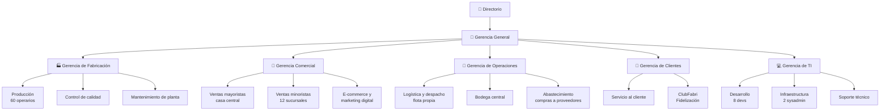

# 02 — Caso de estudio: FabriTech S.A.

← [Volver al índice](./README.md)

---

## La empresa

**FabriTech S.A.** es una empresa chilena fundada en 1998, dedicada a la fabricación y comercialización de **electrónica doméstica** (aspiradoras robóticas, purificadores de aire, cargadores portátiles). Con 28 años de trayectoria, pasó de ser un pequeño taller de manufactura a una empresa con presencia nacional.

### Datos generales

| Dato | Valor |
|------|-------|
| Fundación | 1998, Santiago de Chile |
| RUT | 76.123.456-7 |
| Empleados | ~300 |
| Sucursales | 12 (Arica, Iquique, Antofagasta, La Serena, Viña del Mar, Santiago Centro, Santiago Maipú, Rancagua, Talca, Concepción, Temuco, Puerto Montt) |
| Casa central | Pudahuel, Santiago (planta + bodega + oficinas + punto de venta mayorista) |
| Proveedores activos | 43 |
| SKUs activos | ~180 productos terminados |
| Ventas anuales | ~$4.200 millones CLP |
| Plataforma web | fabritech.cl (e-commerce + catálogo) |

---

## Estructura organizacional



---

## Flujos de negocio detallados

### Flujo 1: Abastecimiento de materias primas

```
1. Bodega central detecta stock bajo de componentes
2. Jefe de abastecimiento revisa en el sistema las órdenes de compra pendientes
3. Se emite una Orden de Compra (OC) al proveedor
4. Proveedor confirma fecha de entrega
5. Materiales llegan a casa central
6. Encargado de bodega registra la recepción en el sistema
7. El stock de materias primas se actualiza
8. Se genera una alerta a fabricación: "Materiales disponibles"
```

### Flujo 2: Fabricación de un lote de productos

```
1. Gerencia comercial proyecta demanda del próximo mes
2. Gerencia de fabricación crea Orden de Producción (OP) con:
   - Producto a fabricar (SKU)
   - Cantidad
   - Fecha límite
3. El sistema verifica que hay suficientes materias primas (BOM check)
4. Si hay materias primas: OP se inicia (estado: EN_PRODUCCIÓN)
5. Si no hay: sistema genera aviso de compra de materiales
6. Al completarse el lote, control de calidad aprueba o rechaza
7. Si aprobado: los productos ingresan a bodega central como PRODUCTO_TERMINADO
8. El stock de productos terminados se actualiza
```

### Flujo 3: Reabastecimiento de sucursal

```
1. Sucursal detecta stock bajo (automático o manual)
2. Jefe de sucursal solicita transferencia de stock en el sistema
3. Bodega central confirma disponibilidad
4. Se programa despacho con flota propia (camión)
5. El sistema genera guía de despacho (PDF)
6. El chofer del camión registra la salida de bodega central
7. Al llegar a la sucursal, el encargado confirma recepción
8. El stock de la sucursal se actualiza
9. El stock de bodega central se actualiza (descuenta)
```

### Flujo 4: Venta minorista en sucursal

```
1. Cliente llega a la sucursal
2. Vendedor busca el producto en el sistema (verifica stock local)
3. Si hay stock: se registra la venta
   a. El sistema busca o registra al cliente (RUT o email)
   b. Se genera boleta/factura en el sistema
   c. Se registra el pago (efectivo, débito, crédito)
   d. El stock de la sucursal disminuye
   e. Si el cliente tiene cuenta ClubFabri: se acreditan puntos
4. Si no hay stock: el vendedor puede ver si hay stock en otras sucursales
                    y puede hacer reserva + envío al cliente
```

### Flujo 5: Venta por e-commerce

```
1. Cliente navega en fabritech.cl
2. Agrega productos al carrito
3. Al hacer checkout:
   a. Verifica stock en bodega central (o sucursal más cercana)
   b. El stock queda RESERVADO (no disponible para otro comprador)
4. Cliente paga (Webpay, tarjeta)
5. Sistema confirma el pago
6. Se genera boleta electrónica (PDF enviado por email)
7. Se crean instrucciones de despacho
8. Logística elige carrier (Starken, Chilexpress, DHL según destino y peso)
9. Se obtiene código de tracking del carrier
10. Cliente recibe email con tracking
11. Sistema monitorea el estado del envío (webhooks del carrier)
12. Al entregarse: se acreditan puntos ClubFabri
```

### Flujo 6: Programa de fidelización (ClubFabri)

```
Acumulación:
  - $1.000 CLP gastados = 10 puntos
  - Tier Bronze (0-499 pts): multiplicador 1x
  - Tier Silver (500-1999 pts): multiplicador 1.5x
  - Tier Gold (2000-4999 pts): multiplicador 2x
  - Tier Platinum (5000+ pts): multiplicador 3x + envío gratis

Canje:
  - 100 puntos = $500 CLP de descuento
  - Mínimo de canje: 200 puntos

Eventos especiales:
  - Cumpleaños del cliente: doble puntos ese día
  - Promociones de temporada: puntos extra en categorías específicas
```

---

## El sistema monolítico actual

### Stack tecnológico

| Capa | Tecnología |
|------|------------|
| Backend | Java 11, Spring Boot 2.7, Spring MVC |
| ORM | Hibernate + Spring Data JPA |
| Base de datos | MySQL 8.0 (un servidor, una base) |
| Frontend web | Thymeleaf (renderizado server-side) |
| E-commerce | Angular 12 (SPA que consume el mismo backend) |
| App mobile | Android nativo (Java) + iOS (Swift) |
| Reportes | JasperReports embebido en el monolito |
| Email | JavaMailSender directo en los servicios |
| PDF | iText embebido en los servicios |
| Servidor | Tomcat embebido, 1 servidor físico en casa central |
| Deploy | JAR subido por FTP al servidor, reinicio manual |

### Métricas del sistema actual

| Métrica | Valor |
|---------|-------|
| Líneas de código | ~180.000 LOC |
| Clases Java | ~620 |
| Tablas en BD | 87 |
| Tiempo de build | 28 minutos |
| Tiempo de deploy | 12 minutos (downtime completo) |
| Tests unitarios | 340 (cobertura ~18%) |
| Tests de integración | 12 |
| Deploys por semana | ~1.5 |
| Deploys con rollback | 35% |
| Incidentes P1 por mes | ~4 |
| Tiempo medio de resolución (MTTR) | 2.5 horas |

---

## Problemas documentados

### Incidente #1 — Módulo de reportes vs. ventas (Noviembre 2025)

El equipo de backoffice desplegó una nueva versión del módulo de reportes que incluía una consulta SQL pesada sin índice. La consulta trababa el pool de conexiones de toda la aplicación. El sistema de ventas quedó sin poder procesar pagos por **47 minutos** en plena campaña de Navidad.

**Pérdida estimada:** $8.2 millones CLP en ventas no realizadas.

### Incidente #2 — Deploy de logística bloquea fidelización (Agosto 2025)

El equipo de logística necesitaba urgente un fix en el cálculo de costos de envío. Para desplegar el fix, toda la aplicación debía reiniciarse. El reinicio duró 12 minutos. Durante ese tiempo, el sistema de fidelización tampoco funcionaba, aunque no tenía ningún bug.

**Impacto:** 200 clientes no pudieron canjear puntos durante una promoción de doble puntos.

### Incidente #3 — Refactor de Customer rompe Facturas (Mayo 2025)

Un desarrollador renombró el campo `rut` a `taxId` en la entidad `Customer` (para estandarizar con el formato internacional). El rename automático en IDE no detectó que una clase de generación de facturas usaba el nombre del campo via reflexión para construir el XML del SII. Las facturas electrónicas dejaron de generarse correctamente.

**Impacto:** 48 horas de facturas inválidas, penalización del SII.

### Problema estructural: la clase OrderService

```java
// OrderService.java — 1.247 líneas
// Responsabilidades mezcladas:
public class OrderService {

    // Lógica de pedidos (correcto)
    public Order createOrder(OrderRequest request) { ... }

    // Verifica stock — debería ser InventoryService
    private boolean checkStock(String sku, int qty) { ... }

    // Calcula puntos — debería ser LoyaltyService
    private void awardPoints(Long customerId, BigDecimal amount) { ... }

    // Genera PDF — debería ser PdfService
    private byte[] generateInvoicePdf(Order order) { ... }

    // Envía email — debería ser EmailService
    private void sendConfirmationEmail(Order order) { ... }

    // Notifica al carrier — debería ser ShippingService
    private String createShipmentInCarrier(Order order) { ... }

    // Actualiza stock — debería ser InventoryService
    private void decrementStock(List<OrderItem> items) { ... }

    // Crea factura en BD — debería ser PaymentService
    private Invoice createInvoice(Order order) { ... }
}
```

Esta clase viola el **Single Responsibility Principle** y es el epicentro de la mayoría de los conflictos de merge.

---

## Objetivos de la migración

El directorio de FabriTech aprobó un proyecto de 18 meses para migrar gradualmente el monolito. Los objetivos son:

| Objetivo | Métrica de éxito |
|----------|-----------------|
| Reducir el impacto de los deploys | Incidentes por deploy < 5% (hoy: 35%) |
| Escalar e-commerce de forma independiente | Costo de infraestructura en peak: -60% |
| Reducir tiempo de build | < 5 minutos por servicio (hoy: 28 min total) |
| Aumentar frecuencia de deploy | > 5 deploys/semana (hoy: 1.5) |
| Mejorar tiempo de resolución (MTTR) | < 30 minutos (hoy: 2.5 horas) |
| Aumentar cobertura de tests | > 70% por servicio (hoy: 18%) |
| Eliminar bloqueos entre equipos | 0 deploys que requieran coordinación entre > 1 equipo |

---

## El equipo de desarrollo

| Squad | Integrantes | Dominio responsable |
|-------|-------------|---------------------|
| **Squad Comercial** | 2 devs | Catálogo, pedidos, e-commerce |
| **Squad Operaciones** | 2 devs | Inventario, fabricación, compras |
| **Squad Clientes** | 2 devs | Clientes, fidelización, pagos |
| **Squad Logística** | 1 dev | Envíos, carriers |
| **Squad Plataforma** | 1 dev (líder técnico) | API Gateway, infraestructura, auth |

La migración se asignará un squad por dominio, con el Squad Plataforma coordinando la infraestructura transversal.

---

*← [01 — ¿Por qué migrar?](./01_por-que-migrar.md) | Siguiente: [03 — El Monolito →](./03_el-monolito.md)*
