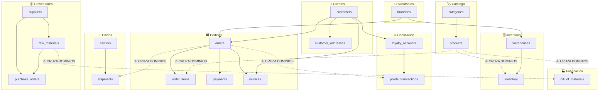

# 03 — El monolito actual

← [Volver al índice](./README.md)

---

## Anatomía del monolito de FabriTech

Para migrar de forma segura, primero hay que **entender profundamente** lo que existe. Esta es la estructura real del monolito de FabriTech antes de la migración.

### Estructura de paquetes

```
cl.fabritech/
├── config/
│   ├── SecurityConfig.java
│   ├── JpaConfig.java
│   ├── EmailConfig.java
│   └── WebConfig.java
│
├── controller/
│   ├── ProductController.java          (42 endpoints)
│   ├── ManufacturingController.java    (18 endpoints)
│   ├── SupplierController.java         (24 endpoints)
│   ├── InventoryController.java        (31 endpoints)
│   ├── BranchController.java           (15 endpoints)
│   ├── CustomerController.java         (28 endpoints)
│   ├── OrderController.java            (37 endpoints)
│   ├── LoyaltyController.java          (22 endpoints)
│   ├── ShippingController.java         (29 endpoints)
│   ├── PaymentController.java          (19 endpoints)
│   ├── ReportController.java           (44 endpoints)
│   └── AuthController.java             (8 endpoints)
│
├── service/
│   ├── ProductService.java             (680 líneas)
│   ├── ManufacturingService.java       (524 líneas)
│   ├── InventoryService.java           (891 líneas)   ← más grande
│   ├── OrderService.java               (1247 líneas)  ← el problemático
│   ├── CustomerService.java            (443 líneas)
│   ├── LoyaltyService.java             (389 líneas)
│   ├── ShippingService.java            (712 líneas)
│   ├── PaymentService.java             (601 líneas)
│   ├── ReportService.java              (934 líneas)
│   ├── EmailService.java               (287 líneas)   ← mezclado con todo
│   ├── PdfService.java                 (356 líneas)   ← mezclado con todo
│   └── NotificationService.java        (198 líneas)
│
├── repository/
│   ├── ProductRepository.java
│   ├── ManufacturingRepository.java
│   ├── InventoryRepository.java
│   ├── OrderRepository.java
│   └── ... (24 repositorios más)
│
├── model/
│   ├── Product.java                    (relaciones a Category, Supplier)
│   ├── ProductionOrder.java            (relación a Product, Employee)
│   ├── BillOfMaterials.java            (relación a Product, RawMaterial)
│   ├── Supplier.java
│   ├── RawMaterial.java                (relación a Supplier)
│   ├── PurchaseOrder.java              (relación a Supplier, RawMaterial)
│   ├── Inventory.java                  (relación a Product, Warehouse)
│   ├── Warehouse.java                  (relación a Branch)
│   ├── Branch.java
│   ├── Customer.java
│   ├── CustomerAddress.java
│   ├── Order.java                      (relación a Customer, Branch, Employee)
│   ├── OrderItem.java                  (relación a Order, Product)
│   ├── LoyaltyAccount.java             (relación a Customer)
│   ├── PointsTransaction.java
│   ├── Shipment.java                   (relación a Order, Carrier)
│   ├── Carrier.java
│   ├── Payment.java                    (relación a Order)
│   ├── Invoice.java                    (relación a Order, Customer)
│   └── ... (67 entidades en total)
│
└── dto/
    └── ... (120+ DTOs)
```

---

## El problema del acoplamiento implícito

El mayor problema del monolito de FabriTech no es la falta de organización en carpetas — los paquetes están razonablemente separados. El problema es el **acoplamiento implícito** que surge de tres fuentes:

### Fuente 1: Inyección de servicios cruzados

```java
// OrderService inyecta servicios de múltiples dominios
@Service
public class OrderService {

    // Dominio de inventario
    @Autowired private InventoryService inventoryService;

    // Dominio de fidelización
    @Autowired private LoyaltyService loyaltyService;

    // Dominio de clientes
    @Autowired private CustomerService customerService;

    // Dominio de envíos
    @Autowired private ShippingService shippingService;

    // Dominio de pagos
    @Autowired private PaymentService paymentService;

    // Servicios técnicos (deberían ser auxiliares independientes)
    @Autowired private EmailService emailService;
    @Autowired private PdfService pdfService;
    @Autowired private NotificationService notificationService;

    // Resultado: cambiar cualquiera de estos servicios puede romper OrderService
}
```

### Fuente 2: Queries que cruzan dominios en la BD

```java
// En ReportService: una query que cruza 6 dominios distintos
@Query("""
    SELECT new cl.fabritech.dto.SalesReport(
        b.name,
        p.name,
        SUM(oi.quantity),
        SUM(oi.quantity * oi.unitPrice),
        c.tier
    )
    FROM Order o
    JOIN o.items oi
    JOIN oi.product p
    JOIN p.category cat
    JOIN o.branch b
    JOIN o.customer c
    JOIN c.loyaltyAccount la
    WHERE o.createdAt BETWEEN :from AND :to
    AND o.status = 'PAID'
    GROUP BY b.id, p.id, c.tier
    ORDER BY SUM(oi.quantity * oi.unitPrice) DESC
""")
List<SalesReport> getSalesByBranchAndProduct(LocalDate from, LocalDate to);
```

Esta query bloquea `Order`, `OrderItem`, `Product`, `Category`, `Branch`, `Customer` y `LoyaltyAccount` simultáneamente. Si el esquema de cualquiera cambia, la query falla.

### Fuente 3: Transacciones @Transactional que cruzan dominios

```java
@Transactional  // ← una sola transacción que abarca 5 dominios
public Order confirmOrder(Long orderId) {

    // Dominio: Pedidos
    Order order = orderRepository.findById(orderId).orElseThrow();

    // Dominio: Inventario
    inventoryService.decrementStock(order.getItems());

    // Dominio: Pagos
    Invoice invoice = paymentService.createInvoice(order);

    // Dominio: Fidelización
    loyaltyService.awardPoints(order.getCustomerId(), order.getTotal());

    // Dominio: Envíos
    Shipment shipment = shippingService.createShipment(order);

    // Auxiliar: Email (si el envío falla, se hace rollback del email también)
    emailService.sendConfirmation(order, invoice, shipment);

    return order;
}
```

Si `shippingService.createShipment` falla (por ejemplo, el carrier externo no responde), hace rollback de **todo**: el stock decrementado se restaura, la factura se borra y los puntos de fidelización no se acreditan. Esto parece correcto a primera vista, pero en realidad **los pedidos pagados deberían poder procesarse incluso si el servicio de envíos tiene problemas temporales**.

---

## El esquema de base de datos monolítico

El monolito tiene 87 tablas en una sola base de datos MySQL. El mayor problema: **tablas que pertenecen a distintos dominios tienen foreign keys entre sí**, haciendo imposible separarlas sin trabajo adicional.

### Mapa de dependencias entre dominios en la BD



Estas FKs cruzadas son el **mayor obstáculo** para separar los servicios. Cuando `order_items` tiene FK a `products`, extraer el catálogo como servicio independiente no es trivial — hay que decidir si eliminar la FK o duplicar el dato.

---

## Herramientas para analizar un monolito

Antes de migrar, el equipo de FabriTech debe hacer un análisis objetivo del acoplamiento. Estas son las herramientas disponibles:

### ArchUnit — Tests de arquitectura en Java

[ArchUnit](https://www.archunit.org/) permite escribir tests que validan las reglas de arquitectura del monolito. Se pueden detectar violaciones de capas y dependencias circulares:

```java
@AnalyzeClasses(packages = "cl.fabritech")
class ArchitectureTest {

    // Regla: los servicios de dominio no deben inyectar otros servicios de dominio directamente
    // (para detectar acoplamientos implícitos)
    @ArchTest
    static final ArchRule no_domain_service_should_import_another =
        noClasses()
            .that().resideInAPackage("..service..")
            .and().haveSimpleNameEndingWith("Service")
            .should().dependOnClassesThat()
            .resideInAPackage("..service..")
            .andShould().haveSimpleNameEndingWith("Service")
            .because("Los servicios de dominio deben comunicarse via interfaces, no inyección directa");

    // Regla: los reportes no deben tener acceso directo a repositorios de otros dominios
    @ArchTest
    static final ArchRule reports_should_not_access_domain_repos =
        noClasses()
            .that().resideInAPackage("..service.report..")
            .should().dependOnClassesThat()
            .resideInAPackage("..repository..");
}
```

Al ejecutar estos tests en FabriTech, se detectan **87 violaciones** — cada una es un candidato a ser refactorizado durante la migración.

### jdeps — Análisis de dependencias del JDK

```bash
# Generar reporte de dependencias entre paquetes
jdeps --dot-output ./deps-report \
      --multi-release 11 \
      fabritech-monolito.jar

# Visualizar como grafo (requiere graphviz)
dot -Tsvg deps-report/cl.fabritech.service.dot -o service-deps.svg
```

### Structure101 / Sonargraph

Herramientas comerciales que generan un mapa visual del acoplamiento entre módulos, identifican ciclos de dependencias y miden la "distancia de separación" de cada módulo del monolito.

---

## La deuda técnica acumulada

Después del análisis, FabriTech tiene documentada la siguiente deuda técnica:

| Tipo de deuda | Cantidad | Impacto |
|---------------|----------|---------|
| Clases con > 3 responsabilidades | 23 | Alto |
| Servicios que inyectan > 5 dependencias | 8 | Alto |
| Queries que cruzan > 3 dominios | 34 | Alto |
| `@Transactional` que abarcan > 2 dominios | 19 | Medio |
| Código duplicado entre módulos | ~8.000 LOC | Medio |
| Clases sin tests unitarios | 412 / 620 (66%) | Alto |
| Configuraciones hardcoded | 47 | Bajo |
| TODOs sin resolver | 203 | Bajo |

### La regla del "techo de deuda"

Antes de extraer un servicio, el equipo debe reducir la deuda técnica de ese módulo específico por debajo de un umbral:

1. **Cobertura de tests > 60%** en el módulo a extraer
2. **Sin dependencias circulares** dentro del módulo
3. **Interfaz pública documentada** (qué métodos son el contrato externo)
4. **Sin queries cross-domain** en los repositorios del módulo

---

## El modelo de datos a separar

El proceso de separar la BD monolítica sigue la estrategia **"Expand and Contract"**:

### Paso 1: Identificar qué datos pertenecen a qué servicio

| Tabla | Dominio dueño | Tablas que la referencian (FK) |
|-------|--------------|-------------------------------|
| `products` | catalog-service | `order_items`, `inventory`, `bill_of_materials` |
| `inventory` | inventory-service | — |
| `orders` | order-service | `order_items`, `payments`, `invoices`, `shipments` |
| `customers` | customer-service | `orders`, `loyalty_accounts`, `invoices` |
| `loyalty_accounts` | loyalty-service | `points_transactions` |
| `shipments` | shipping-service | — |
| `carriers` | shipping-service | `shipments` |

### Paso 2: Eliminar las FKs cruzadas

Por ejemplo, `order_items` tiene FK a `products`:

```sql
-- Antes: FK real en BD
CREATE TABLE order_items (
    id BIGINT PRIMARY KEY,
    order_id BIGINT NOT NULL,
    product_id BIGINT NOT NULL,           -- FK a products
    product_sku VARCHAR(50) NOT NULL,
    product_name VARCHAR(200) NOT NULL,   -- denormalizado
    unit_price DECIMAL(10,2) NOT NULL,
    quantity INT NOT NULL,
    FOREIGN KEY (order_id) REFERENCES orders(id),
    FOREIGN KEY (product_id) REFERENCES products(id)  -- ← ELIMINAR
);

-- Después: se mantiene el dato denormalizado, se elimina la FK
CREATE TABLE order_items (
    id BIGINT PRIMARY KEY,
    order_id BIGINT NOT NULL,
    product_sku VARCHAR(50) NOT NULL,     -- la referencia es el SKU (string), no la FK
    product_name VARCHAR(200) NOT NULL,  -- snapshot del nombre al momento de la venta
    unit_price DECIMAL(10,2) NOT NULL,
    quantity INT NOT NULL,
    FOREIGN KEY (order_id) REFERENCES orders(id)
);
```

**¿Por qué guardar el nombre y precio en `order_items`?**

Porque si mañana el producto cambia de nombre o precio, el historial de órdenes debe reflejar el precio y nombre **al momento de la compra**, no el actual. Esto es **correcto por diseño**, no un workaround.

---

*← [02 — Caso FabriTech](./02_caso-fabritech.md) | Siguiente: [04 — Bounded Contexts →](./04_bounded-contexts.md)*
