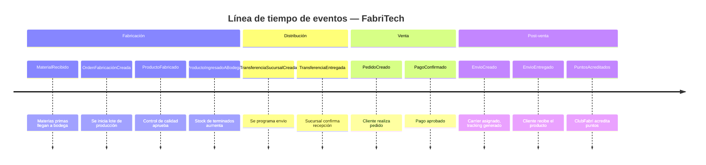
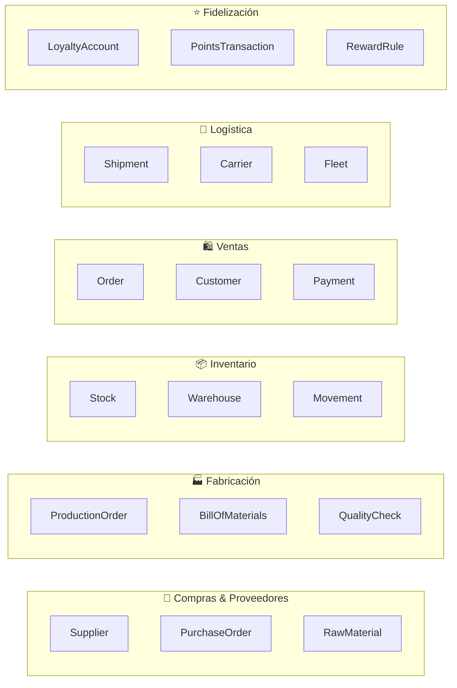
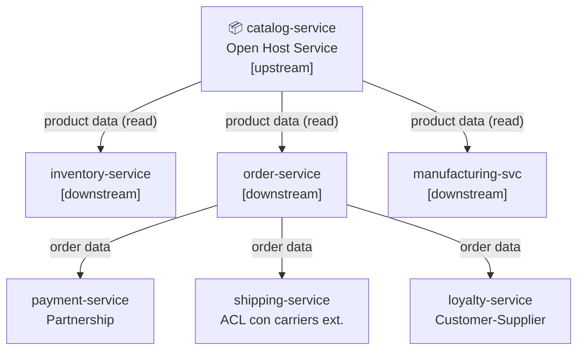

# 04 — Identificando límites de contexto

← [Volver al índice](./README.md)

---

> 📖 **Contenido complementario — fuera del scope de DSY1103**
>
> Domain-Driven Design (DDD) **no es parte del programa evaluado del curso**, pero es uno de los fundamentos intelectuales detrás de cómo se diseñan los bounded contexts en microservicios. Te recomendamos leer esta sección al menos una vez: te dará un vocabulario y un marco de pensamiento que aplicarás durante toda tu carrera. **Puedes saltarla si estás apurado y volver más tarde.**

---

## Domain-Driven Design (DDD) en una página

**Domain-Driven Design** es una metodología de diseño de software que pone el **dominio del negocio** en el centro de todas las decisiones técnicas. Fue formulada por Eric Evans en su libro *"Domain-Driven Design: Tackling Complexity in the Heart of Software"* (2003).

### Conceptos clave de DDD

| Concepto | Definición | Ejemplo en FabriTech |
|----------|-----------|---------------------|
| **Domain** | El problema de negocio que el software resuelve | La operación completa de FabriTech |
| **Subdomain** | Una parte delimitada del dominio | Ventas, Fabricación, Logística |
| **Bounded Context** | El límite donde un modelo de dominio tiene significado coherente y consistente | El contexto "Pedidos" donde `Order` tiene sentido completo |
| **Ubiquitous Language** | El vocabulario común que usan tanto devs como expertos del negocio dentro de un contexto | "Despacho" significa cosas diferentes en Logística vs. Ventas |
| **Entity** | Objeto con identidad propia que persiste en el tiempo | `Order`, `Customer`, `Product` |
| **Value Object** | Objeto sin identidad propia, definido solo por sus atributos | `Money`, `Address`, `DateRange` |
| **Aggregate** | Cluster de entidades y value objects tratados como una unidad | `Order` + sus `OrderItem`s |
| **Aggregate Root** | La entidad principal del aggregate; es el único punto de entrada | `Order` es la raíz; los `OrderItem`s no se acceden directamente |
| **Domain Event** | Algo que ocurrió en el dominio, expresado en tiempo pasado | `OrderPlaced`, `ProductShipped`, `CustomerRegistered` |
| **Repository** | Abstracción de persistencia para un aggregate | `OrderRepository` |

---

## El lenguaje ubicuo en cada contexto

La misma palabra puede significar cosas diferentes en contextos distintos. Esto es **correcto y esperado** en DDD:

### La palabra "Producto"

| Contexto | Lo que "Producto" significa | Atributos relevantes |
|----------|-----------------------------|---------------------|
| **Catálogo** | Un ítem que FabriTech vende, con descripción y foto | `sku`, `name`, `description`, `images`, `category`, `basePrice` |
| **Inventario** | Una unidad en bodega, con ubicación y cantidad | `sku`, `warehouseLocation`, `quantity`, `reservedQty`, `minimumStock` |
| **Fabricación** | Un bien a producir, con receta de materiales | `sku`, `billOfMaterials`, `productionTime`, `qualityChecklist` |
| **Pedido** | Una línea en una orden, con precio snapshot | `sku`, `nameAtSale`, `priceAtSale`, `quantity` |
| **Envío** | Un ítem físico a transportar, con peso y dimensiones | `sku`, `weightKg`, `dimensionsCm`, `isFragile` |

**Conclusión:** No existe un modelo único de "Producto" — existen 5 modelos, uno por contexto. Intentar crear un único `Product.java` que sirva para todos es el origen de la clase Dios.

### La palabra "Cliente"

| Contexto | Lo que "Cliente" significa |
|----------|---------------------------|
| **Clientes** | Una persona registrada con datos personales | `id`, `name`, `email`, `rut`, `phone` |
| **Fidelización** | Una cuenta con puntos y tier | `customerId`, `points`, `tier`, `joinedAt` |
| **Pedidos** | Un comprador asociado a una orden | `customerId`, `name`, `billingAddress` |
| **Envíos** | Un destinatario con dirección de entrega | `recipientName`, `deliveryAddress`, `phone` |

---

## Event Storming: la sesión práctica

**Event Storming** es un taller colaborativo de 4-8 horas donde participan **desarrolladores y expertos del negocio** juntos. El objetivo es mapear todos los eventos del dominio y descubrir los bounded contexts.

### Materiales necesarios

- Una pared larga (mínimo 4 metros)
- Post-its de 5 colores:
  - 🟠 **Naranja** → Domain Events (pasado: "algo ocurrió")
  - 🔵 **Azul** → Commands (presente: "acción que dispara el evento")
  - 🟡 **Amarillo** → Actors (quién ejecuta el command)
  - 🟢 **Verde** → Aggregates (qué entidad cambia)
  - 🔴 **Rojo** → Hot Spots (problemas, preguntas sin resolver)

### Proceso de la sesión

**Etapa 1 — Caos creativo (45 min)**

Todos los participantes escriben eventos de dominio en naranja y los pegan en la pared, sin orden. Reglas: tiempo pasado, sin tecnicismos.

```
🟠 PedidoCreado
🟠 PagoConfirmado
🟠 ProductoFabricado
🟠 MaterialRecibido
🟠 EnvioEntregado
🟠 ClienteRegistrado
🟠 PuntosAcreditados
🟠 StockBajo
🟠 OrdenDeCompraEmitida
🟠 TransferenciaASucursalDespachada
...
```

**Etapa 2 — Línea de tiempo (45 min)**

Se ordenan los post-its en la pared en orden cronológico, de izquierda a derecha:



**Etapa 3 — Identificar commands y actores (30 min)**

Para cada evento: ¿qué acción lo disparó? ¿quién la ejecutó?

```
🟡 Encargado Bodega  →  🔵 RegistrarRecepción  →  🟠 MaterialRecibido
🟡 Jefe Producción   →  🔵 CrearOrden          →  🟠 OrdenFabricaciónCreada
🟡 Cliente           →  🔵 HacerPedido          →  🟠 PedidoCreado
🟡 Sistema Pago      →  🔵 ConfirmarPago        →  🟠 PagoConfirmado
```

**Etapa 4 — Aggregates (30 min)**

Agrupar events/commands alrededor de la entidad que cambia:

```
🟢 Order: [PedidoCreado, PedidoModificado, PedidoCancelado, PedidoEntregado]
🟢 Inventory: [StockIncrementado, StockReservado, StockLiberado, StockTransferido]
🟢 Customer: [ClienteRegistrado, DatosActualizados, DirecciónAgregada]
🟢 Shipment: [EnvioCreado, EnvioEnCamino, EnvioEntregado]
```

**Etapa 5 — Bounded Contexts (30 min)**

Trazar líneas verticales en la pared agrupando aggregates relacionados:



---

## Context Map de FabriTech

El **Context Map** documenta las relaciones entre los bounded contexts. Existen varios tipos de relaciones:

### Tipos de relaciones entre contexts

| Tipo | Descripción | Ejemplo en FabriTech |
|------|-------------|---------------------|
| **Partnership** | Dos contexts coordinan su evolución juntos | `order-service` y `payment-service` |
| **Customer-Supplier** | Un context (upstream) provee datos a otro (downstream) | `catalog-service` ← `order-service` |
| **Conformist** | El downstream acepta el modelo del upstream sin modificarlo | `shipping-service` consume el modelo de carriers externos |
| **Anti-Corruption Layer (ACL)** | El downstream traduce el modelo del upstream a su propio lenguaje | `shipping-service` traduce el API de Starken al modelo interno |
| **Open Host Service** | El upstream expone una API bien definida para múltiples consumers | `catalog-service` con API REST versionada |
| **Published Language** | El upstream define un formato estándar (OpenAPI, eventos JSON) | Eventos en formato CloudEvents |

### Context Map de FabriTech



---

## Anti-Corruption Layer (ACL) en profundidad

El ACL es fundamental cuando `shipping-service` se integra con carriers externos (Starken, Chilexpress, DHL). Cada carrier tiene su propio modelo de datos y API. El ACL traduce entre el mundo externo y el modelo interno de FabriTech.

```java
// Modelo interno de FabriTech
public record ShipmentRequest(
    String recipientName,
    String recipientPhone,
    Address deliveryAddress,
    List<Package> packages,
    ServiceLevel serviceLevel  // STANDARD | EXPRESS | SAME_DAY
) {}

// ─────────────────────────────────────────────────────────────

// Modelo de la API de Starken (externo, no controlamos)
public class StarkenShipmentDTO {
    private String nombreDestinatario;
    private String telefonoDestinatario;
    private String direccionEntrega;
    private String ciudadDestino;
    private String regionDestino;
    private Double pesoKg;
    private String tipoServicio;  // "NORMAL", "EXPRESS_24", "EXPRESS_12"
}

// ─────────────────────────────────────────────────────────────

// El ACL: traduce del modelo interno al modelo de Starken
@Component
public class StarkenAdapter implements CarrierAdapter {

    @Override
    public ExternalShipmentResult createShipment(ShipmentRequest request) {
        StarkenShipmentDTO dto = new StarkenShipmentDTO();
        dto.setNombreDestinatario(request.recipientName());
        dto.setTelefonoDestinatario(request.recipientPhone());
        dto.setDireccionEntrega(request.deliveryAddress().street() + ", " +
                                request.deliveryAddress().city());
        dto.setCiudadDestino(request.deliveryAddress().city());
        dto.setRegionDestino(request.deliveryAddress().region());
        dto.setPesoKg(calculateTotalWeight(request.packages()));
        dto.setTipoServicio(mapServiceLevel(request.serviceLevel()));  // ← traducción

        StarkenResponse response = starkenApiClient.createShipment(dto);

        // Traduce la respuesta de Starken al modelo interno
        return new ExternalShipmentResult(
            response.getNroSeguimiento(),   // → trackingCode
            response.getFechaEstimada(),    // → estimatedDelivery
            CarrierStatus.CREATED
        );
    }

    private String mapServiceLevel(ServiceLevel level) {
        return switch (level) {
            case STANDARD  -> "NORMAL";
            case EXPRESS   -> "EXPRESS_24";
            case SAME_DAY  -> "EXPRESS_12";
        };
    }
}
```

**Beneficio:** cuando Starken cambie su API (v2, v3), solo se modifica el `StarkenAdapter`. El resto de `shipping-service` no cambia.

---

## Los 6 bounded contexts de FabriTech

Después del Event Storming, el equipo identificó 6 bounded contexts principales (los microservicios de negocio se derivan de ellos):

### 1. Contexto de Abastecimiento
- **Entidades:** `Supplier`, `RawMaterial`, `PurchaseOrder`
- **Eventos clave:** `PurchaseOrderCreated`, `RawMaterialReceived`
- **Equipo dueño:** Squad Operaciones

### 2. Contexto de Producción
- **Entidades:** `ProductionOrder`, `BillOfMaterials`, `QualityCheck`
- **Eventos clave:** `ProductionStarted`, `ProductionCompleted`
- **Equipo dueño:** Squad Operaciones

### 3. Contexto de Inventario y Distribución
- **Entidades:** `Warehouse`, `StockEntry`, `StockMovement`, `Branch`
- **Eventos clave:** `StockUpdated`, `TransferCreated`, `TransferDelivered`
- **Equipo dueño:** Squad Operaciones

### 4. Contexto de Ventas
- **Entidades:** `Customer`, `Order`, `OrderItem`, `Payment`, `Invoice`
- **Eventos clave:** `OrderPlaced`, `PaymentConfirmed`, `OrderCancelled`
- **Equipo dueño:** Squad Comercial + Squad Clientes

### 5. Contexto de Fidelización
- **Entidades:** `LoyaltyAccount`, `PointsTransaction`, `RewardRule`
- **Eventos clave:** `PointsEarned`, `PointsRedeemed`, `TierUpgraded`
- **Equipo dueño:** Squad Clientes

### 6. Contexto de Logística
- **Entidades:** `Shipment`, `Carrier`, `FleetVehicle`, `Driver`
- **Eventos clave:** `ShipmentCreated`, `ShipmentDispatched`, `ShipmentDelivered`
- **Equipo dueño:** Squad Logística

---

## La Ley de Conway aplicada

> *"Las organizaciones que diseñan sistemas están limitadas a producir diseños que sean copias de las estructuras de comunicación de esas organizaciones."*  
> — Melvin Conway, 1967

FabriTech tiene 5 squads → el sistema tendrá naturalmente 5 grupos de microservicios. **Esto no es coincidencia — es diseño**. La arquitectura debe reflejar la estructura del equipo, y viceversa.

| Squad | Microservicios |
|-------|---------------|
| Squad Comercial | `catalog-service`, `order-service` |
| Squad Operaciones | `inventory-service`, `manufacturing-service`, `procurement-service` |
| Squad Clientes | `customer-service`, `loyalty-service`, `payment-service` |
| Squad Logística | `shipping-service` |
| Squad Plataforma | `auth-service`, `api-gateway`, `notification-service`, `email-service`, `pdf-service` |

---

*← [03 — El Monolito](./03_el-monolito.md) | Siguiente: [05 — Mapa de Servicios →](./05_mapa-servicios.md)*
