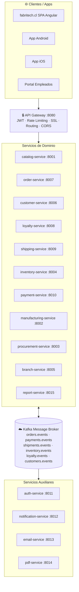

# 05 — Mapa de microservicios

← [Volver al índice](./README.md)

---

## Arquitectura completa



---

## API Gateway en profundidad

> 📖 **Contenido complementario — fuera del scope de DSY1103**
>
> El API Gateway es un componente esencial en arquitecturas de microservicios en producción, pero su implementación y configuración exceden el alcance del curso. Se incluye aquí para que sepas qué es, para qué sirve y cómo se configura cuando llegues a usarlo en un proyecto real.

El API Gateway es el **único punto de entrada** al sistema. Los clientes nunca llaman directamente a los microservicios.

### Responsabilidades del API Gateway

| Responsabilidad | Descripción |
|-----------------|-------------|
| **Routing** | Redirige `/api/v1/orders` → `order-service:8007` |
| **Autenticación** | Valida el JWT antes de enrutar la petición |
| **Rate Limiting** | Máximo N peticiones por IP/usuario por minuto |
| **SSL Termination** | Gestiona el certificado HTTPS; los servicios internos usan HTTP simple |
| **Request Logging** | Registra cada petición con su `traceId` |
| **CORS** | Gestiona las políticas de cross-origin (una sola configuración) |
| **Circuit Breaker** | Si un servicio está caído, retorna respuesta de fallback |
| **Load Balancing** | Distribuye el tráfico entre múltiples instancias del mismo servicio |

### Configuración de routing (Spring Cloud Gateway)

```yaml
# application.yml del API Gateway
spring:
  cloud:
    gateway:
      routes:
        - id: catalog-service
          uri: lb://catalog-service          # lb:// → load balancer automático
          predicates:
            - Path=/api/v1/products/**
          filters:
            - AuthFilter                     # valida JWT
            - name: RequestRateLimiter
              args:
                redis-rate-limiter.replenishRate: 100   # 100 req/seg
                redis-rate-limiter.burstCapacity: 200

        - id: order-service
          uri: lb://order-service
          predicates:
            - Path=/api/v1/orders/**
          filters:
            - AuthFilter
            - name: CircuitBreaker
              args:
                name: orderCircuitBreaker
                fallbackUri: forward:/fallback/orders

        - id: shipping-service
          uri: lb://shipping-service
          predicates:
            - Path=/api/v1/shipments/**
          filters:
            - AuthFilter
```

### Lo que NO debe hacer el API Gateway

❌ **No debe contener lógica de negocio** — el gateway solo enruta y valida, no procesa.

```java
// ❌ MAL: lógica de negocio en el gateway
@Component
public class OrderGatewayFilter implements GatewayFilter {
    public Mono<Void> filter(ServerWebExchange exchange, GatewayFilterChain chain) {
        // Calculando descuentos en el gateway ← INCORRECTO
        BigDecimal discount = calculateDiscount(exchange.getRequest());
        // ...
    }
}

// ✅ BIEN: el gateway solo valida el token y enruta
@Component
public class AuthFilter implements GatewayFilter {
    public Mono<Void> filter(ServerWebExchange exchange, GatewayFilterChain chain) {
        String token = extractToken(exchange.getRequest());
        if (!jwtValidator.isValid(token)) {
            exchange.getResponse().setStatusCode(HttpStatus.UNAUTHORIZED);
            return exchange.getResponse().setComplete();
        }
        return chain.filter(exchange);
    }
}
```

---

## Service Registry y Service Discovery

> 📖 **Contenido complementario — fuera del scope de DSY1103**
>
> El Service Registry resuelve el problema de "¿cómo se encuentran los servicios entre sí?" en un entorno dinámico (muchas instancias, IPs que cambian). Es fundamental en producción pero no se implementa en el curso.

En un ambiente con 15 servicios y múltiples instancias de cada uno, ¿cómo sabe `order-service` la dirección IP y puerto de `inventory-service`?

La respuesta es el **Service Registry** (registro de servicios).

### Funcionamiento

```
1. Al iniciar, cada servicio se registra en el Registry:
   inventory-service → "Soy inventory-service, estoy en 10.0.1.45:8004"

2. El API Gateway (y otros servicios) consultan el Registry:
   "¿Dónde está inventory-service?" → "En 10.0.1.45:8004 y 10.0.1.46:8004"

3. El cliente elige una instancia (round-robin u otro algoritmo)

4. Si una instancia cae, deja de renovar su registro → el Registry la marca como DOWN
```

### Implementación con Spring Cloud Eureka

```java
// En el servidor Eureka (un proyecto Spring Boot separado)
@SpringBootApplication
@EnableEurekaServer
public class ServiceRegistryApplication {
    public static void main(String[] args) {
        SpringApplication.run(ServiceRegistryApplication.class, args);
    }
}
```

```yaml
# En cada microservicio
spring:
  application:
    name: inventory-service    # ← nombre con el que se registra

eureka:
  client:
    serviceUrl:
      defaultZone: http://registry:8761/eureka/
  instance:
    preferIpAddress: true
    leaseRenewalIntervalInSeconds: 10     # heartbeat cada 10 seg
    leaseExpirationDurationInSeconds: 30  # se elimina si no hay heartbeat en 30 seg
```

```java
// En order-service, llamar a inventory-service por nombre (no por IP)
@FeignClient(name = "inventory-service")  // ← Eureka resuelve el nombre a IP
public interface InventoryClient {
    @GetMapping("/api/v1/stock/{warehouseId}/{sku}")
    StockResponse getStock(@PathVariable Long warehouseId, @PathVariable String sku);
}
```

### Eureka vs Consul

| Característica | Eureka | Consul |
|---------------|--------|--------|
| Origen | Netflix | HashiCorp |
| Integración Spring | Nativa (Spring Cloud Netflix) | Requiere dependencia adicional |
| Health checks | Heartbeat periódico | HTTP/TCP/Script activo |
| DNS discovery | No nativo | Sí nativo |
| Key-Value store | No | Sí (útil para config) |
| Complejidad | Baja | Media |
| Recomendado para | Proyectos Spring Boot puros | Entornos multi-lenguaje |

---

## Configuration Server

> 📖 **Contenido complementario — fuera del scope de DSY1103**
>
> El Config Server centraliza la configuración de todos los servicios en un repositorio Git. En el curso cada servicio gestiona su propio `application.yml`. Este patrón es lo que aplicarías al escalar a producción real.

En un monolito, la configuración vive en un solo `application.yml`. Con 15 servicios, gestionar la configuración se complica:

- ¿Cómo cambio el timeout de un servicio sin redesplegar?
- ¿Cómo gestiono configuraciones diferentes por ambiente (dev/staging/prod)?
- ¿Cómo evito duplicar la misma configuración en 15 `application.yml`?

La respuesta es el **Spring Cloud Config Server**.

```
Config Server
    ├── Lee configuraciones de un repositorio Git
    │     fabritech-config/
    │       ├── application.yml          (común a todos los servicios)
    │       ├── order-service.yml        (específico de order-service)
    │       ├── order-service-prod.yml   (order-service en producción)
    │       └── inventory-service.yml
    │
    └── Expone una API que los servicios consultan al iniciar

Cada servicio al iniciar:
    GET http://config-server:8888/order-service/prod
    → recibe su configuración centralizada
```

```yaml
# fabritech-config/order-service.yml (en el repo Git de config)
inventory:
  client:
    timeout: 3000
    retry-max-attempts: 3

order:
  max-items-per-order: 50
  payment-timeout-minutes: 15
```

**Ventaja:** si necesitas cambiar el timeout de inventory-client, editas un archivo en Git → los servicios recargan la config sin reiniciar (con Spring Cloud Bus + Kafka).

---

## Topology de despliegue con Docker y Kubernetes

### Docker: un servicio = un contenedor

```dockerfile
# Dockerfile de order-service
FROM eclipse-temurin:21-jre-alpine
WORKDIR /app
COPY target/order-service.jar app.jar
EXPOSE 8007
ENTRYPOINT ["java", "-jar", "app.jar"]
```

```yaml
# docker-compose.yml (para desarrollo local)
version: "3.9"
services:

  api-gateway:
    image: fabritech/api-gateway:latest
    ports: ["8080:8080"]
    environment:
      EUREKA_URL: http://registry:8761/eureka/

  registry:
    image: fabritech/service-registry:latest
    ports: ["8761:8761"]

  order-service:
    image: fabritech/order-service:latest
    environment:
      SPRING_DATASOURCE_URL: jdbc:postgresql://orders-db:5432/orders
      EUREKA_URL: http://registry:8761/eureka/
    depends_on: [orders-db, registry]

  orders-db:
    image: postgres:16
    environment:
      POSTGRES_DB: orders
      POSTGRES_USER: orders_user
      POSTGRES_PASSWORD: ${ORDERS_DB_PASSWORD}
    volumes:
      - orders-data:/var/lib/postgresql/data

  # ... (15 servicios + sus BDs)

volumes:
  orders-data:
```

### Kubernetes (producción): escalado automático

```yaml
# order-service-deployment.yaml
apiVersion: apps/v1
kind: Deployment
metadata:
  name: order-service
spec:
  replicas: 3                           # 3 instancias en producción
  selector:
    matchLabels:
      app: order-service
  template:
    spec:
      containers:
        - name: order-service
          image: fabritech/order-service:2.1.0
          ports:
            - containerPort: 8007
          readinessProbe:               # Kubernetes solo enruta a pods sanos
            httpGet:
              path: /actuator/health/readiness
              port: 8007
            initialDelaySeconds: 30
            periodSeconds: 10
          livenessProbe:                # Kubernetes reinicia pods muertos
            httpGet:
              path: /actuator/health/liveness
              port: 8007
          resources:
            requests:
              memory: "256Mi"
              cpu: "250m"
            limits:
              memory: "512Mi"
              cpu: "500m"
---
# Escalado automático según CPU
apiVersion: autoscaling/v2
kind: HorizontalPodAutoscaler
metadata:
  name: order-service-hpa
spec:
  scaleTargetRef:
    apiVersion: apps/v1
    kind: Deployment
    name: order-service
  minReplicas: 2
  maxReplicas: 10                       # escala hasta 10 instancias en peak
  metrics:
    - type: Resource
      resource:
        name: cpu
        target:
          type: Utilization
          averageUtilization: 70        # escala cuando CPU > 70%
```

---

## Flujo completo de una petición

Este es el camino que sigue la petición `POST /api/v1/orders` (crear un pedido en e-commerce):

```
1.  Cliente → HTTPS → API Gateway
2.  API Gateway verifica JWT → válido, usuario = customer-456
3.  API Gateway → HTTP → order-service:8007/api/v1/orders
4.  order-service valida el request body
5.  order-service → HTTP → customer-service:8006/api/v1/customers/456
6.  customer-service responde: cliente válido ✓
7.  order-service → HTTP → inventory-service:8004/api/v1/stock/reserve
    { sku: "FT-ASP-001", quantity: 1 }
8.  inventory-service reserva el stock, responde: reservationId=R-789 ✓
9.  order-service crea la Order en su BD (estado: STOCK_RESERVED)
10. order-service → Kafka topic: orders.events
    { type: "OrderCreated", orderId: "ORD-7821", customerId: "456" }
11. order-service responde al API Gateway: 201 Created
12. API Gateway → HTTPS → Cliente: { orderId: "ORD-7821", ... }

---- asíncronamente, en paralelo: ----

13. payment-service consume orders.events → crea registro de pago pendiente
14. email-service consume orders.events → envía email de confirmación
15. notification-service consume orders.events → envía push notification
```

El paso 11 ocurre ~200ms después del paso 1. Los pasos 13-15 ocurren sin que el cliente espere.

---

*← [04 — Bounded Contexts](./04_bounded-contexts.md) | Siguiente: [06 — Descripción de Servicios →](./06_descripcion-servicios.md)*
