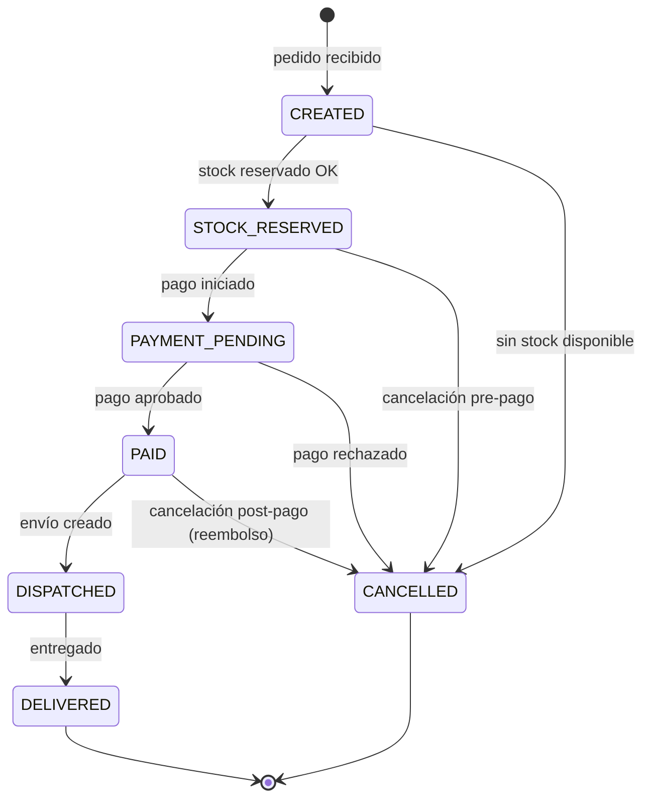

# 06 — Descripción de cada servicio

← [Volver al índice](./README.md)

---

## Guía de lectura

Cada servicio se documenta con:
- **Responsabilidad única** (lo que hace y lo que NO hace)
- **Modelo de datos** (entidades propias, sin FKs a otras BDs)
- **APIs** (endpoints principales)
- **Eventos** (qué publica, qué consume)
- **Decisiones de diseño** (por qué se estructuró así)

---

## catalog-service (Puerto 8001)

### Responsabilidad

Gestionar el **catálogo de productos** que FabriTech fabrica y vende: nombre, descripción, imágenes, precio base, categorías y estado.

**NO es responsable de:**
- Stock ni disponibilidad (→ `inventory-service`)
- Precio final con descuentos (→ `order-service`)
- Producción del producto (→ `manufacturing-service`)

### Modelo de datos

```sql
CREATE TABLE products (
    id          BIGSERIAL PRIMARY KEY,
    sku         VARCHAR(20)    UNIQUE NOT NULL,  -- ej: FT-ASP-001
    name        VARCHAR(200)   NOT NULL,
    description TEXT,
    base_price  DECIMAL(10,2)  NOT NULL,
    category_id BIGINT         NOT NULL REFERENCES categories(id),
    is_active   BOOLEAN        DEFAULT true,
    created_at  TIMESTAMP      DEFAULT NOW(),
    updated_at  TIMESTAMP      DEFAULT NOW()
);

CREATE TABLE categories (
    id          BIGSERIAL PRIMARY KEY,
    name        VARCHAR(100)   UNIQUE NOT NULL,
    description TEXT
);

CREATE TABLE product_images (
    id          BIGSERIAL PRIMARY KEY,
    product_id  BIGINT         NOT NULL REFERENCES products(id),
    url         TEXT           NOT NULL,
    is_primary  BOOLEAN        DEFAULT false,
    sort_order  INT            DEFAULT 0
);
```

### APIs

```
GET  /api/v1/products                  → lista paginada (filtros: category, active, search)
GET  /api/v1/products/{sku}            → detalle completo con imágenes
POST /api/v1/products                  → crear producto [ROLE_ADMIN]
PUT  /api/v1/products/{sku}            → actualizar [ROLE_ADMIN]
PUT  /api/v1/products/{sku}/deactivate → desactivar (no se elimina) [ROLE_ADMIN]

GET  /api/v1/categories                → lista de categorías
POST /api/v1/categories                → crear categoría [ROLE_ADMIN]
```

### Eventos publicados

```json
// Topic: catalog.events
{ "type": "ProductCreated",     "sku": "FT-ASP-002", "basePrice": 89990 }
{ "type": "ProductPriceUpdated","sku": "FT-ASP-002", "oldPrice": 89990, "newPrice": 79990 }
{ "type": "ProductDeactivated", "sku": "FT-ASP-002" }
```

---

## inventory-service (Puerto 8004)

### Responsabilidad

El servicio más crítico. Gestiona el **stock físico** en bodega central y en cada sucursal, los movimientos de inventario y las reservas de stock antes de vender.

**Patrón de reserva:**

```
DISPONIBLE = stockTotal - stockReservado

Al crear un pedido:
  1. reserve(sku, qty)   → stockReservado += qty  (si stockDisponible >= qty)
  2. ...el cliente paga...
  3a. confirm(sku, qty)  → stockTotal -= qty, stockReservado -= qty
  3b. release(sku, qty)  → stockReservado -= qty  (si el pago falló)
```

### Modelo de datos

```sql
CREATE TABLE warehouses (
    id        BIGSERIAL PRIMARY KEY,
    type      VARCHAR(20) NOT NULL CHECK (type IN ('CENTRAL', 'BRANCH')),
    branch_id BIGINT,               -- NULL si type = 'CENTRAL'
    name      VARCHAR(100) NOT NULL
);

CREATE TABLE stock_entries (
    id                BIGSERIAL PRIMARY KEY,
    warehouse_id      BIGINT         NOT NULL REFERENCES warehouses(id),
    product_sku       VARCHAR(20)    NOT NULL,
    quantity          INT            NOT NULL DEFAULT 0,
    reserved_quantity INT            NOT NULL DEFAULT 0,
    minimum_stock     INT            NOT NULL DEFAULT 5,
    updated_at        TIMESTAMP      DEFAULT NOW(),
    UNIQUE (warehouse_id, product_sku)
);

CREATE TABLE stock_movements (
    id            BIGSERIAL PRIMARY KEY,
    warehouse_id  BIGINT      NOT NULL REFERENCES warehouses(id),
    product_sku   VARCHAR(20) NOT NULL,
    movement_type VARCHAR(20) NOT NULL CHECK (movement_type IN ('IN','OUT','RESERVE','RELEASE','TRANSFER')),
    quantity      INT         NOT NULL,
    reference_id  VARCHAR(50),  -- orderId, shipmentId, productionOrderId
    reason        TEXT,
    created_at    TIMESTAMP   DEFAULT NOW()
);
```

### Lógica de reserva (implementación)

```java
@Service
@Transactional
public class StockReservationService {

    public ReservationResult reserve(String sku, Long warehouseId, int quantity) {
        StockEntry entry = stockEntryRepository
            .findByWarehouseIdAndProductSku(warehouseId, sku)
            .orElseThrow(() -> new StockNotFoundException(sku, warehouseId));

        int available = entry.getQuantity() - entry.getReservedQuantity();

        if (available < quantity) {
            return ReservationResult.insufficient(available);
        }

        entry.setReservedQuantity(entry.getReservedQuantity() + quantity);
        stockEntryRepository.save(entry);

        // Registrar el movimiento para auditoría
        stockMovementRepository.save(StockMovement.reserve(entry, quantity));

        // Si el disponible restante cae bajo el mínimo, publicar alerta
        int remainingAvailable = available - quantity;
        if (remainingAvailable < entry.getMinimumStock()) {
            eventPublisher.publishStockLow(sku, warehouseId, remainingAvailable);
        }

        return ReservationResult.success();
    }
}
```

### APIs

```
GET  /api/v1/stock/{warehouseId}/{sku}       → stock disponible
GET  /api/v1/stock/{warehouseId}/low-stock   → productos bajo el mínimo
POST /api/v1/stock/reserve                   → reservar stock
POST /api/v1/stock/confirm                   → confirmar salida definitiva
POST /api/v1/stock/release                   → liberar reserva
POST /api/v1/stock/transfer                  → transferir entre bodegas
POST /api/v1/stock/receive                   → ingresar stock (producción/compra)
```

### Eventos

**Publica:** `StockReserved`, `StockConfirmed`, `StockReleased`, `StockLow`, `StockTransferred`

**Consume:**
- `ProductionCompleted` (de manufacturing-service) → `stock/receive`
- `RawMaterialReceived` (de procurement-service) → actualiza materias primas
- `TransferDelivered` (de shipping-service) → actualiza stock en sucursal

---

## order-service (Puerto 8007)

### Responsabilidad

Gestiona el **ciclo de vida completo de los pedidos**: desde la creación hasta la entrega. Es el coordinador de la Saga de compra.

### Máquina de estados del pedido



### Modelo de datos

```sql
CREATE TABLE orders (
    id          BIGSERIAL PRIMARY KEY,
    customer_id BIGINT         NOT NULL,      -- referencia soft (no FK a otra BD)
    branch_id   BIGINT,                       -- NULL para pedidos web
    type        VARCHAR(20)    NOT NULL CHECK (type IN ('ONLINE','IN_STORE','WHOLESALE')),
    status      VARCHAR(30)    NOT NULL,
    subtotal    DECIMAL(10,2)  NOT NULL,
    discount    DECIMAL(10,2)  DEFAULT 0,
    tax         DECIMAL(10,2)  NOT NULL,
    total       DECIMAL(10,2)  NOT NULL,
    notes       TEXT,
    created_at  TIMESTAMP      DEFAULT NOW(),
    updated_at  TIMESTAMP      DEFAULT NOW()
);

CREATE TABLE order_items (
    id           BIGSERIAL PRIMARY KEY,
    order_id     BIGINT         NOT NULL REFERENCES orders(id),
    product_sku  VARCHAR(20)    NOT NULL,       -- snapshot, no FK
    product_name VARCHAR(200)   NOT NULL,       -- snapshot del nombre al momento
    unit_price   DECIMAL(10,2)  NOT NULL,       -- snapshot del precio al momento
    quantity     INT            NOT NULL,
    subtotal     DECIMAL(10,2)  NOT NULL        -- unit_price * quantity
);

CREATE TABLE order_status_history (
    id          BIGSERIAL PRIMARY KEY,
    order_id    BIGINT      NOT NULL REFERENCES orders(id),
    from_status VARCHAR(30),
    to_status   VARCHAR(30) NOT NULL,
    reason      TEXT,
    changed_at  TIMESTAMP   DEFAULT NOW()
);
```

> **¿Por qué `product_name` y `unit_price` en `order_items`?**
> El precio y el nombre pueden cambiar en el catálogo. El historial de pedidos debe reflejar el precio pagado, no el precio actual.

### Saga de creación de pedido

```java
@Service
public class OrderCreationSaga {

    @Transactional
    public Order createOrder(CreateOrderRequest request) {

        // Paso 1: validar cliente (síncrono — necesitamos saber si existe)
        CustomerDTO customer = customerClient.getCustomer(request.customerId());
        // Si falla: 404 al usuario, no se crea nada

        // Paso 2: obtener precios del catálogo (síncrono — necesitamos el precio)
        List<ProductPriceDTO> prices = catalogClient.getPrices(
            request.items().stream().map(CreateOrderItem::sku).toList()
        );

        // Paso 3: reservar stock (síncrono — necesitamos confirmación)
        ReservationResult reservation = inventoryClient.reserve(
            buildReservationRequest(request.items(), request.warehouseId())
        );
        if (!reservation.isSuccess()) {
            throw new InsufficientStockException(reservation.details());
        }

        // Paso 4: crear la orden en BD
        Order order = orderRepository.save(buildOrder(request, prices, reservation));

        // Paso 5: publicar evento (asíncrono — el pago se coordina independientemente)
        eventPublisher.publish(new OrderCreatedEvent(order));

        return order;
    }

    // Compensación: si algo falla después del paso 3, liberar la reserva
    @EventListener
    public void onPaymentFailed(PaymentFailedEvent event) {
        inventoryClient.release(event.orderId());
        updateOrderStatus(event.orderId(), OrderStatus.CANCELLED, "Pago rechazado");
    }
}
```

---

## customer-service (Puerto 8006)

### Responsabilidad

Registro y gestión del **perfil de compradores**. Este servicio es de datos maestros: es la fuente de verdad sobre quién es un cliente.

### Modelo de datos

```sql
CREATE TABLE customers (
    id           BIGSERIAL PRIMARY KEY,
    email        VARCHAR(254) UNIQUE NOT NULL,
    rut          VARCHAR(12)  UNIQUE,
    first_name   VARCHAR(100) NOT NULL,
    last_name    VARCHAR(100) NOT NULL,
    phone        VARCHAR(20),
    birth_date   DATE,
    is_active    BOOLEAN      DEFAULT true,
    created_at   TIMESTAMP    DEFAULT NOW()
);

CREATE TABLE customer_addresses (
    id           BIGSERIAL PRIMARY KEY,
    customer_id  BIGINT       NOT NULL REFERENCES customers(id),
    alias        VARCHAR(50),           -- ej: "Casa", "Trabajo"
    street       VARCHAR(200) NOT NULL,
    city         VARCHAR(100) NOT NULL,
    region       VARCHAR(100) NOT NULL,
    zip_code     VARCHAR(10),
    is_default   BOOLEAN      DEFAULT false
);
```

### APIs

```
POST /api/v1/customers                              → registrar cliente
GET  /api/v1/customers/{id}                         → perfil
PUT  /api/v1/customers/{id}                         → actualizar datos
GET  /api/v1/customers/by-email/{email}             → buscar por email
GET  /api/v1/customers/{id}/addresses               → direcciones
POST /api/v1/customers/{id}/addresses               → agregar dirección
PUT  /api/v1/customers/{id}/addresses/{addressId}/default → marcar como default
```

### Eventos publicados

```json
{ "type": "CustomerRegistered", "customerId": 456, "email": "ana@ejemplo.cl" }
{ "type": "CustomerUpdated",    "customerId": 456, "changedFields": ["phone"] }
```

---

## loyalty-service (Puerto 8008)

### Responsabilidad

El programa **ClubFabri**: acumulación de puntos, canjes y niveles de cliente.

### Lógica de acumulación

```java
@Service
public class PointsCalculationService {

    // Regla base: $1.000 CLP = 10 puntos
    private static final BigDecimal POINTS_PER_PESO = new BigDecimal("0.01");

    public int calculatePoints(BigDecimal orderAmount, String customerTier) {
        BigDecimal basePoints = orderAmount.multiply(POINTS_PER_PESO);
        BigDecimal multiplier = switch (customerTier) {
            case "BRONZE"   -> BigDecimal.ONE;
            case "SILVER"   -> new BigDecimal("1.5");
            case "GOLD"     -> new BigDecimal("2.0");
            case "PLATINUM" -> new BigDecimal("3.0");
            default         -> BigDecimal.ONE;
        };
        return basePoints.multiply(multiplier).intValue();
    }

    // Recalcular tier después de cada acumulación
    public String calculateTier(int totalPoints) {
        if (totalPoints >= 5000) return "PLATINUM";
        if (totalPoints >= 2000) return "GOLD";
        if (totalPoints >= 500)  return "SILVER";
        return "BRONZE";
    }
}
```

### Consumo del evento OrderPaid

```java
@Component
public class OrderPaidEventHandler {

    @KafkaListener(topics = "orders.events")
    public void handleOrderEvent(OrderEvent event) {
        if (!"OrderPaid".equals(event.type())) return;

        LoyaltyAccount account = accountRepository
            .findByCustomerId(event.customerId())
            .orElseThrow();

        int pointsToAdd = pointsCalculator.calculatePoints(
            event.totalAmount(),
            account.getTier()
        );

        account.addPoints(pointsToAdd);
        String newTier = pointsCalculator.calculateTier(account.getTotalPoints());

        if (!newTier.equals(account.getTier())) {
            account.setTier(newTier);
            // Publicar evento de upgrade de tier
            eventPublisher.publish(new TierUpgradedEvent(account.getCustomerId(), newTier));
        }

        accountRepository.save(account);
    }
}
```

---

## shipping-service (Puerto 8009)

### Responsabilidad

Gestiona **todos los envíos**: reabastecimiento de sucursales (flota propia) y envíos a clientes (flota propia + carriers externos).

### Selección automática de carrier

```java
@Service
public class CarrierSelectionService {

    public Carrier selectCarrier(ShipmentRequest request) {
        // Regla 1: si es transferencia a sucursal → flota propia siempre
        if (request.type() == ShipmentType.REPLENISHMENT) {
            return fleetCarrier;
        }

        // Regla 2: si el peso > 30kg y es Región Metropolitana → flota propia
        if (request.totalWeightKg() > 30 &&
            request.destination().region().equals("Metropolitana")) {
            return fleetCarrier;
        }

        // Regla 3: si el cliente pagó envío express → DHL
        if (request.serviceLevel() == ServiceLevel.EXPRESS) {
            return dhlAdapter;
        }

        // Regla 4: destino norte del país → Starken
        List<String> northRegions = List.of("Arica y Parinacota", "Tarapacá", "Antofagasta", "Atacama");
        if (northRegions.contains(request.destination().region())) {
            return starkenAdapter;
        }

        // Regla 5: default → Chilexpress (mejor precio en rutas estándar)
        return chilexpressAdapter;
    }
}
```

### Tracking en tiempo real

Los carriers envían **webhooks** cuando el estado del envío cambia. Shipping-service expone endpoints para recibirlos:

```
POST /webhooks/starken    → recibe actualizaciones de Starken
POST /webhooks/chilexpress → recibe actualizaciones de Chilexpress
POST /webhooks/dhl        → recibe actualizaciones de DHL
```

Al recibir el webhook, actualiza el estado del `Shipment` y publica un evento:

```java
@PostMapping("/webhooks/starken")
public ResponseEntity<Void> receiveStarkenWebhook(
        @RequestBody StarkenWebhookPayload payload,
        @RequestHeader("X-Starken-Signature") String signature) {

    // Verificar firma para autenticar que viene de Starken
    if (!starkenSignatureVerifier.verify(payload, signature)) {
        return ResponseEntity.status(401).build();
    }

    ShipmentStatus newStatus = starkenAdapter.translateStatus(payload.getEstado());
    shipmentService.updateStatus(payload.getNroSeguimiento(), newStatus);

    return ResponseEntity.ok().build();
}
```

---

## payment-service (Puerto 8010)

### Responsabilidad

Procesamiento de **pagos y facturación electrónica**. Integra con pasarelas de pago externas (Webpay, Flow, Stripe).

### Modelo de datos

```sql
CREATE TABLE payments (
    id             BIGSERIAL PRIMARY KEY,
    order_id       BIGINT         NOT NULL,     -- referencia soft
    amount         DECIMAL(10,2)  NOT NULL,
    currency       VARCHAR(3)     DEFAULT 'CLP',
    method         VARCHAR(20)    NOT NULL CHECK (method IN ('WEBPAY','FLOW','STRIPE','CASH','TRANSFER')),
    status         VARCHAR(20)    NOT NULL,
    external_id    VARCHAR(100),               -- ID de la transacción en el proveedor
    failure_reason TEXT,
    processed_at   TIMESTAMP,
    created_at     TIMESTAMP      DEFAULT NOW()
);

CREATE TABLE invoices (
    id             BIGSERIAL PRIMARY KEY,
    order_id       BIGINT         NOT NULL,
    customer_id    BIGINT         NOT NULL,
    invoice_number VARCHAR(20)    UNIQUE NOT NULL,
    type           VARCHAR(10)    CHECK (type IN ('BOLETA','FACTURA')),
    status         VARCHAR(20)    NOT NULL DEFAULT 'PENDING',
    pdf_url        TEXT,
    issued_at      TIMESTAMP
);
```

### Integración con Webpay (Transbank)

```java
@Service
public class WebpayPaymentGateway implements PaymentGateway {

    @Override
    public PaymentInitResult initiate(PaymentRequest request) {
        // Llamada a SDK de Transbank
        TransactionCreateResponse response = Transaction.create(
            generateBuyOrder(request.orderId()),
            generateSessionId(),
            request.amount().doubleValue(),
            request.returnUrl()   // URL de retorno tras pago
        );

        return new PaymentInitResult(
            response.getUrl() + "?token_ws=" + response.getToken(),
            response.getToken()
        );
    }

    @Override
    public PaymentConfirmResult confirm(String token) {
        TransactionCommitResponse response = Transaction.commit(token);

        return new PaymentConfirmResult(
            response.getStatus().equals("AUTHORIZED"),
            response.getAuthorizationCode(),
            response.getResponseCode()
        );
    }
}
```

---

*← [05 — Mapa de Servicios](./05_mapa-servicios.md) | Siguiente: [07 — Servicios Auxiliares →](./07_servicios-auxiliares.md)*
