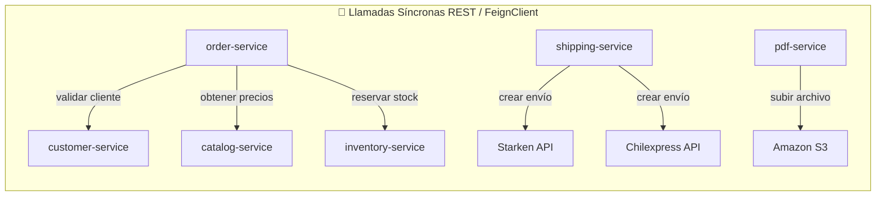
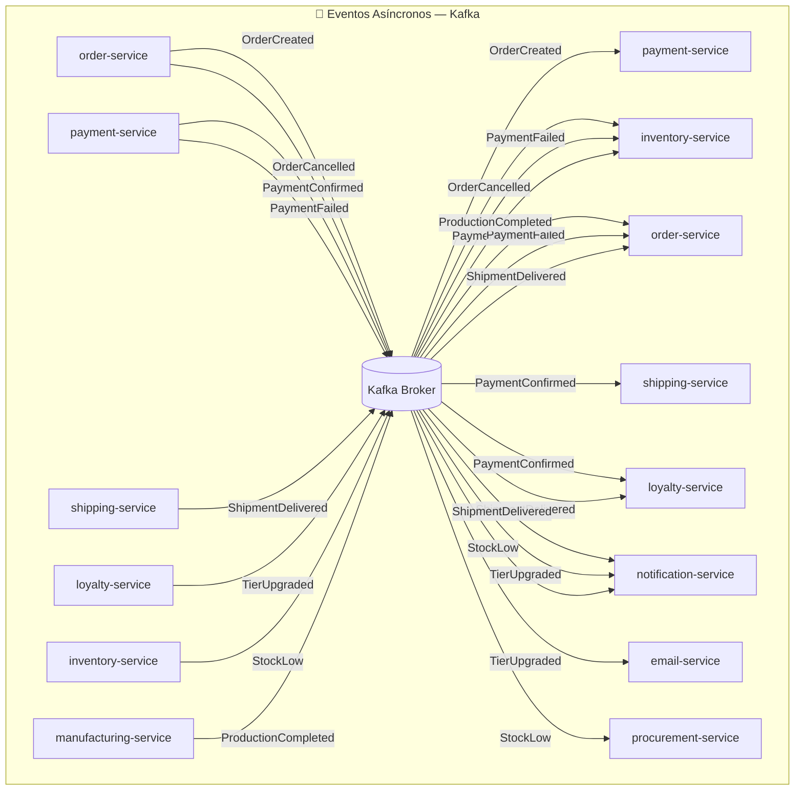
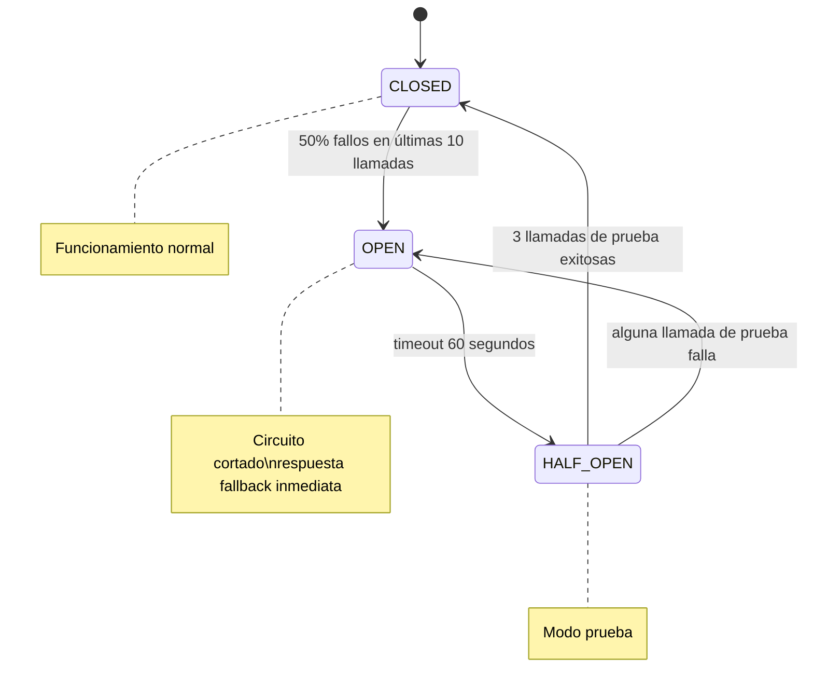
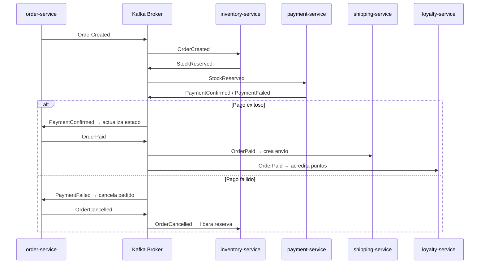

# 08 — Comunicación entre servicios

← [Volver al índice](./README.md)

---

> 🎯 **Scope del curso DSY1103:** En el curso trabajamos exclusivamente con **comunicación síncrona** (RestClient / FeignClient). Es el patrón más directo y suficiente para los proyectos del curso.
>
> 📖 **La sección de comunicación asíncrona (Kafka, Message Broker, eventos)** es **complementaria** — no evaluada, pero muy recomendada. En el mundo real la mayoría de arquitecturas de microservicios maduras combinan ambos estilos.

---

## Sincrónico vs. Asincrónico

La decisión más importante en la arquitectura de microservicios es cuándo usar comunicación **síncrona** (el llamante espera la respuesta) y cuándo **asíncrona** (el llamante no espera).

### La regla de oro

> **Sincrónico:** cuando el resultado afecta la respuesta al usuario en la misma petición.  
> **Asincrónico:** para todo lo demás.

### Cuadro comparativo

| Aspecto | REST Síncrono | Eventos Asíncronos |
|---------|--------------|-------------------|
| **Acoplamiento temporal** | Alto — ambos deben estar disponibles | Bajo — el productor no necesita al consumidor |
| **Latencia** | La del servicio más lento de la cadena | Baja en el productor; el consumidor procesa después |
| **Confiabilidad** | Si el target falla, falla el llamante | Si el consumidor falla, reintenta cuando vuelve |
| **Trazabilidad** | Fácil (stack trace lineal) | Requiere correlation ID + distributed tracing |
| **Consistencia** | Inmediata | Eventual |
| **Caso de uso ideal** | Validaciones bloqueantes, leer datos | Notificaciones, propagar cambios, coordinar workflows |

### Mapa de comunicaciones de FabriTech





---

## REST Síncrono con FeignClient

Spring Cloud OpenFeign simplifica las llamadas HTTP entre servicios:

```java
// Declarar el cliente (en order-service)
@FeignClient(
    name = "inventory-service",
    fallbackFactory = InventoryClientFallback.class
)
public interface InventoryClient {

    @PostMapping("/api/v1/stock/reserve")
    ReservationResult reserve(@RequestBody ReservationRequest request);

    @PostMapping("/api/v1/stock/release")
    void release(@RequestParam String orderId);

    @GetMapping("/api/v1/stock/{warehouseId}/{sku}")
    StockInfo getStock(@PathVariable Long warehouseId, @PathVariable String sku);
}
```

### Configuración de timeout

```yaml
# application.yml de order-service
spring:
  cloud:
    openfeign:
      client:
        config:
          inventory-service:
            connectTimeout: 2000     # 2 seg para conectar
            readTimeout: 5000        # 5 seg para leer la respuesta
          default:
            connectTimeout: 3000
            readTimeout: 8000
```

---

## Circuit Breaker con Resilience4j

El **Circuit Breaker** protege al sistema cuando un servicio dependiente falla o es lento. Funciona como un interruptor eléctrico: cuando detecta demasiados fallos, "abre el circuito" y deja de hacer llamadas, retornando una respuesta de fallback inmediata.

### Estados del Circuit Breaker



### Implementación en FabriTech

```yaml
## Configuración (application.yml de order-service)
resilience4j:
  circuitbreaker:
    instances:
      inventory-service:
        slidingWindowSize: 10                      # evalúa las últimas 10 llamadas
        minimumNumberOfCalls: 5                    # mínimo 5 antes de calcular ratio
        failureRateThreshold: 50                   # abre si >50% fallan
        waitDurationInOpenState: 60s               # espera 60s antes de probar
        permittedNumberOfCallsInHalfOpenState: 3
        recordExceptions:
          - java.io.IOException
          - java.util.concurrent.TimeoutException
          - feign.FeignException.ServiceUnavailable

      catalog-service:
        slidingWindowSize: 20
        failureRateThreshold: 40
        waitDurationInOpenState: 30s
```

```java
// Uso en el servicio
@Service
public class OrderCreationService {

    @CircuitBreaker(name = "inventory-service", fallbackMethod = "handleInventoryUnavailable")
    @TimeLimiter(name = "inventory-service")    // corta si tarda más de 5s
    public CompletableFuture<ReservationResult> reserveStock(ReservationRequest request) {
        return CompletableFuture.supplyAsync(() -> inventoryClient.reserve(request));
    }

    // Fallback: el inventario no está disponible
    public CompletableFuture<ReservationResult> handleInventoryUnavailable(
            ReservationRequest request, Throwable ex) {
        log.warn("inventory-service no disponible: {}", ex.getMessage());
        // Opción 1: rechazar el pedido (conservador — FabriTech eligió esto)
        return CompletableFuture.completedFuture(
            ReservationResult.serviceUnavailable("El inventario está temporalmente no disponible")
        );
        // Opción 2: permitir el pedido sin verificar stock (permisivo — riesgo de oversell)
    }
}
```

### Retry con backoff exponencial

```java
@Retry(name = "external-carriers", fallbackMethod = "carrierFallback")
public ShipmentResult createShipmentInCarrier(ShipmentRequest request) {
    return selectedCarrier.createShipment(request);
}
```

```yaml
resilience4j:
  retry:
    instances:
      external-carriers:
        maxAttempts: 3
        waitDuration: 1s
        enableExponentialBackoff: true
        exponentialBackoffMultiplier: 2        # 1s, 2s, 4s
        retryExceptions:
          - java.io.IOException
          - feign.RetryableException
        ignoreExceptions:
          - cl.fabritech.shipping.CarrierRejectedException  # no reintentar si el carrier rechaza
```

---

## Eventos asíncronos con Kafka

> 📖 **Contenido complementario — fuera del scope de DSY1103**
>
> Kafka y la mensajería asíncrona son temas avanzados que se estudian en cursos de arquitectura distribuida. Lo que sigue es una referencia de cómo se implementa en la práctica, ideal para cuando trabajes en proyectos reales.

### ¿Por qué Kafka?

| Característica | Kafka | RabbitMQ |
|----------------|-------|----------|
| **Persistencia** | Los mensajes persisten días/semanas | Temporal (se elimina al consumir) |
| **Replay** | Sí — un consumidor puede releer eventos pasados | No |
| **Throughput** | Muy alto (millones msg/seg) | Alto (miles msg/seg) |
| **Modelo** | Pull — el consumidor decide cuándo leer | Push — el broker envía cuando hay mensajes |
| **Orden** | Garantizado dentro de una partición | No garantizado |
| **Complejidad** | Mayor (requiere ZooKeeper/KRaft) | Menor |
| **Ideal para** | Event sourcing, auditoría, alta carga | Task queues, RPC asíncrono |

FabriTech elige **Kafka** porque necesita historial de eventos (auditoría) y replay (el `report-service` puede reprocesar eventos históricos para corregir datos).

### Estructura de un evento de dominio

Todos los eventos siguen el formato **CloudEvents**:

```json
{
  "specversion": "1.0",
  "id": "evt-8f2a3b1c",
  "source": "order-service",
  "type": "cl.fabritech.orders.OrderPaid",
  "datacontenttype": "application/json",
  "time": "2026-04-26T15:30:00Z",
  "data": {
    "orderId": "ORD-7821",
    "customerId": 456,
    "totalAmount": 89990,
    "items": [
      { "sku": "FT-ASP-001", "name": "Aspiradora Robótica", "quantity": 1, "unitPrice": 89990 }
    ],
    "paidAt": "2026-04-26T15:30:00Z"
  }
}
```

### Productor en Spring Boot

```java
@Service
public class DomainEventPublisher {

    private final KafkaTemplate<String, DomainEvent> kafkaTemplate;

    public void publish(DomainEvent event) {
        // La clave del mensaje es el ID de la entidad principal
        // → garantiza que eventos del mismo pedido van a la misma partición (orden preservado)
        kafkaTemplate.send(event.topic(), event.entityId(), event)
            .whenComplete((result, ex) -> {
                if (ex != null) {
                    log.error("Error publicando evento {}: {}", event.type(), ex.getMessage());
                    // Guardar en outbox table para reintentar
                    outboxRepository.save(OutboxEntry.from(event));
                }
            });
    }
}
```

### Consumer con idempotencia

Los eventos pueden entregarse más de una vez (Kafka garantiza "al menos una vez"). Los consumers deben ser **idempotentes**:

```java
@KafkaListener(topics = "orders.events", groupId = "loyalty-service")
public void handleOrderEvent(OrderEvent event) {
    // Verificar si ya procesamos este evento (por ID)
    if (processedEventRepository.existsById(event.id())) {
        log.info("Evento {} ya procesado, ignorando", event.id());
        return;
    }

    // Procesar el evento
    if ("OrderPaid".equals(event.type())) {
        loyaltyService.awardPoints(event.customerId(), event.totalAmount());
    }

    // Marcar como procesado (dentro de la misma transacción)
    processedEventRepository.save(new ProcessedEvent(event.id()));
}
```

---

## Saga Pattern: orquestación vs. coreografía

Cuando una operación de negocio abarca múltiples servicios, necesitamos coordinar las compensaciones si algo falla.

### Saga Coreografiada (FabriTech la usa para el flujo de pedido)

Cada servicio escucha eventos y decide qué hacer. No hay un coordinador central.



**Ventaja:** simple, sin coordinador central que se convierta en punto de fallo.  
**Desventaja:** difícil de entender el flujo completo si hay muchos servicios.

### Saga Orquestada (para flujos complejos con muchas compensaciones)

Un servicio **orquestador** coordina todos los pasos y compensaciones:

```java
// En order-service: el orquestador de la saga
@Service
public class OrderSagaOrchestrator {

    @Saga  // (con Axon Framework o similar)
    public void handle(StartOrderSagaCommand cmd) {

        // Paso 1
        sendCommand(new ReserveStockCommand(cmd.orderId(), cmd.items()));
    }

    @SagaEventHandler(associationProperty = "orderId")
    public void on(StockReservedEvent event) {
        // Paso 2
        sendCommand(new ProcessPaymentCommand(event.orderId(), event.amount()));
    }

    @SagaEventHandler(associationProperty = "orderId")
    public void on(PaymentFailedEvent event) {
        // Compensación: liberar el stock
        sendCommand(new ReleaseStockCommand(event.orderId()));
        // Marcar saga como fallida
        end();
    }

    @SagaEventHandler(associationProperty = "orderId")
    public void on(PaymentConfirmedEvent event) {
        // Paso 3
        sendCommand(new CreateShipmentCommand(event.orderId()));
        end();    // saga completada exitosamente
    }
}
```

---

## Outbox Pattern: garantía de entrega

Problema: ¿qué pasa si `order-service` guarda el pedido en BD pero luego falla antes de publicar el evento en Kafka?

```
order-service:
  1. BEGIN TRANSACTION
  2. INSERT INTO orders (...)          ← guardar en BD ✓
  3. INSERT INTO outbox (event_data)   ← guardar el evento en BD ✓
  4. COMMIT                            ← transacción atómica
  5. (proceso separado)
     SELECT * FROM outbox WHERE published = false
     → kafkaTemplate.send(event)
     → UPDATE outbox SET published = true
```

El paso 5 es un **Outbox Publisher** que corre en background cada segundo. Así se garantiza que **si el pedido se guardó, el evento se publicará eventualmente** (aunque la app caiga entre los pasos 4 y 5).

---

*← [07 — Servicios Auxiliares](./07_servicios-auxiliares.md) | Siguiente: [09 — Strangler Fig →](./09_strangler-fig.md)*
