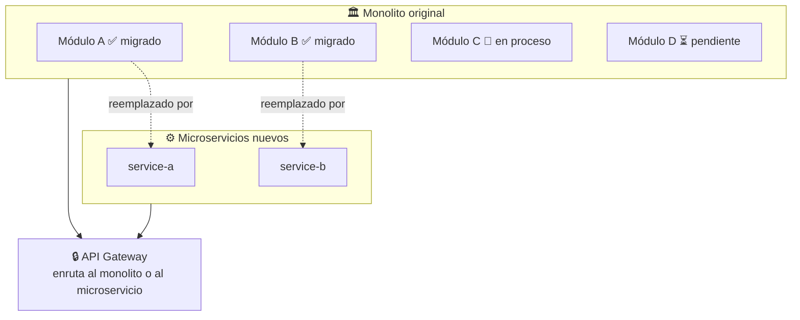

# 09 — Estrategia de migración: Strangler Fig

← [Volver al índice](./README.md)

---

## El patrón

El **Strangler Fig** (higo estrangulador) toma su nombre de un árbol tropical que crece alrededor de otro árbol existente, reemplazándolo lentamente sin derribar el árbol original hasta que está completamente sustituido.



El monolito sigue funcionando durante toda la migración. El API Gateway decide a qué destino enrutar cada request. A medida que los microservicios están listos, el gateway redirige el tráfico y eventualmente el monolito se retira.

---

## Principios del Strangler Fig

1. **Nunca Big Bang** — no se reescribe todo a la vez.
2. **El monolito no cambia** durante la migración de un dominio (o los cambios son mínimos).
3. **Siempre hay rollback** — el API Gateway puede revertir el tráfico al monolito en segundos.
4. **Orden correcto** — se migran primero los dominios con menos dependencias.
5. **Verificación en producción** — cada servicio se prueba con tráfico real antes de retirar el monolito.

---

## Hoja de ruta detallada de FabriTech

### Fase 0: Preparación (semanas 1-4)

**Objetivo:** crear la infraestructura sin tocar el monolito.

```
Tareas:
  ✓ Instalar y configurar el API Gateway (Spring Cloud Gateway)
  ✓ Desplegar el Service Registry (Eureka)
  ✓ Desplegar el Config Server
  ✓ Configurar el stack de observabilidad (Prometheus + Grafana + Zipkin)
  ✓ Implementar el CI/CD pipeline base (GitHub Actions → Docker → Kubernetes)
  ✓ Registrar el monolito en Eureka (como "legacy-service")
  ✓ El API Gateway redirige TODO el tráfico al monolito (estado inicial)

Validación:
  Todo funciona exactamente igual que antes, pero con el Gateway por delante.
```

### Fase 1: auth-service (semanas 5-8)

**Por qué primero:** el módulo de auth es pequeño, bien delimitado y ningún otro módulo depende de él en el sentido de ejecución de negocio (solo lo llaman para validar tokens).

```
Tareas:
  1. Construir auth-service con Spring Boot (JWT, BCrypt, refresh tokens)
  2. Migrar la tabla users del monolito → BD propia de auth-service
     (con script de migración SQL + validación de conteo de registros)
  3. Configurar el Gateway para que /api/v1/auth/** → auth-service
  4. Canary release: 10% del tráfico → auth-service, 90% → monolito
  5. Monitorear durante 48h
  6. Si OK: 100% → auth-service
  7. Eliminar el módulo de auth del monolito
```

**Script de validación post-migración:**
```sql
-- Verificar que todos los usuarios se migraron
SELECT COUNT(*) FROM monolito_db.users;           -- debe coincidir con:
SELECT COUNT(*) FROM auth_db.users;

-- Verificar que los hash de contraseñas son iguales
SELECT u1.email, u1.password_hash = u2.password_hash as match
FROM monolito_db.users u1
JOIN auth_db.users u2 ON u1.email = u2.email
WHERE u1.password_hash != u2.password_hash;        -- debe retornar 0 filas
```

### Fase 2: catalog-service (semanas 9-12)

**Por qué aquí:** el catálogo es principalmente de lectura y tiene pocas escrituras. Migrar los reads primero reduce el riesgo.

```
Tareas:
  1. Construir catalog-service
  2. Migrar tablas: products, categories, product_images
  3. Configurar el Gateway: /api/v1/products/** → catalog-service
  4. El monolito puede seguir leyendo el catálogo vía API (en lugar de la BD)
     [Fase transitoria: el monolito hace HTTP calls a catalog-service]
  5. Canary release → validación → 100%
  6. Eliminar módulo de productos del monolito
```

**Patrón "Monolito llama al nuevo servicio":**

Durante la transición, el monolito llama al nuevo servicio en lugar de a la BD directamente:

```java
// En el monolito, antes de la migración:
@Autowired
private ProductRepository productRepository;

public Product getProduct(String sku) {
    return productRepository.findBySku(sku).orElseThrow();
}

// Durante la transición (monolito llama a catalog-service):
@Autowired
private CatalogServiceClient catalogServiceClient;  // ← nuevo cliente HTTP

public Product getProduct(String sku) {
    // Ya no lee de la BD propia — delega al nuevo servicio
    return catalogServiceClient.getProduct(sku);
}
```

### Fase 3: branch-service (semanas 13-14)

**Por qué aquí:** datos maestros simples, pocas escrituras, bajo riesgo.

```
Tareas:
  1. Construir branch-service
  2. Migrar tabla branches (12 sucursales = pocos registros)
  3. Gateway: /api/v1/branches/** → branch-service
  4. Deploy y validación
```

### Fase 4: customer-service (semanas 15-20)

**Complejidad:** muchos módulos del monolito usan datos de clientes. Requiere más coordinación.

```
Tareas:
  1. Construir customer-service
  2. Migrar tablas: customers, customer_addresses
  3. CUIDADO: orders y invoices tienen FK a customers en el monolito
     → Las FKs deben eliminarse antes de separar las BDs
     → Se reemplaza con referencia por ID (soft reference)
  4. Gateway: /api/v1/customers/** → customer-service
  5. Canary release con período de validación más largo (7 días)
```

**Migración de FK a referencia soft:**

```sql
-- ANTES: FK real
CREATE TABLE orders (
    customer_id BIGINT NOT NULL REFERENCES customers(id)
);

-- PASO 1: eliminar la constraint (la BD ahora solo tiene el ID, sin integridad referencial)
ALTER TABLE orders DROP CONSTRAINT fk_orders_customer;

-- PASO 2: mover la tabla customers a la nueva BD
-- pg_dump -t customers monolito_db | psql customer_db

-- PASO 3: actualizar el código del monolito para obtener datos de clientes via API
-- (no más JOIN — se hace una llamada HTTP a customer-service)
```

### Fase 5: loyalty-service (semanas 21-24)

Depende de customer-service (ya migrado en Fase 4).

```
Tareas:
  1. Construir loyalty-service
  2. Migrar tablas: loyalty_accounts, points_transactions, reward_rules
  3. Subscribir a eventos: CustomerRegistered (de customer-service)
  4. Subscribir a eventos: OrderPaid (cuando order-service esté listo)
     [Transitorio: el monolito publica OrderPaid en Kafka]
  5. Gateway: /api/v1/loyalty/** → loyalty-service
```

### Fases 6-8: PDF, Email, Notification (semanas 25-30)

Servicios sin estado de negocio, fáciles de extraer.

```
Para cada uno:
  1. Construir el servicio auxiliar
  2. Publicar su API
  3. Actualizar el monolito para llamar al servicio auxiliar en lugar de ejecutarlo internamente
  4. Validar
  5. Eliminar el módulo del monolito
```

### Fase 9: inventory-service (semanas 31-38)

El más crítico. Requiere el mayor cuidado.

```
Preparación específica:
  1. Auditar todos los lugares del monolito que leen/escriben inventario
     (pueden ser decenas de sitios)
  2. Definir el contrato de API completo antes de construir
  3. Construir con tests de integración exhaustivos
  4. Implementar el patrón de reserva (reserve/confirm/release) en paralelo con el monolito
  5. Período de "Parallel Run": ambos sistemas actualizan el stock simultáneamente
     durante 2 semanas, y se verifican que los números coincidan

Parallel Run:
  order-service (monolito) actualiza stock → en monolito_db
  order-service (monolito) también llama → inventory-service (nuevo)
  Se compara el stock entre ambas BDs cada hora
  Si divergen → alerta → investigar causa

  Al cabo de 2 semanas sin divergencias: cortar el monolito, solo inventory-service es la fuente de verdad
```

### Fase 10: order-service (semanas 39-48)

El más complejo. Depende de inventory-service (Fase 9), customer-service (Fase 4) y catalog-service (Fase 2).

```
Desafíos específicos:
  - El OrderService del monolito tiene 1.247 líneas → dividir en:
    * OrderCreationSaga (Paso 1-4 del flujo)
    * OrderStateMachine (máquina de estados)
    * OrderQueryService (búsquedas, historial)
  - Migrar historial de pedidos (años de datos)
    → Script de migración por lotes (100.000 registros a la vez)
    → Validar sumas de subtotales para verificar integridad
```

### Fases 11-15: payment, shipping, procurement, manufacturing, report

Continúan con el mismo patrón. La última en retirarse es la tabla "central" del monolito.

### Fase Final: retirar el monolito

```
Condiciones de salida:
  ✓ 0% del tráfico enrutado al monolito por el Gateway
  ✓ 30 días sin incidentes relacionados con la migración
  ✓ Todos los tests de humo pasan en el nuevo stack
  ✓ El equipo de TI tiene runbooks actualizados para cada servicio

Acciones:
  1. Desactivar el proceso del monolito
  2. Hacer backup final de monolito_db
  3. Archivar el repositorio del monolito (no eliminar — historial valioso)
  4. Festejar 🎉
```

---

## Migración de base de datos: Expand-Contract

La estrategia **Expand-Contract** permite separar una BD monolítica de forma segura:

```
EXPAND:
  1. Agregar las nuevas columnas/tablas en la BD monolítica (sin eliminar las viejas)
  2. El código empieza a escribir en las columnas nuevas Y en las viejas (dual write)

CONTRACT:
  3. Verificar que los datos nuevos son correctos
  4. Eliminar las escrituras a las columnas viejas del código
  5. Eliminar las columnas/tablas viejas de la BD

Ejemplo: separar customer.email del monolito a customer-service
  Expand:   customer_service_db.customers.email ← se crea y empieza a recibir datos
  Contract: monolito.customers.email se elimina del código, luego de la BD
```

---

## Canary Releases durante la migración

Un **Canary Release** envía un pequeño porcentaje del tráfico al nuevo servicio mientras el resto va al monolito. Así se valida el comportamiento en producción con riesgo acotado.

```yaml
# Configuración en el API Gateway (Spring Cloud Gateway)
spring:
  cloud:
    gateway:
      routes:
        # 10% del tráfico va al nuevo inventory-service
        - id: inventory-service-canary
          uri: lb://inventory-service
          predicates:
            - Path=/api/v1/stock/**
            - Weight=inventory-group, 10          # ← 10%
          filters:
            - AuthFilter

        # 90% del tráfico va al monolito
        - id: inventory-monolith
          uri: lb://legacy-monolith
          predicates:
            - Path=/api/v1/stock/**
            - Weight=inventory-group, 90          # ← 90%
```

Se monitorea durante 48h. Si la tasa de error del canary es ≤ la del monolito → aumentar al 50% → luego 100%.

---

*← [08 — Comunicación](./08_comunicacion.md) | Siguiente: [10 — Buenas Prácticas →](./10_buenas-practicas.md)*
