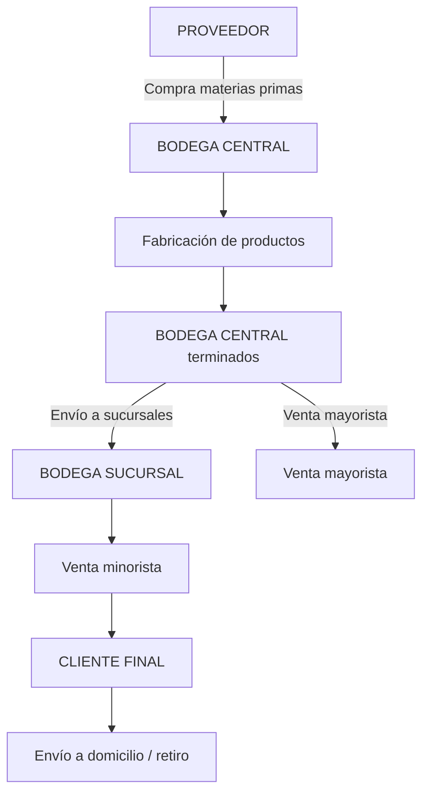
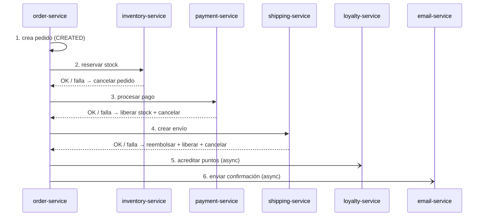
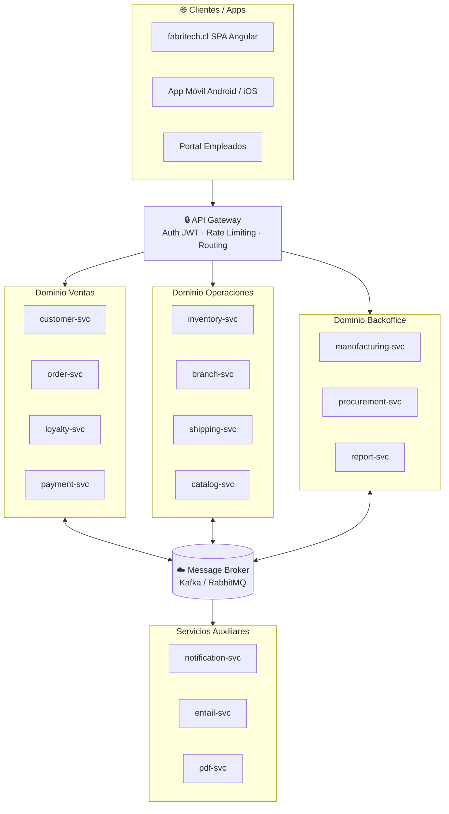

# 🏗️ De Monolito a Microservicios

## Buenas prácticas para dividir un sistema monolítico

---

## Índice

1. [¿Por qué dividir un monolito?](#1-por-qué-dividir-un-monolito)
2. [Caso de estudio: FabriTech S.A.](#2-caso-de-estudio-fabritech-sa)
3. [El monolito actual](#3-el-monolito-actual)
4. [Identificando límites de contexto](#4-identificando-límites-de-contexto) *(📖 DDD — complementario)*
5. [Mapa de microservicios propuesto](#5-mapa-de-microservicios-propuesto) *(📖 API Gateway, Service Registry, Config Server — complementario)*
6. [Descripción de cada servicio](#6-descripción-de-cada-servicio)
7. [Servicios auxiliares](#7-servicios-auxiliares)
8. [Comunicación entre servicios](#8-comunicación-entre-servicios) *(✅ síncrono | 📖 async/Kafka — complementario)*
9. [Estrategia de migración — Strangler Fig](#9-estrategia-de-migración--strangler-fig)
10. [Buenas prácticas](#10-buenas-prácticas) *(📖 Prometheus, Grafana, Zipkin — complementario)*
11. [Anti-patrones a evitar](#11-anti-patrones-a-evitar)
12. [Checklist de migración](#12-checklist-de-migración)

---

## 🎯 Alcance de este extra y el curso DSY1103

> Este extra cubre un espectro amplio del mundo de microservicios **a propósito**: el objetivo es darte el panorama completo para que entiendas el contexto real en el que operan los sistemas que construirás.
>
> Sin embargo, no todo el contenido es parte del programa del curso. La siguiente tabla te ayuda a priorizar:

| Tema | ¿En el curso? | Sección |
|------|:---:|---------|
| Arquitectura de microservicios (qué son, cuándo usarlos) | ✅ Sí | §1, §2, §3 |
| Comunicación **síncrona** con RestClient / FeignClient | ✅ Sí | §8 (primera parte) |
| Descripción de servicios y su API REST | ✅ Sí | §6 |
| Estrategia Strangler Fig (conocimiento de migración) | ✅ Sí | §9 |
| **DDD y Bounded Contexts** | 📖 Opcional | §4 |
| **Comunicación asíncrona (Kafka / Message Broker)** | 📖 Complementario | §8 |
| **API Gateway** | 📖 Complementario | §5 |
| **Service Discovery & Registry (Eureka/Consul)** | 📖 Complementario | §5 |
| **Config Server** | 📖 Complementario | §5 |
| **Observabilidad: Prometheus, Grafana, Zipkin** | 📖 Complementario | §10 |

> - ✅ **En el curso:** contenido evaluable del programa DSY1103.
> - 📖 **Complementario:** no es evaluado, pero te hace mejor profesional. Se indica explícitamente en cada sección.

---

## 1. ¿Por qué dividir un monolito?

Un **monolito** es una aplicación donde todo el código —lógica de negocio, acceso a datos, presentación— convive en un único proceso y se despliega como una sola unidad. No es malo por definición; de hecho, **la mayoría de los sistemas exitosos empezaron como monolitos**.

El problema aparece cuando el sistema crece:

| Síntoma en el monolito | Consecuencia |
|------------------------|--------------|
| Un cambio pequeño requiere redesplegar todo | Riesgo alto, deploys lentos |
| El equipo se bloquea entre sí al modificar el mismo código | Conflictos de merge, coordinación costosa |
| La base de datos es un único punto de fallo | Un bug tumba todo |
| Escalar un módulo obliga a escalar todo | Costo innecesario de infraestructura |
| El tiempo de build/test crece semana a semana | Ciclo de desarrollo lento |
| Nadie entiende el sistema completo | Acoplamiento invisible, deuda técnica |

Los **microservicios** proponen dividir el sistema en servicios pequeños, independientes, con responsabilidades claras, que se comunican entre sí por red.

> ⚠️ **Advertencia:** los microservicios no eliminan la complejidad, la redistribuyen. Antes de migrar, asegúrate de entender bien los límites de tu dominio — si los límites son incorrectos, solo habrás creado un **monolito distribuido**, que es lo peor de ambos mundos.

> 🔎 [Ver análisis completo →](./01_por-que-migrar.md)

---

## 2. Caso de estudio: FabriTech S.A.

**FabriTech S.A.** es una empresa mediana con las siguientes características:

| Aspecto | Detalle |
|---------|---------|
| **Actividad** | Fabricación y venta de productos propios (electrónica doméstica) |
| **Casa central** | Una planta industrial + oficinas + bodega central + punto de venta mayorista |
| **Sucursales** | 12 sucursales distribuidas en distintas ciudades |
| **Proveedores** | ~40 proveedores de materias primas y componentes |
| **Clientes** | Consumidores finales (venta minorista en sucursales y web) + distribuidores (venta mayorista desde casa central) |
| **Logística** | Flota propia de 5 camiones para distribución entre casa central y sucursales; contratos con Starken, Chilexpress y DHL para envíos a clientes finales |
| **Empleados** | ~300 personas entre fabricación, ventas, logística y administración |

### Flujos principales del negocio



> 🔎 [Ver caso completo →](./02_caso-fabritech.md)

---

## 3. El monolito actual

El sistema monolítico de FabriTech tiene un único proyecto con los siguientes módulos mezclados:

```
fabritech-monolito/
├── controllers/
│   ├── ProductController.java
│   ├── ManufacturingController.java
│   ├── SupplierController.java
│   ├── InventoryController.java
│   ├── BranchController.java
│   ├── CustomerController.java
│   ├── OrderController.java
│   ├── LoyaltyController.java
│   ├── ShippingController.java
│   └── ReportController.java
├── services/           (toda la lógica de negocio mezclada)
├── repositories/       (todo acceso a datos sobre la misma BD)
├── models/             (>80 entidades JPA en el mismo esquema)
└── resources/
    └── application.yml (una BD, un servidor, un deploy)
```

### Problemas concretos que ya sufre FabriTech

- El equipo de logística no puede desplegar su módulo de envíos sin congelar a los equipos de ventas y fabricación.
- Un bug en el módulo de reportes tiró el sistema de ventas tres veces en el último mes.
- Escalar el módulo de e-commerce en temporada alta obliga a escalar también fabricación y backoffice.
- El módulo de fidelización hace 12 JOINs sobre la base de datos central para calcular los puntos de un cliente.
- Nadie toca el módulo de nóminas porque "siempre se rompe algo más".

> 🔎 [Ver análisis del monolito →](./03_el-monolito.md)

---

## 4. Identificando límites de contexto

Antes de definir los microservicios, se aplica **Domain-Driven Design (DDD)** para identificar los **Bounded Contexts** (límites de contexto): zonas del sistema donde los conceptos tienen significado propio y coherente.

### Herramienta: Event Storming

El equipo realiza un **Event Storming** — una sesión colaborativa donde se listan todos los eventos de negocio que ocurren en el sistema y se agrupan por dominio:

| Evento de negocio | Dominio |
|-------------------|---------|
| `MaterialesRecibidos` | Compras |
| `OrdenDeFabricacionIniciada` | Fabricación |
| `ProductoTerminadoIngresadoABodega` | Inventario |
| `TransferenciaASucursalDespachada` | Inventario / Envíos |
| `StockDeProductoActualizado` | Inventario |
| `ClienteRegistrado` | Clientes |
| `PedidoCreado` | Pedidos |
| `PagoConfirmado` | Pagos |
| `PuntosFidelizaciónAcreditados` | Fidelización |
| `EnvioCreado` | Envíos |
| `EnvioEntregado` | Envíos |
| `FacturaGenerada` | Pagos |
| `ReporteDeVentasSolicitado` | Reportes |

### Criterios para definir los límites

Al agrupar los eventos, se aplican tres preguntas:

1. **¿Cambia independientemente?** — Si el módulo de logística puede evolucionar sin tocar el de ventas, son dominios separados.
2. **¿Tiene su propio lenguaje?** — El concepto "Producto" en Catálogo (nombre, descripción, foto) es diferente del "Producto" en Inventario (SKU, stock, ubicación en bodega).
3. **¿Tiene su propio dueño?** — El equipo de fidelización es quien define las reglas de puntos, no el equipo de ventas.

> 🔎 [Ver bounded contexts →](./04_bounded-contexts.md)

---

## 5. Mapa de microservicios propuesto

### Servicios de dominio

| # | Servicio | Puerto | Responsabilidad |
|---|----------|--------|-----------------|
| 1 | `catalog-service` | 8001 | Catálogo de productos: nombre, descripción, precio de venta, categorías |
| 2 | `manufacturing-service` | 8002 | Órdenes de producción, BOM (lista de materiales), control de calidad |
| 3 | `procurement-service` | 8003 | Proveedores, órdenes de compra, recepción de materias primas |
| 4 | `inventory-service` | 8004 | Stock en bodega central y bodegas de sucursales, movimientos de inventario |
| 5 | `branch-service` | 8005 | Sucursales: datos, zona geográfica, bodega asignada, venta mayorista |
| 6 | `customer-service` | 8006 | Registro de compradores, perfil, historial de compras |
| 7 | `order-service` | 8007 | Ciclo de vida de pedidos, validación de stock, historial de órdenes |
| 8 | `loyalty-service` | 8008 | Programa de recompensas: acumulación de puntos, canjes, tiers |
| 9 | `shipping-service` | 8009 | Envíos a sucursales y clientes, flota propia + carriers externos |
| 10 | `payment-service` | 8010 | Pagos, facturación, notas de crédito |

### Servicios auxiliares

| # | Servicio | Puerto | Responsabilidad |
|---|----------|--------|-----------------|
| 11 | `auth-service` | 8011 | Autenticación JWT, gestión de usuarios internos y permisos |
| 12 | `notification-service` | 8012 | Push notifications, SMS, notificaciones in-app |
| 13 | `email-service` | 8013 | Emails transaccionales (confirmaciones, alertas, newsletters) |
| 14 | `pdf-service` | 8014 | Generación de PDFs: facturas, guías de despacho, informes |
| 15 | `report-service` | 8015 | Analítica, reportes de ventas, inventario, producción |

### Infraestructura

| Componente | Propósito |
|------------|-----------|
| **API Gateway** | Punto único de entrada, routing, rate limiting, autenticación |
| **Service Registry** | Descubrimiento de servicios (Eureka / Consul) |
| **Message Broker** | Comunicación asíncrona entre servicios (Kafka o RabbitMQ) |
| **Config Server** | Configuración centralizada por ambiente |
| **Distributed Tracing** | Seguimiento de llamadas entre servicios (Zipkin) |

> 🔎 [Ver mapa de servicios →](./05_mapa-servicios.md)

---

## 6. Descripción de cada servicio

### 📦 catalog-service

Gestiona el **catálogo de productos terminados** que FabriTech fabrica y vende.

**Datos propios:**
```
Product { id, sku, name, description, category, basePrice, images, isActive }
Category { id, name, description }
```

**APIs principales:**
```
GET  /api/v1/products            → lista paginada con filtros
GET  /api/v1/products/{sku}      → detalle de producto
POST /api/v1/products            → crear producto (admin)
PUT  /api/v1/products/{sku}      → actualizar
```

**Eventos que publica:**
- `ProductCreated`, `ProductPriceUpdated`, `ProductDeactivated`

> El catálogo **no sabe nada de stock**. Solo define qué productos existen y cuánto cuestan. El stock es responsabilidad de `inventory-service`.

---

### 🏭 manufacturing-service

Gestiona la **producción de productos**.

**Datos propios:**
```
ProductionOrder { id, productSku, quantity, status, startedAt, completedAt }
BillOfMaterials { id, productSku, rawMaterialId, quantityRequired }
QualityCheck    { id, orderId, result, inspectedAt }
```

**APIs principales:**
```
POST /api/v1/production-orders           → crear orden de producción
GET  /api/v1/production-orders/{id}      → estado de una orden
PUT  /api/v1/production-orders/{id}/complete → marcar como terminada
```

**Eventos que publica:**
- `ProductionOrderCreated`
- `ProductionCompleted` → lo consume `inventory-service` para ingresar stock

**Llama a:**
- `procurement-service` (sync): verificar disponibilidad de materias primas antes de iniciar producción
- `inventory-service` (async via evento): al terminar, informa las unidades producidas

---

### 🛒 procurement-service

Gestiona **proveedores y compra de materias primas**.

**Datos propios:**
```
Supplier       { id, name, contact, taxId, paymentTerms }
RawMaterial    { id, supplierId, name, unit, currentStock }
PurchaseOrder  { id, supplierId, items, status, expectedDelivery }
```

**APIs principales:**
```
GET  /api/v1/suppliers                   → lista de proveedores
POST /api/v1/purchase-orders             → emitir orden de compra
PUT  /api/v1/purchase-orders/{id}/receive → registrar recepción de materiales
```

**Eventos que publica:**
- `RawMaterialReceived` → lo consume `manufacturing-service`
- `StockAlertTriggered` (cuando el stock de una materia prima cae bajo el mínimo)

---

### 🗄️ inventory-service

**Servicio más crítico**: gestiona el stock en bodega central y en cada sucursal.

**Datos propios:**
```
WarehouseLocation { id, type: CENTRAL | BRANCH, branchId? }
StockEntry        { id, warehouseId, productSku, quantity, reservedQuantity }
StockMovement     { id, warehouseId, productSku, type: IN|OUT|TRANSFER, quantity, reason }
```

**APIs principales:**
```
GET  /api/v1/stock/{warehouseId}/{sku}          → stock disponible
POST /api/v1/stock/reserve                      → reservar stock (antes de vender)
POST /api/v1/stock/confirm                      → confirmar salida
POST /api/v1/stock/transfer                     → transferencia central → sucursal
GET  /api/v1/stock/{warehouseId}/low-stock      → productos bajo mínimo
```

**Patrón de reserva antes de vender:**
```
1. order-service llama POST /stock/reserve     → stock queda reservado
2. payment-service confirma el pago
3. order-service llama POST /stock/confirm     → stock sale definitivamente
   O bien:
3b. Si el pago falla → POST /stock/release     → libera la reserva
```

**Eventos que publica:**
- `StockReserved`, `StockReleased`, `StockLow`, `StockTransferred`

---

### 🏪 branch-service

Gestiona las **sucursales** de la empresa.

**Datos propios:**
```
Branch { id, name, city, address, phone, warehouseId, managerEmployeeId, isActive }
```

**APIs principales:**
```
GET  /api/v1/branches          → lista de sucursales
GET  /api/v1/branches/{id}     → detalle de sucursal
```

> Es un servicio de **datos maestros** — raramente cambia. Otros servicios lo consultan para obtener datos de la sucursal asociada a un pedido o una bodega.

---

### 👤 customer-service

Gestiona el **registro y perfil de compradores**.

**Datos propios:**
```
Customer       { id, firstName, lastName, email, phone, rut, createdAt }
CustomerAddress { id, customerId, street, city, region, isDefault }
```

**APIs principales:**
```
POST /api/v1/customers               → registrar nuevo cliente
GET  /api/v1/customers/{id}          → perfil de cliente
PUT  /api/v1/customers/{id}          → actualizar datos
GET  /api/v1/customers/{id}/addresses → direcciones registradas
```

**Eventos que publica:**
- `CustomerRegistered` → lo consume `loyalty-service` para crear la cuenta de puntos

---

### 🛍️ order-service

El **corazón del ciclo de venta**: gestiona el ciclo de vida de los pedidos.

**Datos propios:**
```
Order      { id, customerId, branchId, type: ONLINE|IN_STORE, status, total, createdAt }
OrderItem  { id, orderId, productSku, quantity, unitPrice }
```

**Ciclo de vida de un pedido:**
```
CREATED → STOCK_RESERVED → PAYMENT_PENDING → PAID → DISPATCHED → DELIVERED
                                                               ↘ CANCELLED
```

**APIs principales:**
```
POST /api/v1/orders              → crear pedido
GET  /api/v1/orders/{id}         → estado del pedido
GET  /api/v1/orders/customer/{customerId} → historial del cliente
PUT  /api/v1/orders/{id}/cancel  → cancelar
```

**Llama a (sync):**
- `inventory-service`: reservar stock al crear el pedido
- `customer-service`: validar que el cliente existe

**Publica eventos:**
- `OrderCreated` → lo consume `payment-service`
- `OrderPaid` → lo consume `shipping-service`, `loyalty-service`
- `OrderCancelled` → lo consume `inventory-service` (para liberar reserva)

---

### 🌟 loyalty-service

Gestiona el **programa de fidelización**: puntos, canjes y niveles de cliente.

**Datos propios:**
```
LoyaltyAccount { id, customerId, points, tier: BRONZE|SILVER|GOLD|PLATINUM }
PointsTransaction { id, accountId, type: EARN|REDEEM, amount, orderId, createdAt }
RewardRule     { id, spendAmount, earnPoints, validFrom, validTo }
```

**APIs principales:**
```
GET  /api/v1/loyalty/{customerId}          → saldo de puntos y tier
GET  /api/v1/loyalty/{customerId}/history  → historial de transacciones
POST /api/v1/loyalty/redeem                → canjear puntos en un pedido
```

**Consume eventos:**
- `CustomerRegistered` → crea la cuenta de puntos
- `OrderPaid` → acredita puntos según el monto comprado

> El tier (Bronze/Silver/Gold/Platinum) se recalcula automáticamente cuando el saldo de puntos cruza los umbrales definidos.

---

### 🚚 shipping-service

Gestiona **todos los envíos**: desde la casa central a sucursales (reabastecimiento) y desde sucursales o e-commerce a clientes finales.

**Datos propios:**
```
Shipment   { id, type: REPLENISHMENT|CUSTOMER_DELIVERY, originId, destinationId,
             carrierId, trackingCode, status, estimatedDelivery }
Carrier    { id, name, type: OWN_FLEET|THIRD_PARTY, apiEndpoint, apiKey }
Fleet      { id, vehicleId, driverId, capacity, currentLocation }
```

**APIs principales:**
```
POST /api/v1/shipments                    → crear envío
GET  /api/v1/shipments/{id}/track         → tracking en tiempo real
PUT  /api/v1/shipments/{id}/delivered     → marcar como entregado
GET  /api/v1/shipments/branch/{branchId}  → envíos pendientes hacia una sucursal
```

**Carriers externos integrados:**

| Carrier | Tipo | Integración |
|---------|------|-------------|
| Flota propia | `OWN_FLEET` | Sistema interno GPS |
| Starken | `THIRD_PARTY` | REST API + webhook |
| Chilexpress | `THIRD_PARTY` | REST API + webhook |
| DHL | `THIRD_PARTY` | REST API + webhook |

**Consume eventos:**
- `OrderPaid` → crea el envío al cliente

**Publica eventos:**
- `ShipmentCreated`, `ShipmentDispatched`, `ShipmentDelivered`
→ los consume `notification-service` para avisar al cliente

---

### 💳 payment-service

Gestiona **pagos y facturación**.

**Datos propios:**
```
Payment  { id, orderId, amount, method: CREDIT|DEBIT|TRANSFER|CASH, status, processedAt }
Invoice  { id, orderId, customerId, items, subtotal, tax, total, pdfUrl }
```

**APIs principales:**
```
POST /api/v1/payments              → procesar pago
GET  /api/v1/payments/{orderId}    → estado de pago de un pedido
GET  /api/v1/invoices/{id}         → datos de factura
GET  /api/v1/invoices/{id}/pdf     → descargar PDF
```

**Consume eventos:**
- `OrderCreated` → queda en espera de pago

**Publica eventos:**
- `PaymentConfirmed` → lo consumen `order-service`, `inventory-service`
- `PaymentFailed` → lo consume `order-service` para cancelar

**Llama a (async):**
- `pdf-service`: genera la factura en PDF al confirmar el pago

> 🔎 [Ver descripción detallada de servicios →](./06_descripcion-servicios.md)

---

## 7. Servicios auxiliares

Los servicios auxiliares son **transversales**: no pertenecen a ningún dominio de negocio específico, sino que proveen capacidades técnicas que otros servicios consumen.

### 🔐 auth-service

Gestiona la **identidad y autenticación** de los usuarios internos del sistema (empleados, administradores) y de los clientes externos.

```
User    { id, email, passwordHash, roles: [ADMIN, MANAGER, CASHIER, CUSTOMER] }
Session { id, userId, token, expiresAt }
```

```
POST /api/v1/auth/login          → devuelve JWT
POST /api/v1/auth/refresh        → refresca el token
POST /api/v1/auth/logout
GET  /api/v1/auth/me             → datos del usuario autenticado
```

El **API Gateway** valida el JWT contra `auth-service` antes de enrutar la petición al servicio destino.

> `customer-service` gestiona el *perfil* del comprador; `auth-service` gestiona sus *credenciales de acceso*. Son responsabilidades distintas.

---

### 🔔 notification-service

Envía **notificaciones en tiempo real** a usuarios finales y empleados.

**Canales soportados:**
| Canal | Casos de uso |
|-------|--------------|
| Push (FCM/APNs) | Pedido listo, envío en camino, oferta especial |
| SMS (Twilio) | Código de verificación, alerta de entrega |
| In-app | Notificación en el panel del empleado |

**API:**
```
POST /api/v1/notifications/send
{
  "recipientId": "customer-456",
  "channel": "PUSH",
  "title": "Tu pedido está en camino",
  "body": "Tu pedido #7821 fue despachado hoy.",
  "data": { "orderId": "7821" }
}
```

**Consume eventos:** `ShipmentDispatched`, `ShipmentDelivered`, `StockLow`

> `notification-service` **no sabe nada de lógica de negocio**. Solo recibe un mensaje estructurado y lo entrega por el canal indicado.

---

### 📧 email-service

Envía **emails transaccionales** usando plantillas.

**Plantillas disponibles:**
| Código | Asunto |
|--------|--------|
| `ORDER_CONFIRMED` | "Tu pedido #{{orderId}} fue confirmado" |
| `SHIPMENT_DISPATCHED` | "Tu pedido está en camino — tracking: {{trackingCode}}" |
| `INVOICE_READY` | "Tu factura está disponible" |
| `LOYALTY_TIER_UPGRADE` | "¡Felicidades! Subiste a Gold 🥇" |
| `STOCK_ALERT_INTERNAL` | "Alerta: stock bajo en {{productSku}}" |
| `PURCHASE_ORDER_SENT` | "Orden de compra enviada a {{supplierName}}" |

**API:**
```
POST /api/v1/emails/send
{
  "to": "cliente@ejemplo.cl",
  "template": "ORDER_CONFIRMED",
  "variables": {
    "orderId": "7821",
    "customerName": "Ana García",
    "total": "$45.990"
  }
}
```

**Proveedor subyacente:** SendGrid, AWS SES, o SMTP propio — encapsulado dentro del servicio. Los otros servicios no saben (ni les importa) qué proveedor se usa.

---

### 📄 pdf-service

Genera **documentos PDF** a partir de datos y plantillas HTML.

**Documentos que genera:**

| Documento | Quién lo solicita | Evento desencadenante |
|-----------|-------------------|-----------------------|
| Factura / Boleta | `payment-service` | `PaymentConfirmed` |
| Guía de despacho | `shipping-service` | `ShipmentCreated` |
| Orden de compra | `procurement-service` | `PurchaseOrderCreated` |
| Reporte de ventas | `report-service` | Solicitud manual (admin) |
| Reporte de inventario | `report-service` | Solicitud manual (admin) |
| Etiqueta de envío | `shipping-service` | `ShipmentCreated` |

**API:**
```
POST /api/v1/pdf/generate
{
  "template": "INVOICE",
  "data": { "orderId": "7821", "items": [...], "total": 45990 }
}
→ Response: { "url": "https://storage.fabritech.cl/invoices/7821.pdf" }
```

Internamente usa [Thymeleaf](https://www.thymeleaf.org/) + [Flying Saucer](https://github.com/flyingsaucerproject/flyingsaucer) o [iText](https://itextpdf.com/) para renderizar HTML a PDF, y sube el archivo a S3 o un storage propio.

---

### 📊 report-service

Genera **reportes de negocio** bajo demanda, sin impactar el rendimiento de los servicios transaccionales.

**Reportes disponibles:**
- Ventas por sucursal (período, producto, canal)
- Inventario actual por bodega
- Productos más vendidos
- Clientes con mayor valor de por vida (LTV)
- Órdenes de producción del mes
- Rendimiento de proveedores (lead time, calidad)

**Patrón CQRS:** `report-service` tiene su propia base de datos de lectura (replica/denormalizada), alimentada por los eventos que publican los demás servicios. Así las consultas analíticas no compiten con las escrituras transaccionales.

```
order-service publica → OrderPaid
                           ↓
                    report-service consume y escribe
                    en su BD de lectura (Elasticsearch o PostgreSQL denormalizado)
                           ↓
                    GET /api/v1/reports/sales → query rápida
```

> 🔎 [Ver servicios auxiliares →](./07_servicios-auxiliares.md)

---

## 8. Comunicación entre servicios

### Sincrónica vs. Asincrónica

| Tipo | Cuándo usarla | Tecnología |
|------|--------------|------------|
| **REST síncrono** | El llamante necesita la respuesta *ahora* para continuar | `RestClient`, `FeignClient` |
| **Eventos asíncronos** | El llamante no necesita esperar; solo notifica que algo ocurrió | Kafka, RabbitMQ |

### Regla de oro

> Usa **sincrónico** cuando el resultado afecta directamente la respuesta al usuario.  
> Usa **asincrónico** para todo lo demás.

### Ejemplos de FabriTech

| Interacción | Tipo | Justificación |
|-------------|------|---------------|
| `order-service` verifica stock antes de confirmar | REST sync | El usuario espera la confirmación |
| `order-service` notifica al completar el pago | Evento async | El cliente ya fue confirmado; el envío puede organizarse después |
| `payment-service` genera la factura | Evento async | El PDF no bloquea la confirmación del pago |
| `loyalty-service` acredita puntos | Evento async | El cliente puede esperar; los puntos no son urgentes |
| `shipping-service` llama a carrier externo | REST sync con circuit breaker | Necesita el código de tracking |

### Manejo de fallos en llamadas síncronas — Circuit Breaker

Cuando `order-service` llama a `inventory-service` y este cae, se usa el patrón **Circuit Breaker** (con Resilience4j en Spring Boot):

```java
@CircuitBreaker(name = "inventory", fallbackMethod = "stockFallback")
public StockResponse checkStock(String sku, int quantity) {
    return inventoryClient.getStock(sku, quantity);
}

public StockResponse stockFallback(String sku, int quantity, Exception e) {
    // Retorna "stock desconocido" o rechaza el pedido
    return StockResponse.unavailable("Inventario temporalmente no disponible");
}
```

### Transacciones distribuidas — Saga Pattern

Cuando una operación de negocio involucra múltiples servicios, **no existe una transacción ACID global**. Se usa el patrón **Saga**:



Cada paso publica un evento de éxito o fallo; los servicios aguas abajo reaccionan y compensan si es necesario.

> 🔎 [Ver comunicación entre servicios →](./08_comunicacion.md)

---

## 9. Estrategia de migración — Strangler Fig

El **Strangler Fig Pattern** (patrón del higo estrangulador) es la forma segura de migrar un monolito:

1. Se **construye el microservicio** nuevo al lado del monolito.
2. Se redirige **gradualmente** el tráfico hacia el nuevo servicio (vía API Gateway).
3. Una vez que el microservicio maneja el 100% del tráfico, se **elimina** esa parte del monolito.
4. Se repite para el siguiente dominio.

El monolito nunca muere de golpe — va siendo "estrangulado" pieza por pieza.

### Hoja de ruta para FabriTech

| Fase | Servicio a extraer | Riesgo | Valor | Justificación |
|------|--------------------|--------|-------|---------------|
| **0** | API Gateway | Bajo | Alto | Prerequisito: todo el tráfico pasa por aquí |
| **1** | `auth-service` | Bajo | Alto | Poco acoplamiento, alto impacto en seguridad |
| **2** | `catalog-service` | Bajo | Medio | Solo lectura, sin dependencias transaccionales |
| **3** | `branch-service` | Bajo | Bajo | Datos maestros simples |
| **4** | `customer-service` | Medio | Alto | Muchos consumers, pero interfaz clara |
| **5** | `loyalty-service` | Medio | Alto | Depende de `customer-service` (ya extraído) |
| **6** | `pdf-service` | Bajo | Medio | Auxiliar puro, sin estado de negocio |
| **7** | `email-service` | Bajo | Medio | Auxiliar puro |
| **8** | `notification-service` | Bajo | Medio | Auxiliar puro |
| **9** | `inventory-service` | Alto | Crítico | Core del negocio; extraer con cuidado |
| **10** | `order-service` | Alto | Crítico | Depende de inventario ya extraído |
| **11** | `payment-service` | Alto | Alto | Integración con terceros de pago |
| **12** | `shipping-service` | Medio | Alto | Depende de órdenes ya extraídas |
| **13** | `procurement-service` | Medio | Medio | Backoffice, menor urgencia |
| **14** | `manufacturing-service` | Medio | Medio | Backoffice, menor urgencia |
| **15** | `report-service` | Bajo | Medio | Consume eventos; base de datos separada desde el inicio |
| **—** | 🏁 Retirar monolito | — | — | Todo el tráfico está en microservicios |

### Técnicas de migración de base de datos

El mayor desafío no es el código, sino la base de datos. Se usa la estrategia **Database-per-Service** con migración gradual:

```
Paso 1: El microservicio nuevo tiene su propia BD
Paso 2: El monolito y el microservicio leen de la misma BD (temporalmente)
Paso 3: Se migra el acceso a escritura al microservicio
Paso 4: El monolito lee del microservicio (vía API)
Paso 5: Se cortan las conexiones directas del monolito a esas tablas
```

> 🔎 [Ver estrategia Strangler Fig →](./09_strangler-fig.md)

---

## 10. Buenas prácticas

### 🗄️ Base de datos por servicio

Cada microservicio tiene su propia base de datos. Ningún otro servicio puede acceder directamente a ella.

```
✅ order-service → orders_db (PostgreSQL)
✅ inventory-service → inventory_db (PostgreSQL)
✅ loyalty-service → loyalty_db (Redis + PostgreSQL)
✅ report-service → reports_db (Elasticsearch)

❌ order-service → SELECT * FROM inventory_db.stock  ← PROHIBIDO
```

Si necesitas datos de otro servicio: llama a su API o consume sus eventos.

### 🔢 Versionado de APIs

Siempre versionar los endpoints para poder evolucionar sin romper consumers existentes:

```
/api/v1/orders    → versión actual
/api/v2/orders    → nueva versión con cambios breaking
```

Mantener ambas versiones activas durante un período de transición.

### 💪 Diseño para el fallo

- **Circuit Breaker:** corta el circuito cuando un servicio falla repetidamente
- **Retry con backoff exponencial:** reintenta con espera creciente: 1s, 2s, 4s, 8s
- **Timeout:** toda llamada HTTP debe tener timeout configurado (nunca usar el default infinito)
- **Fallback:** siempre define un comportamiento alternativo cuando el servicio no está disponible

### 🔍 Observabilidad

Los tres pilares de la observabilidad en microservicios:

| Pilar | Qué es | Herramienta |
|-------|--------|-------------|
| **Logs** | Registros de eventos | Logback + ELK Stack |
| **Métricas** | Contadores, tiempos de respuesta, throughput | Prometheus + Grafana |
| **Trazas distribuidas** | Seguimiento de una petición a través de múltiples servicios | Zipkin / Jaeger |

Cada petición debe tener un **Correlation ID** (traceId) que se propaga entre servicios:

```
[API Gateway] → traceId: abc-123 → [order-service] → traceId: abc-123 → [inventory-service]
```

### 🔒 Seguridad

- **Autenticación:** JWT validado en el API Gateway
- **Autorización:** cada servicio valida los roles del usuario en el token
- **Comunicación entre servicios:** mTLS (mutual TLS) en producción
- **Secretos:** nunca en el código, siempre en variables de entorno o Vault

### 🏥 Health checks

Cada servicio expone endpoints de salud (Spring Actuator):

```
GET /actuator/health        → UP / DOWN
GET /actuator/health/db     → estado de la BD
GET /actuator/health/broker → estado del message broker
```

El API Gateway y el orquestador (Kubernetes) los usan para enrutar solo hacia instancias saludables.

### 📐 Contratos de API

Documenta cada servicio con **OpenAPI / Swagger**. El contrato es lo único que el consumidor necesita conocer — nunca la implementación interna.

```yaml
# Contrato mínimo de inventory-service
openapi: "3.0.0"
paths:
  /api/v1/stock/{warehouseId}/{sku}:
    get:
      summary: Consultar stock disponible
      parameters:
        - name: warehouseId
          in: path
          required: true
          schema: { type: integer }
        - name: sku
          in: path
          required: true
          schema: { type: string }
      responses:
        "200":
          description: Stock actual
          content:
            application/json:
              schema:
                $ref: '#/components/schemas/StockResponse'
```

### 📏 Tamaño correcto de un servicio

No existe una regla exacta, pero una guía práctica:

> Un microservicio debe ser lo suficientemente pequeño para que **un equipo de 2-4 personas** lo entienda, lo posea y lo despliegue de forma independiente.

Si un servicio hace demasiado → dividirlo.  
Si un servicio es tan pequeño que hace una sola operación → probablemente es un nano-servicio.

> 🔎 [Ver buenas prácticas →](./10_buenas-practicas.md)

---

## 11. Anti-patrones a evitar

### ❌ El monolito distribuido

El error más común: se separan los servicios físicamente pero siguen estando **fuertemente acoplados**:

```
// order-service llama DIRECTAMENTE a la BD de inventory-service
// en lugar de llamar a su API

@Query("SELECT s FROM Stock s WHERE s.productSku = :sku")  // ← acceso a BD ajena
public Stock getStockDirectly(String sku) { ... }
```

Resultado: tienes todos los problemas de los microservicios (red, latencia, deploys separados) más todos los problemas del monolito (acoplamiento fuerte, cambios en cascada).

### ❌ Servicios charlatanes (Chatty Services)

Un flujo que requiere 15 llamadas síncronas encadenadas para completarse:

```
order-service
  → customer-service (validar cliente)
    → loyalty-service (verificar tier)
      → inventory-service (verificar stock)
        → pricing-service (calcular precio)
          → discount-service (calcular descuento)
            → tax-service (calcular impuesto)
              → ...
```

**Solución:** usar eventos donde sea posible; denormalizar datos que se leen frecuentemente; considerar un BFF (Backend for Frontend).

### ❌ Base de datos compartida

Múltiples servicios escribiendo y leyendo en la misma base de datos. Pareciera más simple al principio, pero:

- Cambiar el esquema rompe todos los servicios a la vez
- Un servicio lento bloquea el pool de conexiones de todos
- No hay límite real entre los dominios

### ❌ Big Bang Migration

"Vamos a reescribir todo en microservicios en 6 meses y entregar el día X."

**Problema:** los sistemas en producción nunca se pueden apagar 6 meses. Y a mitad del proceso, el monolito original ha seguido evolucionando y la reescritura ya está desactualizada.

**Solución:** Strangler Fig — siempre.

### ❌ Nano-servicios

Dividir demasiado: un servicio por tabla de base de datos, o un servicio por endpoint.

```
// Esto es un nano-servicio sin sentido:
customer-name-service   → solo devuelve el nombre del cliente
customer-email-service  → solo devuelve el email del cliente
customer-phone-service  → solo devuelve el teléfono del cliente
```

Resultado: overhead de red brutal, complejidad de deploys sin beneficio real.

### ❌ Sincronismo donde no hace falta

Usar REST síncrono para operaciones que no requieren respuesta inmediata. Por ejemplo, llamar síncronamente a `email-service` desde `order-service`:

```
// El cliente espera la respuesta del pedido
// y no puede continuar hasta que el email se haya enviado
// → si email-service está caído, el pedido falla

POST /orders
  → POST /emails/send   ← ¡no debería bloquear!
```

**Solución:** publicar un evento `OrderCreated`; que `email-service` lo consuma cuando pueda.

> 🔎 [Ver anti-patrones con código →](./11_antipatrones.md)

---

## 12. Checklist de migración

Antes de empezar a migrar un dominio del monolito a un microservicio:

### Preparación

- [ ] ¿El límite de contexto está claramente definido? (¿sabes exactamente qué datos posee este servicio?)
- [ ] ¿Se realizó un Event Storming para mapear los eventos del dominio?
- [ ] ¿Existe un API Gateway en frente del monolito?
- [ ] ¿Hay un sistema de logging centralizado?
- [ ] ¿Hay un sistema de distributed tracing?
- [ ] ¿El equipo sabe operar contenedores (Docker/Kubernetes)?

### Diseño del nuevo servicio

- [ ] ¿El servicio tiene su propia base de datos?
- [ ] ¿Los endpoints siguen el patrón `/api/v{n}/...`?
- [ ] ¿Está documentada la API con OpenAPI?
- [ ] ¿Están definidos los eventos que publica y los que consume?
- [ ] ¿Hay circuit breakers en todas las llamadas a otros servicios?
- [ ] ¿Hay health checks (`/actuator/health`)?
- [ ] ¿Los timeouts están configurados explícitamente?

### Migración

- [ ] ¿El nuevo servicio fue testeado en un ambiente de staging con carga real?
- [ ] ¿El API Gateway puede enrutar tanto al monolito como al nuevo servicio (para rollback)?
- [ ] ¿Se definió un plan de rollback si el servicio falla en producción?
- [ ] ¿Los logs del nuevo servicio incluyen el Correlation ID?

### Cierre

- [ ] ¿El nuevo servicio maneja el 100% del tráfico de ese dominio?
- [ ] ¿El código del dominio fue eliminado del monolito?
- [ ] ¿Las tablas del monolito fueron migradas o eliminadas?
- [ ] ¿Se actualizó la documentación de arquitectura?

> 🔎 [Ver checklist completo →](./12_checklist.md)

---

## Resumen visual — Arquitectura final de FabriTech



---

*Última actualización: Abril 2026 — DSY1103 Fullstack I Backend*
