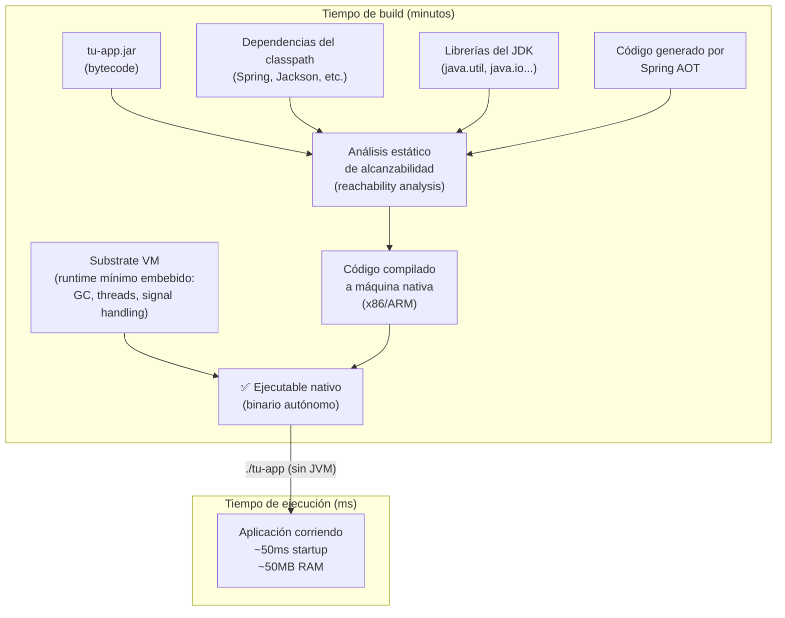
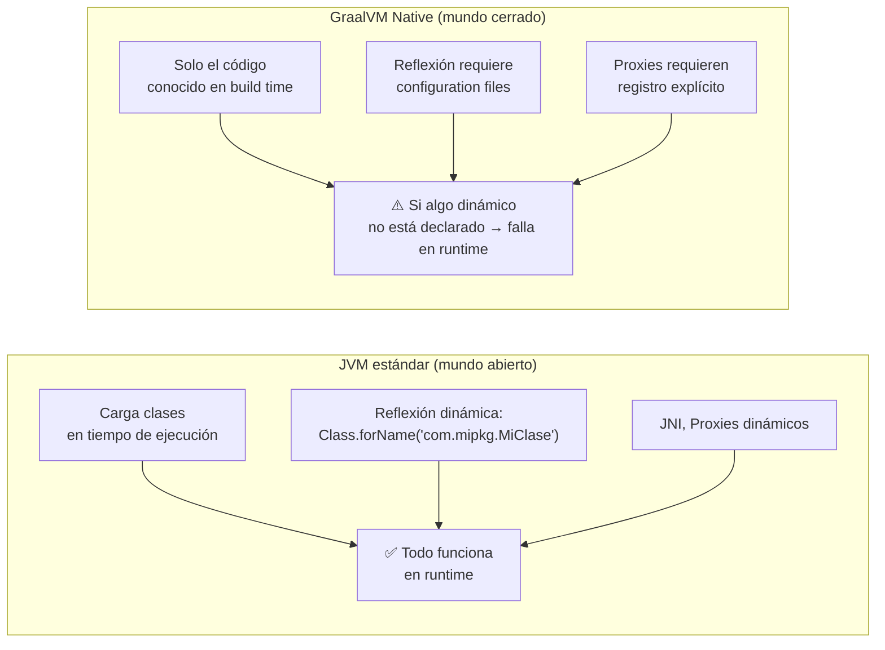

# 01 — GraalVM Native Image

> Material complementario para DSY1103. La compilación nativa no es parte del currículo oficial.

---

## ¿Qué es GraalVM?

GraalVM es una distribución del JDK desarrollada por Oracle Labs que extiende el JDK estándar con capacidades adicionales:

- **Native Image:** compila Java a un ejecutable nativo (tema de este archivo)
- **Polyglot:** permite ejecutar código JavaScript, Python, Ruby dentro de la JVM
- **Truffle framework:** para implementar nuevos lenguajes sobre la JVM
- **GraalVM JIT:** compilador JIT de alta performance que reemplaza al C2 estándar

Para compilación nativa solo necesitas la herramienta `native-image`, que viene incluida en la distribución GraalVM.

---

## Cómo funciona internamente



El proceso más importante es el **análisis de alcanzabilidad** (*reachability analysis*): GraalVM rastrea todo el código que puede ser invocado partiendo de los puntos de entrada (el `main`). Solo lo que es alcanzable se incluye en el binario final. Todo lo demás se descarta.

---

## El Closed World Assumption

Esta es la restricción más importante de la compilación nativa: **en tiempo de build se debe conocer todo el código que se va a ejecutar**.



### Problemas comunes con la reflexión

El código Java puede cargar clases dinámicamente con:
```java
Class.forName("com.ejemplo.MiServicio")
```

GraalVM no puede saber en build time qué cadena se pasará ahí. La solución es declararlo en archivos de configuración:

```json
// src/main/resources/META-INF/native-image/reflect-config.json
[
  {
    "name": "com.ejemplo.MiServicio",
    "allDeclaredConstructors": true,
    "allDeclaredMethods": true,
    "allDeclaredFields": true
  }
]
```

**La buena noticia:** Spring Boot AOT genera estos archivos automáticamente para todo el código de Spring. Solo necesitas configuración manual para librerías muy dinámicas o código propio que use reflexión directamente.

---

## Archivos de configuración de Native Image

GraalVM lee archivos en `META-INF/native-image/` para saber qué código dinámico incluir:

| Archivo | Propósito |
|---|---|
| `reflect-config.json` | Clases accedidas por reflexión |
| `resource-config.json` | Archivos de recursos (`classpath:*.properties`, etc.) |
| `proxy-config.json` | Interfaces usadas para crear proxies dinámicos |
| `jni-config.json` | Código accedido via JNI (Java Native Interface) |
| `serialization-config.json` | Clases serializadas/deserializadas |

Spring AOT genera la mayoría de estos. Para ver qué generó:
```bash
# Después de mvnw package, busca en target/spring-aot/
find target/spring-aot -name "*.json" | head -20
```

---

## El agente de trazado (Tracing Agent)

Para aplicaciones con reflexión difícil de detectar estáticamente, GraalVM incluye un agente que observa la aplicación JVM en ejecución y genera los archivos de configuración automáticamente:

```bash
# Ejecutar la app con el agente activado
java -agentlib:native-image-agent=config-output-dir=src/main/resources/META-INF/native-image \
     -jar target/mi-app.jar

# Mientras corre, hacer peticiones a TODOS los endpoints para que el agente los registre
curl http://localhost:8080/ticket-app/tickets
curl -X POST http://localhost:8080/ticket-app/tickets ...

# Ctrl+C para detener — el agente escribe los archivos de config
```

Esto genera automáticamente los JSONs de configuración. Luego puedes hacer el build nativo con esa configuración incluida.

---

## Distribuciones de GraalVM

Existen varias distribuciones:

| Distribución | Organización | Gratuita |
|---|---|---|
| **GraalVM Community Edition** | Oracle | ✅ |
| **GraalVM Enterprise Edition** | Oracle | ❌ (licencia comercial) |
| **Liberica NIK** | BellSoft | ✅ |
| **Mandrel** | Red Hat | ✅ (enfocado en Quarkus) |
| **Eclipse Temurin + Native Image** | Adoptium | En desarrollo |

Para Spring Boot: **GraalVM Community Edition** es suficiente y la más usada.

---

## Instalación de GraalVM

### Con SDKMAN (Linux/Mac — recomendado)
```bash
sdk install java 21.0.3-graalce   # GraalVM Community Edition 21
sdk use java 21.0.3-graalce
java -version                      # debería mostrar "GraalVM CE"
native-image --version             # verificar que native-image está disponible
```

### Con Scoop (Windows)
```powershell
scoop bucket add java
scoop install graalvm-community-21
```

### Manual (Windows/Linux/Mac)
1. Descargar desde [graalvm.org](https://www.graalvm.org/downloads/) la versión Community Edition
2. Descomprimir y agregar `bin/` al PATH
3. Verificar: `native-image --version`

---

## Build nativo directo (sin Spring)

Para entender el proceso sin la magia de Spring:

```bash
# 1. Compilar Java normal
javac HolaMundo.java

# 2. Compilar a nativo
native-image HolaMundo

# 3. Ejecutar el binario (no requiere Java instalado)
./holomundo
```

Para proyectos Maven, el plugin de GraalVM:
```xml
<!-- pom.xml -->
<plugin>
  <groupId>org.graalvm.buildtools</groupId>
  <artifactId>native-maven-plugin</artifactId>
  <version>0.10.3</version>
</plugin>
```

```bash
mvn -Pnative native:compile
```

---

## Siguiente paso

- [`02_spring_boot_native.md`](./02_spring_boot_native.md) — Cómo construir un ejecutable nativo con Spring Boot 4, Dockerfile para imágenes nativas y comparativa de rendimiento
