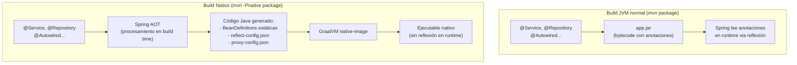
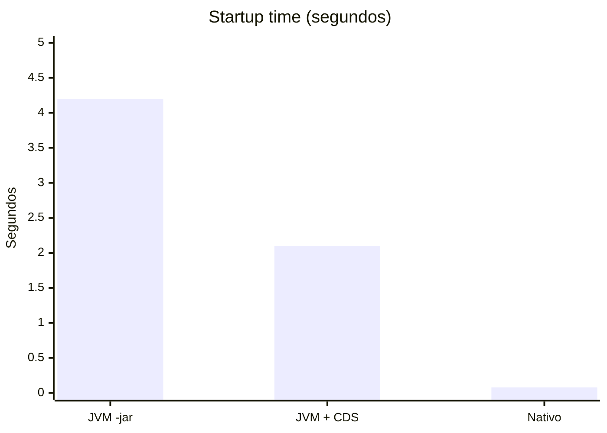
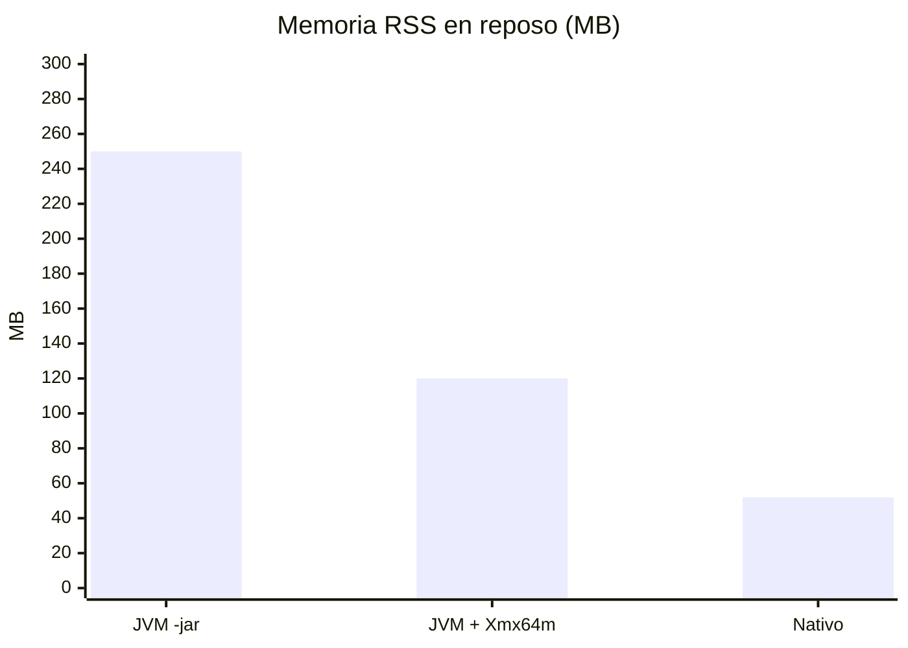

# 02 — Spring Boot 4 y compilación nativa

> Material complementario para DSY1103. La compilación nativa no es parte del currículo oficial.

---

## Spring AOT — el puente entre Spring y GraalVM

Spring Framework 6 (base de Spring Boot 3 y 4) introdujo el procesamiento **AOT** (*Ahead-Of-Time*). El problema es que Spring usa reflexión masivamente: lee anotaciones, crea beans dinámicamente, genera proxies. Todo eso es incompatible con el *Closed World* de GraalVM si no se prepara antes.

Spring AOT resuelve esto generando **código estático equivalente** en tiempo de build:



No necesitas cambiar tu código Spring Boot. Solo activar el perfil `native` en el build.

---

## Requisitos para compilación nativa con Spring Boot 4

| Requisito | Descripción |
|---|---|
| **GraalVM 21+** instalado | Con `native-image` disponible en el PATH. Ver [`01_graalvm.md`](./01_graalvm.md) |
| **Spring Boot 4.x** | Ya incluye `spring-boot-starter` con soporte AOT nativo |
| `spring-boot-maven-plugin` | Ya viene en el `pom.xml` generado por Spring Initializr |
| **Tiempo y paciencia** | El build nativo tarda 3–10 minutos vs ~10 segundos del JAR normal |

> **Verificar GraalVM antes de intentar el build:**
> ```bash
> java -version        # debe decir GraalVM
> native-image --version
> ```

---

## Cómo activar el soporte nativo en el pom.xml

Los proyectos generados con Spring Initializr que marcaron "GraalVM Native Support" ya tienen esto. Para proyectos existentes, agrega el plugin:

```xml
<!-- pom.xml — ya debería estar si usaste Spring Initializr con native support -->
<build>
    <plugins>
        <plugin>
            <groupId>org.springframework.boot</groupId>
            <artifactId>spring-boot-maven-plugin</artifactId>
            <configuration>
                <!-- Opcional: personalizar el nombre del ejecutable -->
                <imageName>mi-app</imageName>
            </configuration>
        </plugin>

        <!-- Plugin de GraalVM para build nativo directo -->
        <plugin>
            <groupId>org.graalvm.buildtools</groupId>
            <artifactId>native-maven-plugin</artifactId>
        </plugin>
    </plugins>
</build>

<!-- Perfil 'native' activa la compilación nativa con Maven -->
<profiles>
    <profile>
        <id>native</id>
        <build>
            <plugins>
                <plugin>
                    <groupId>org.graalvm.buildtools</groupId>
                    <artifactId>native-maven-plugin</artifactId>
                    <executions>
                        <execution>
                            <id>build-native</id>
                            <goals><goal>compile-no-fork</goal></goals>
                            <phase>package</phase>
                        </execution>
                    </executions>
                </plugin>
            </plugins>
        </build>
    </profile>
</profiles>
```

---

## Comandos de build

```bash
# Build JVM normal (rápido, para desarrollo)
mvnw.cmd package -DskipTests

# Build nativo local (lento, requiere GraalVM instalado)
mvnw.cmd -Pnative native:compile -DskipTests

# El ejecutable queda en target/ (Linux/Mac: target/mi-app, Windows: target/mi-app.exe)
./target/mi-app

# Test con perfil nativo (compila y ejecuta tests en nativo)
mvnw.cmd -Pnative test
```

---

## Opción 2: Build via Buildpacks (sin GraalVM local)

Spring Boot puede construir la imagen nativa usando **Buildpacks** de Cloud Native Buildpacks. No requiere GraalVM instalado en tu máquina — solo Docker.

```bash
# Construye una imagen Docker con el ejecutable nativo dentro
mvnw.cmd spring-boot:build-image -Pnative

# Luego corre la imagen
docker run --rm -p 8080:8080 mi-app:0.0.1-SNAPSHOT
```

**Ventaja:** no necesitas instalar GraalVM.  
**Desventaja:** el proceso es más lento (descarga el buildpack la primera vez) y menos transparente.

---

## Dockerfile para imagen nativa

Una vez que tienes el ejecutable nativo, el Dockerfile es mucho más simple:

```dockerfile
# ─────────────────────────────────────────────
# Etapa 1: compilación nativa (requiere GraalVM)
# ─────────────────────────────────────────────
FROM ghcr.io/graalvm/native-image-community:21 AS build
WORKDIR /app
COPY .mvn/ .mvn/
COPY mvnw pom.xml ./
RUN ./mvnw dependency:go-offline -q
COPY src/ src/
RUN ./mvnw -Pnative native:compile -DskipTests --no-transfer-progress

# ─────────────────────────────────────────────
# Etapa 2: imagen final — sin JVM
# ─────────────────────────────────────────────
FROM debian:12-slim
WORKDIR /app

# El ejecutable nativo no necesita Java — es código máquina directo
COPY --from=build /app/target/mi-app .

# Librerías de sistema que el ejecutable puede necesitar
RUN apt-get update && apt-get install -y --no-install-recommends \
    libstdc++6 zlib1g \
    && rm -rf /var/lib/apt/lists/*

EXPOSE 8080
ENTRYPOINT ["./mi-app"]
```

Comparativa de imágenes resultantes:

| Imagen | Base | Tamaño aprox. |
|---|---|---|
| JVM standard | `eclipse-temurin:21-jre` | ~200 MB |
| JVM + JAR | `eclipse-temurin:21-jre` + JAR | ~220 MB |
| **Nativo** | `debian:12-slim` | **~60 MB** |
| **Nativo mínimo** | `scratch` (si es fully static) | **~30 MB** |

---

## Compilación fully-static (imagen scratch)

Para la imagen más pequeña posible, puedes compilar un binario completamente estático que no dependa de librerías del sistema operativo. Esto permite usar la imagen `scratch` (literalmente vacía):

```dockerfile
# En el Dockerfile, en la etapa de build:
RUN ./mvnw -Pnative native:compile \
    -DskipTests \
    -Dspring-boot.native.musl=true \
    --no-transfer-progress

# Imagen final: cero dependencias
FROM scratch
COPY --from=build /app/target/mi-app /mi-app
EXPOSE 8080
ENTRYPOINT ["/mi-app"]
```

> Requiere que el build ocurra sobre Alpine/musl. Útil en CI/CD o Kubernetes con restricciones de tamaño extremas.

---

## Restricciones y problemas frecuentes

### Reflexión no declarada
```
Exception in thread "main" com.oracle.svm.core.jdk.UnsupportedFeatureError:
  Reflection registration failed for class com.ejemplo.MiClase
```
**Solución:** agregar la clase a `reflect-config.json` o usar el agente de trazado (ver `01_graalvm.md`).

### Recursos no incluidos
```
java.io.FileNotFoundException: application.yml not found in classpath
```
**Solución:** Spring Boot incluye automáticamente los recursos de `src/main/resources`. Si tienes archivos en rutas no estándar, decláralos en `resource-config.json`.

### Proxies dinámicos (muy común con Spring Data, Feign)
Spring AOT genera automáticamente la configuración para los proxies que Spring crea. Para librerías de terceros que crean sus propios proxies, puede ser necesaria configuración adicional.

### Tiempo de build
El build nativo es lento. Para desarrollo diario sigue usando el JAR normal. Solo compila nativo para:
- Probar que la app funciona en modo nativo
- CI/CD para producción

---

## Comparativa de rendimiento real

Mediciones aproximadas para un microservicio Spring Boot simple (similar a los de esta asignatura):





> **CDS** (Class Data Sharing) es una optimización del JDK estándar que precarga las clases del JDK al inicio. No llega a los niveles del nativo pero mejora el startup sin el costo del build nativo.

---

## ¿Vale la pena para los proyectos de la asignatura?

**Para aprendizaje: no.** El ciclo de desarrollo (editar → compilar → probar) con GraalVM nativo es doloroso: cada cambio requiere 5-10 minutos de build.

**Para el proyecto final evaluado:** tampoco es necesario. La asignatura evalúa la arquitectura y funcionalidad, no el rendimiento de startup.

**Para aprender más allá de la asignatura:** sí vale investigarlo. El mundo de microservicios en Kubernetes y serverless cada vez adopta más el ejecutable nativo, especialmente con frameworks como [Quarkus](https://quarkus.io/) y [Micronaut](https://micronaut.io/) que lo tienen como primer ciudadano.

---

## Recursos para profundizar

- [Spring Boot — Native Image Support](https://docs.spring.io/spring-boot/reference/native-image/introducing-graalvm-native-images.html)
- [Spring AOT Processing](https://docs.spring.io/spring-framework/reference/core/aot.html)
- [GraalVM Native Image Docs](https://www.graalvm.org/latest/reference-manual/native-image/)
- [Guía práctica: Spring Boot Native con Docker](https://spring.io/guides/gs/spring-boot-docker/)
- [Quarkus](https://quarkus.io/) — Framework Java diseñado desde cero para nativos
