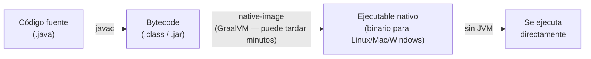
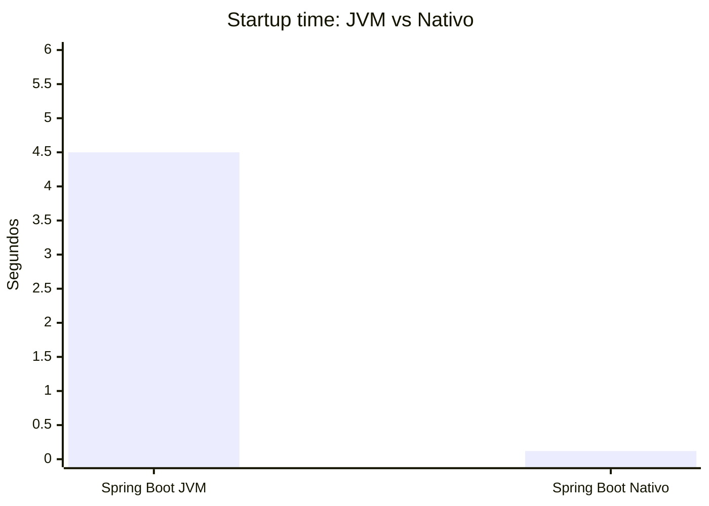
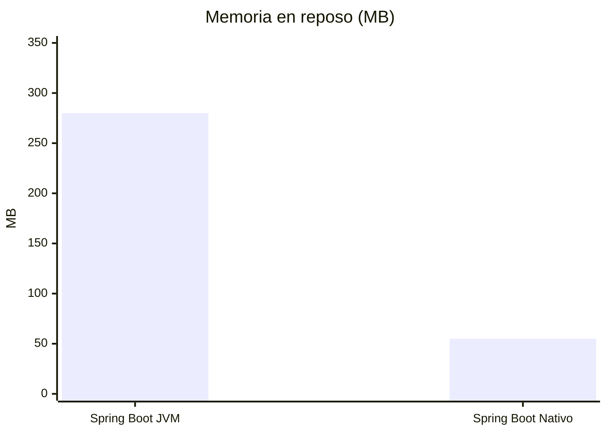
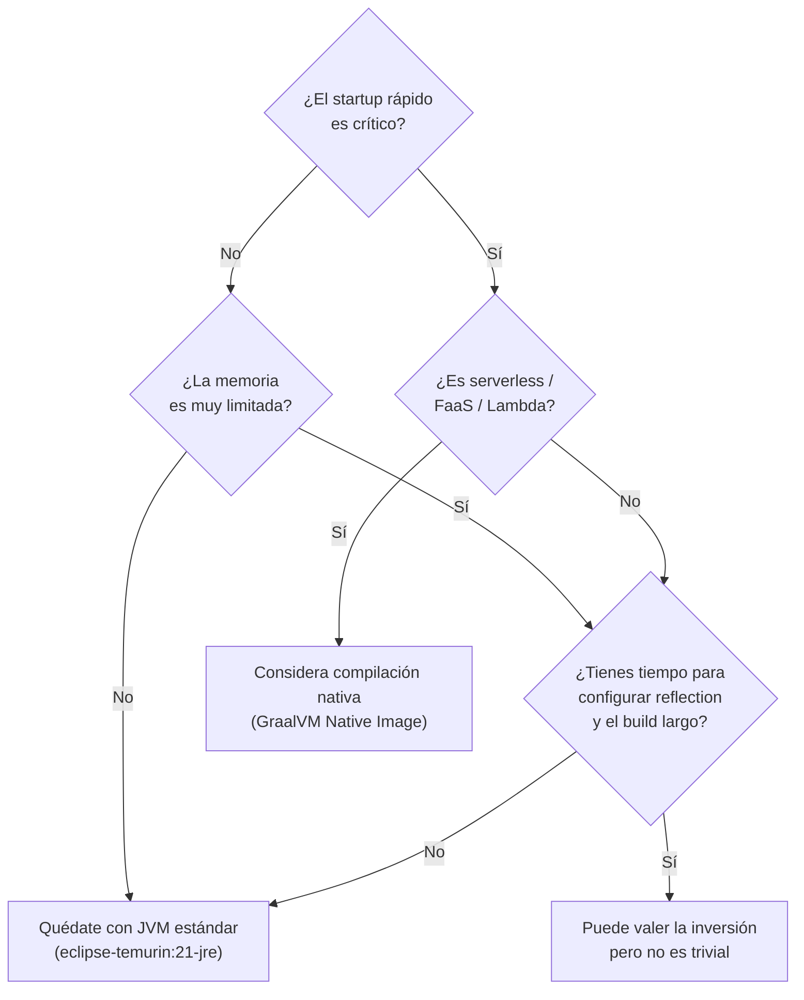

# ⚡ Compilación Nativa en Spring Boot

> **Nota:** La compilación nativa no es parte de la asignatura DSY1103. Este material es complementario para quienes quieran entender cómo funcionan las aplicaciones Java de alto rendimiento y bajo consumo de memoria.

---

## Contenido

| Archivo | Descripción |
|---|---|
| **README.md** (este archivo) | ¿Qué es la compilación nativa? JIT vs AOT |
| [`01_graalvm.md`](./01_graalvm.md) | GraalVM Native Image: closed world, reflection, configuración |
| [`02_spring_boot_native.md`](./02_spring_boot_native.md) | Spring Boot 4 + native: cómo construir, Docker nativo, tradeoffs |

---

## ¿Qué es la compilación nativa?

Cuando ejecutas una aplicación Java con el JDK estándar, el proceso es el siguiente:

El código `.jar` no es código máquina — es **bytecode**, un lenguaje intermedio que la JVM interpreta y compila **en tiempo de ejecución** (JIT = *Just In Time*). Esto tiene un costo: la aplicación tarda varios segundos en arrancar y consume bastante memoria mientras "calienta".

**La compilación nativa hace todo ese trabajo antes de desplegar:**

El resultado es un **binario autónomo** — no necesita Java instalado para ejecutarse. Arranca en milisegundos y consume mucho menos memoria.

---

## JIT vs AOT — la diferencia central

| | JIT (estándar) | AOT / Nativo |
|---|---|---|
| **Compilación** | En tiempo de ejecución | Antes del despliegue |
| **Startup** | 2–8 segundos (Spring Boot) | 50–200 ms |
| **Memoria en reposo** | 200–400 MB | 30–80 MB |
| **Throughput pico** | Alto (JIT optimiza código caliente) | Ligeramente menor (sin JIT dinámico) |
| **Tiempo de build** | Segundos | 3–10 minutos |
| **Reflexión dinámica** | ✅ Funciona libremente | ⚠️ Requiere configuración |
| **Depuración** | Fácil | Más difícil |
| **Tamaño imagen Docker** | ~200 MB (JRE + JAR) | ~30–60 MB (sin JVM) |

---

## ¿Cuándo vale la pena?

**Casos donde el nativo brilla:**
- Funciones serverless (AWS Lambda, Google Cloud Functions) — se instancian y destruyen constantemente, el startup importa mucho
- Microservicios en Kubernetes con escalado horizontal frecuente
- CLI tools escritas en Java que deben sentirse "instantáneas"
- Entornos edge con RAM limitada (IoT, Raspberry Pi)

**Casos donde JVM sigue siendo mejor:**
- Aplicaciones de larga vida (servidores que corren días/semanas) — el JIT se vuelve más eficiente con el tiempo
- Aplicaciones con mucha reflexión dinámica (frameworks legacy, algunas herramientas de testing)
- Desarrollo activo con ciclos rápidos de debug

---

## Relación con Spring Boot 4

Spring Boot 4 (que usa este curso) tiene **soporte nativo de primera clase** gracias a Spring AOT (*Ahead-Of-Time processing*). No es necesario hacer nada especial en el código — Spring se encarga de analizar el contexto de aplicación en tiempo de build y generar el código estático necesario.

> Ver [`02_spring_boot_native.md`](./02_spring_boot_native.md) para cómo activarlo y construir la imagen.

---

## Recursos para aprender más

- [GraalVM Native Image — Documentación oficial](https://www.graalvm.org/latest/reference-manual/native-image/)
- [Spring Boot Native Support](https://docs.spring.io/spring-boot/reference/native-image/introducing-graalvm-native-images.html)
- [Introducing GraalVM Native Images (video)](https://www.youtube.com/watch?v=DVbg3sXeZAs)
