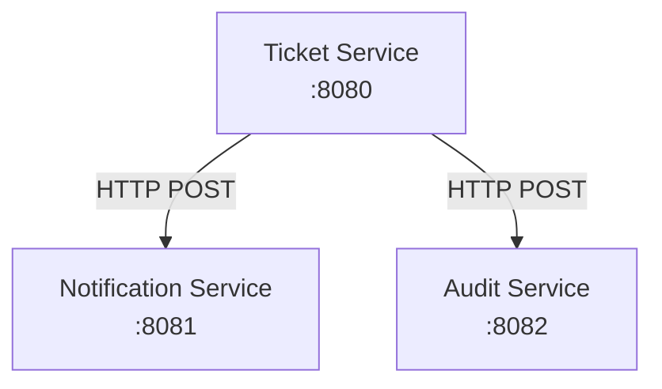

# El proyecto: Sistema de Soporte Técnico — Tickets

> Documento de requerimientos del proyecto para las lecciones 01-18

---

## 1. Identificación del problema

Un equipo de soporte técnico recibe solicitudes de ayuda todos los días: equipos que no funcionan, accesos bloqueados, sistemas caídos. Hoy gestionan todo por correo y por teléfono.

El problema es evidente: no hay registro, no hay seguimiento, no hay forma de saber qué está pendiente y qué ya fue resuelto. Cuando alguien pregunta *"¿en qué quedó mi problema?"*, nadie tiene una respuesta clara.

El sistema debe permitir a los usuarios **registrar, consultar, actualizar y cerrar** solicitudes de soporte (tickets), con trazabilidad completa de cada cambio y comunicación automática con servicios externos.

---

## 2. Actores del sistema

| Actor | Descripción |
|-------|------------|
| **USER** | Usuario final que reporta problemas y hace seguimiento a sus tickets |
| **AGENT** | Técnico de soporte que recibe, trabaja y resuelve tickets asignados |
| **ADMIN** | Administrador que gestiona usuarios, categorías, etiquetas y supervisa el sistema |

---

## 3. Requerimientos del sistema

### Scope 1: Lecciones 01-09 — CRUD de Tickets

Solo existe la entidad Ticket.

| ID | Descripción |
|----|------------|
| RF-01 | Consultar tickets con filtro opcional por estado y orden por fecha |
| RF-02 | Registrar nuevo ticket con título, descripción, estado NEW, fecha de creación y fecha estimada (5 días) |
| RF-03 | Actualizar título o descripción de un ticket |
| RF-04 | Eliminar un ticket |
| RF-05 | Consultar ticket por identificador |

**Req. No Funcionales:**

| ID | Descripción |
|----|------------|
| RNF-01 | Persistir tickets en memoria (sobreviven reinicio de la aplicación) |

### Scope 2: Lecciones 10-18 — Sistema Extendido

Se agregan User, Category, Tag, relaciones, TicketHistory, Notification, Audit y seguridad.

| ID | Descripción |
|----|------------|
| RF-07 | Gestionar usuarios (crear, modificar, desactivar) con roles |
| RF-08 | Gestionar categorías (crear, listar) |
| RF-09 | Gestionar etiquetas (crear, listar) |
| RF-10 | Asignar ticket a agente (creador y asignado no pueden ser el mismo) |
| RF-11 | Ver tickets asignados a un agente |
| RF-12 | Registrar historial automático de cambios de estado |
| RF-13 | Enviar notificaciones al crear, asignar o cambiar estado de ticket |
| RF-14 | Registrar eventos de auditoría por ticket |
| RF-15 | Consultar auditoría por ticket |
| RF-16 | Autenticar usuarios y controlar acceso por roles |

---

## 4. Solución Propuesta

El sistema utiliza una arquitectura de microservicios donde cada servicio tiene su propia base de datos y se comunica vía HTTP.

**Justificación:** La separación permite escalar servicios independientemente, mantener bases de datos propias y desarrollar funcionalidades de notificación y auditoría de forma independiente al core de tickets.

---

## 5. Casos de Uso

### Scope 1: Lecciones 01-09 — CRUD de Tickets

| Caso | Descripción |
|------|-------------|
| CU-01 | Crear un ticket con título y descripción |
| CU-02 | Listar todos los tickets |
| CU-03 | Ver detalle de un ticket |
| CU-04 | Actualizar título o descripción de un ticket |
| CU-05 | Eliminar un ticket |
| CU-06 | Filtrar tickets por estado |

### Scope 2: Lecciones 10-18 — Sistema Extendido

| Caso | Descripción |
|------|-------------|
| CU-07 | Crear categoría |
| CU-08 | Crear etiqueta |
| CU-09 | Crear usuario con rol |
| CU-10 | Asignar ticket a un agente |
| CU-11 | Ver tickets asignados |
| CU-12 | Registrar cambio de estado en historial |
| CU-13 | Enviar notificación al crear ticket |
| CU-14 | Enviar notificación al asignar agente |
| CU-15 | Registrar evento de auditoría |
| CU-16 | Iniciar sesión con credenciales |
| CU-17 | Validar permisos por rol |

---

## 6. Microservicios

> En este proyecto, solo **Notification Service** y **Audit Service** son microservicios separados.
> **Ticket Service** extiende sus funcionalidades con User, Category, Tag y TicketHistory en el mismo proyecto.

### 6.1 Ticket Service (Core + Extensiones)

| Campo | Descripción |
|-------|------------|
| **Puerto** | 8080 |
| **Responsabilidad** | Gestionar tickets, usuarios, categorías, etiquetas y su historial |
| **Entidades** | Ticket, User, Category, Tag, TicketHistory |
| **Endpoints** | /tickets, /users, /categories, /tags |

### 6.2 Notification Service

| Campo | Descripción |
|-------|------------|
| **Puerto** | 8081 |
| **Responsabilidad** | Enviar y almacenar notificaciones |
| **Entidades** | Notification |
| **Endpoints** | POST/GET /api/notifications |
| **Comunicación** | Llamado por Ticket Service |

### 6.3 Audit Service

| Campo | Descripción |
|-------|------------|
| **Puerto** | 8082 |
| **Responsabilidad** | Registrar y consultar eventos de auditoría |
| **Entidades** | AuditLog |
| **Endpoints** | POST/GET /api/audit |
| **Comunicación** | Llamado por Ticket Service |

---

## 7. Modelo de Datos

> **Scope 1 (01-09):** Solo Ticket

### Ticket

| Campo | Tipo | Descripción |
|-------|------|-------------|
| id | Long | Identificador único |
| title | String | Título del ticket |
| description | String | Descripción del problema |
| status | String | Estado: NEW, IN_PROGRESS, RESOLVED, CLOSED |
| createdAt | LocalDateTime | Fecha de creación |
| estimatedResolutionDate | LocalDate | Fecha estimada (5 días) |
| effectiveResolutionDate | LocalDateTime | Fecha de resolución |

> **Scope 2 (10-18):** Entidades adicionales

### User

| Campo | Tipo | Descripción |
|-------|------|-------------|
| id | Long | Identificador único |
| name | String | Nombre |
| email | String | Correo electrónico |
| role | Enum | USER, AGENT, ADMIN |
| active | Boolean | Estado activo |

### Category

| Campo | Tipo | Descripción |
|-------|------|-------------|
| id | Long | Identificador único |
| name | String | Nombre |
| description | String | Descripción |

### Tag

| Campo | Tipo | Descripción |
|-------|------|-------------|
| id | Long | Identificador único |
| name | String | Nombre |
| color | String | Color visualize |

### TicketHistory

| Campo | Tipo | Descripción |
|-------|------|-------------|
| id | Long | Identificador único |
| ticketId | Long | ID del ticket |
| oldStatus | String | Estado anterior |
| newStatus | String | Estado nuevo |
| changedAt | LocalDateTime | Fecha del cambio |

---

## 8. Endpoints del Sistema

### Scope 1 (01-09): Ticket Service

| Método | Endpoint | Descripción |
|--------|---------|-------------|
| GET | /tickets | Listar tickets |
| GET | /tickets/{id} | Ver ticket |
| POST | /tickets | Crear ticket |
| PUT | /tickets/{id} | Actualizar ticket |
| DELETE | /tickets/{id} | Eliminar ticket |
| GET | /tickets?status= | Filtrar por estado |

### Scope 2 (10-18): Servicios Extendidos

**Ticket Service (extendido)**

| Método | Endpoint | Descripción |
|--------|---------|-------------|
| GET | /categories | Listar categorías |
| POST | /categories | Crear categoría |
| GET | /tags | Listar etiquetas |
| POST | /tags | Crear etiqueta |
| GET | /tickets/{id}/history | Ver historial |

**User Service**

| Método | Endpoint | Descripción |
|--------|---------|-------------|
| GET | /users | Listar usuarios |
| GET | /users/{id} | Ver usuario |
| POST | /users | Crear usuario |
| PUT | /users/{id} | Actualizar usuario |
| DELETE | /users/{id} | Desactivar usuario |
| POST | /tickets/{id}/assign/{userId} | Asignar ticket |
| GET | /tickets/assigned-to-me | Tickets asignados |

**Notification Service**

| Método | Endpoint | Descripción |
|--------|---------|-------------|
| POST | /api/notifications | Crear notificación |
| GET | /api/notifications | Listar notificaciones |

**Audit Service**

| Método | Endpoint | Descripción |
|--------|---------|-------------|
| POST | /api/audit | Registrar evento |
| GET | /api/audit | Listar eventos |
| GET | /api/audit/ticket/{id} | Eventos por ticket |

---

## 9. Mapa de Implementación por Lección

### Scope 1: Lecciones 01-09 — CRUD de Tickets

| Lección | Funcionalidad |
|--------|--------------|
| 01-04 | Estructura proyecto + GET /tickets |
| 05 | POST /tickets + validaciones |
| 06 | GET /tickets/{id} + PUT /tickets |
| 07 | DELETE + errores |
| 08 | DTOs + filtros |
| 09 | Persistencia H2 |

### Scope 2: Lecciones 10-18 — Sistema Extendido

| Lección | Funcionalidad |
|--------|--------------|
| 10 | User entity con roles + relaciones Ticket-User |
| 11 | Perfiles H2/MySQL/PostgreSQL |
| 12 | Category (One-to-Many) + Tag (Many-to-Many) |
| 13 | TicketHistory automático |
| 14 | Flyway migrations |
| 15 | Microservicios: Notification + Audit |
| 16 | Spring Security |
| 17 | Logging |
| 18 | Exception handling global |

---

## 10. Tecnologías

- **Framework:** Spring Boot 4.0.5
- **Lenguaje:** Java 21
- **ORM:** JPA/Hibernate
- **BD:** H2, MySQL, PostgreSQL
- **Comunicación:** OpenFeign, RestClient
- **Migraciones:** Flyway

---

**Última actualización:** Abril 2026