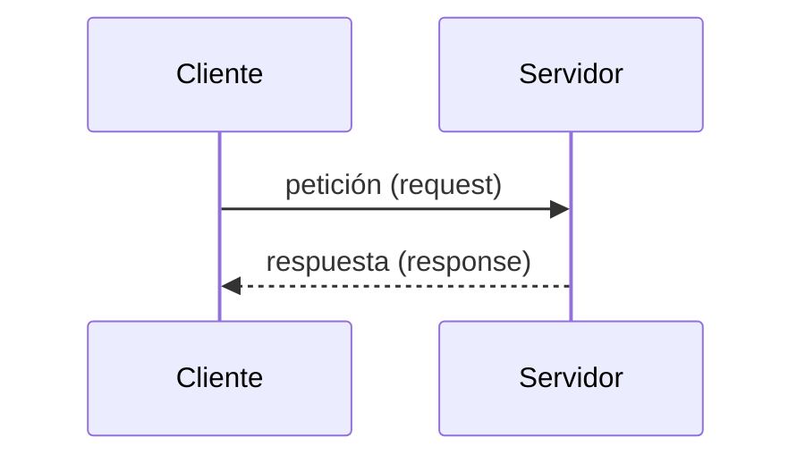

# Lección 01 - La Web y HTTP: cómo funciona todo

Esta sección no es un glosario para memorizar. Es la explicación del mecanismo real detrás de cada sitio web que has usado en tu vida. Léela con calma, más de una vez si es necesario.

---

## Internet vs. la Web: no son lo mismo

Un error muy común es usar "Internet" y "Web" como sinónimos. No lo son.

- **Internet** es la infraestructura: la red física global de cables, routers, fibra óptica y antenas que conecta dispositivos entre sí. Es como la red de carreteras del país.
- **La Web** (World Wide Web) es un *servicio* que corre sobre esa infraestructura. Es el sistema que permite acceder a páginas y recursos usando el protocolo HTTP. Es como el sistema de transporte que usa esas carreteras.

Existen otros servicios que también usan Internet pero no son la Web: el correo electrónico (protocolo SMTP/IMAP), la transferencia de archivos (FTP), los videojuegos en línea, etc.

> **En este curso trabajamos con la Web**: construimos servidores que hablan HTTP y responden peticiones que llegan desde navegadores, aplicaciones móviles u otros servicios.

---

## El modelo cliente-servidor

Toda comunicación en la Web sigue el mismo patrón básico:



### ¿Qué es un cliente?

Un **cliente** es cualquier programa que *inicia* una comunicación y *solicita* algo. Ejemplos:

- Un navegador web (Chrome, Firefox, Safari)
- Una aplicación móvil que consulta datos de un servidor
- Postman o Insomnia (herramientas para probar APIs)
- Otro servidor que consume servicios de un tercero

El cliente **siempre inicia** la comunicación. El servidor *espera* y *responde*.

### ¿Qué es un servidor?

Un **servidor** es un programa (no necesariamente una máquina física especial) que *escucha* peticiones y *devuelve* respuestas. Ejemplos:

- Un servidor web como Apache o Nginx que sirve archivos HTML
- Una aplicación Spring Boot que devuelve datos en JSON
- Un servidor de base de datos que responde consultas SQL

La diferencia clave no está en el hardware, sino en el rol: el servidor escucha y responde; el cliente pregunta y espera.

> **Importante:** un mismo programa puede ser cliente y servidor al mismo tiempo. Por ejemplo, tu aplicación Spring Boot es un servidor para el navegador, pero actúa como cliente si consulta una base de datos o llama a otra API.

---

## ¿Cómo sabe el cliente dónde encontrar al servidor?

Cuando escribes `https://www.duoc.cl` en el navegador, no escribes una dirección IP como `200.27.240.10`. Escribes un nombre legible para humanos. Alguien tiene que traducir ese nombre a una dirección real de red. Ese "alguien" es el **DNS**.

### DNS: el directorio telefónico de Internet

**DNS** (Domain Name System) es un sistema distribuido que traduce nombres de dominio legibles (`www.duoc.cl`) a direcciones IP (`200.27.240.10`) que las computadoras usan para encontrarse.

El proceso ocurre automáticamente y en milisegundos, pero los pasos son:

```
1. Escribes "www.duoc.cl" en el navegador
2. Tu computadora pregunta al servidor DNS configurado (usualmente el de tu proveedor de internet o Google 8.8.8.8): "¿Cuál es la IP de www.duoc.cl?"
3. El DNS responde: "200.27.240.10"
4. Tu navegador se conecta directamente a esa IP
5. El servidor en esa IP responde con el contenido
```

> **Analogía:** el DNS es como la agenda de contactos de tu teléfono. Buscas "Mamá" y el teléfono sabe que eso corresponde al número `+56 9 XXXX XXXX`. No tienes que memorizar el número; solo el nombre.

---

## ¿Qué es HTTP?

Una vez que el cliente sabe la dirección IP del servidor, necesita un **lenguaje común** para comunicarse con él. Ese lenguaje es **HTTP**.

**HTTP** (HyperText Transfer Protocol) es el protocolo de comunicación de la Web. Define las reglas sobre:

- **Cómo formatear una petición** para que el servidor la entienda
- **Cómo formatear una respuesta** para que el cliente la entienda
- **Qué tipos de operaciones existen** (obtener, crear, modificar, eliminar)
- **Cómo indicar si algo salió bien o mal**

HTTP es un protocolo **de texto**: las peticiones y respuestas son cadenas de texto con un formato muy específico. No hay magia ni binario. Si pudieras interceptar la comunicación entre tu navegador y un servidor, verías texto plano que cualquier humano puede leer.

### Características fundamentales de HTTP

#### Sin estado (stateless)

HTTP no tiene memoria entre peticiones. Cada petición es completamente independiente de la anterior. El servidor no sabe quién eres ni qué pediste antes, a menos que el cliente le envíe esa información explícitamente (por ejemplo, usando cookies o tokens de autenticación).

> **Implicación práctica:** si quieres que el servidor te "recuerde" entre peticiones (por ejemplo, para mantener una sesión de usuario), tú eres responsable de enviar esa información en cada petición.

#### Basado en texto

Todas las peticiones y respuestas HTTP son texto. Esto las hace fáciles de leer, depurar y entender sin herramientas especiales.

#### Sin conexión persistente por defecto (en HTTP/1.0)

En HTTP/1.0, cada petición abría una nueva conexión TCP y la cerraba al terminar. HTTP/1.1 introdujo las conexiones persistentes (keep-alive) para reutilizar la misma conexión. HTTP/2 y HTTP/3 mejoran esto aún más con multiplexación, pero el modelo básico de petición-respuesta no cambia.

---

## Versiones de HTTP

| Versión | Año | Lo más importante |
|---|---|---|
| HTTP/1.0 | 1996 | El original. Una conexión por petición. |
| HTTP/1.1 | 1997 | Conexiones persistentes. El más usado durante décadas. |
| HTTP/2 | 2015 | Múltiples peticiones en paralelo sobre una sola conexión (multiplexación). Más rápido. |
| HTTP/3 | 2022 | Basado en UDP en lugar de TCP. Más eficiente en redes inestables. |

> **Para este curso** trabajamos con HTTP/1.1. Es el que todos los navegadores, herramientas y servidores soportan sin configuración especial. Los principios que aprenderás aplican igual a HTTP/2 y HTTP/3.

---

## ¿Qué es una URL?

Antes de hablar de peticiones, necesitas entender el formato de una URL (Uniform Resource Locator), que es la dirección que identifica un recurso en la Web.

```
https://api.ejemplo.com:8080/usuarios/42?formato=json#seccion
  │         │              │      │      │              │
  │         │              │      │      │              └─ Fragmento (solo en navegador)
  │         │              │      │      └─ Query string (parámetros)
  │         │              │      └─ Ruta del recurso
  │         │              └─ Puerto (8080)
  │         └─ Dominio (host)
  └─ Protocolo (scheme)
```

| Parte | Nombre | Descripción |
|---|---|---|
| `https` | Protocolo | Cómo se comunican. `http` o `https` (la versión segura) |
| `api.ejemplo.com` | Host / Dominio | Dónde está el servidor |
| `:8080` | Puerto | Por cuál "puerta" entrar. Por defecto es 80 para HTTP y 443 para HTTPS |
| `/usuarios/42` | Ruta (path) | Qué recurso específico se solicita |
| `?formato=json` | Query string | Parámetros opcionales para filtrar o modificar la petición |
| `#seccion` | Fragmento | Posición dentro de la página. Solo lo usa el navegador; no llega al servidor |

> **Para el desarrollo de APIs**, lo que más te interesa es la **ruta** y el **query string**. El protocolo y el host los configura el servidor. Los fragmentos no son relevantes en APIs.

---

## Puertos: las puertas del servidor

Un servidor puede tener muchos servicios corriendo al mismo tiempo. Los **puertos** son la forma de distinguirlos: cada servicio escucha en un puerto diferente, como distintas puertas de un edificio.

Algunos puertos relevantes:

| Puerto | Uso común |
|---|---|
| 80 | HTTP (web sin cifrar) |
| 443 | HTTPS (web con cifrado TLS) |
| 8080 | HTTP alternativo (muy usado en desarrollo) |
| 3306 | MySQL |
| 5432 | PostgreSQL |
| 6379 | Redis |

Cuando desarrollas con Spring Boot, por defecto usa el **puerto 8080**. Por eso accedes a tu aplicación con `http://localhost:8080`.

> **`localhost`** es el nombre de dominio especial que siempre apunta a tu propia máquina. Su IP equivalente es `127.0.0.1`. Cuando dices "abrir `localhost:8080`", estás diciendo "conectarme al servicio que está corriendo en el puerto 8080 de mi propia computadora".

---

## Resumen del flujo completo

Juntando todo lo que vimos, el flujo completo desde que escribes una URL hasta que ves el resultado es:

```
1. Escribes https://www.duoc.cl/noticias en el navegador

2. [DNS] El navegador consulta al DNS: "¿Cuál es la IP de www.duoc.cl?"
         DNS responde: "200.27.240.10"

3. [TCP] El navegador establece una conexión TCP con 200.27.240.10 en el puerto 443 (HTTPS)

4. [TLS] Se negocia el cifrado (porque es HTTPS)

5. [HTTP] El navegador envía una petición HTTP:
         GET /noticias HTTP/1.1
         Host: www.duoc.cl
         ...

6. [Servidor] El servidor procesa la petición y devuelve una respuesta HTTP:
         HTTP/1.1 200 OK
         Content-Type: text/html
         ...
         <html>...</html>

7. [Navegador] El navegador recibe la respuesta y muestra la página
```

Este mismo flujo ocurre, con pequeñas variaciones, en cada petición que hace tu aplicación a un servidor. Cuando construyes una API con Spring Boot, **tu aplicación es el paso 6** de este flujo: espera peticiones y devuelve respuestas.

