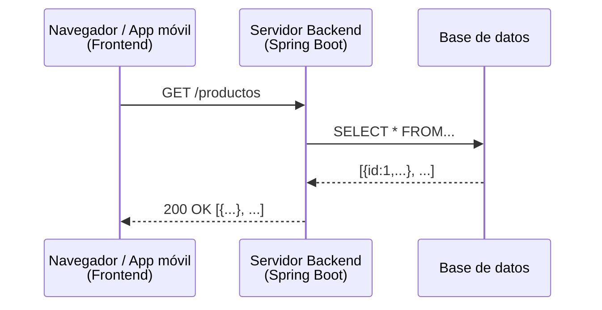
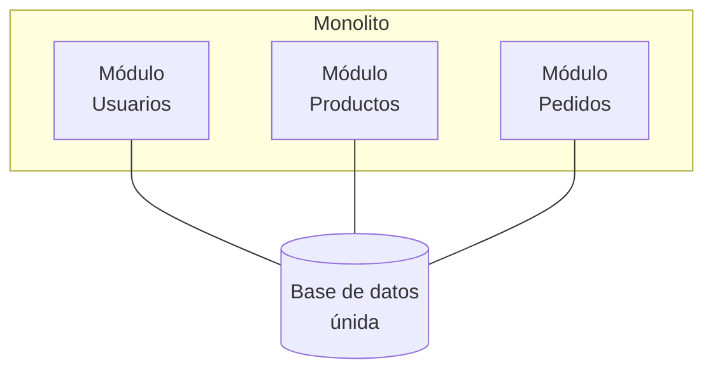
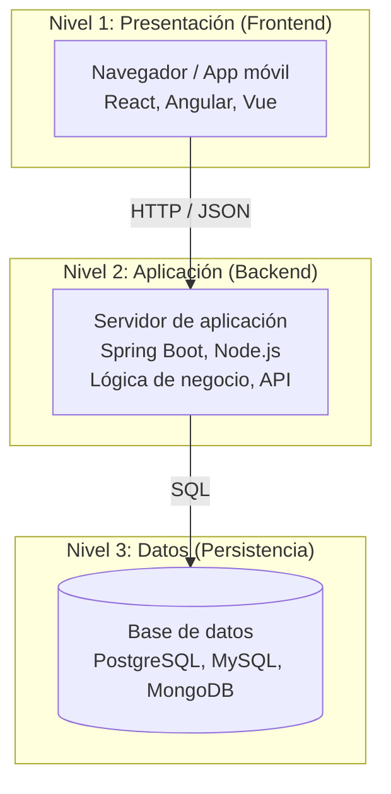

# Lección 02 - Arquitecturas y roles: Frontend, Backend, Monolito y Microservicios

Esta sección explora cómo se organizan los sistemas modernos. Antes de construir una API, necesitas entender el contexto en el que vivirá.

---

## Frontend y Backend: dos mundos que se comunican

Cuando usas una aplicación web, hay dos mundos trabajando juntos aunque nunca los ves al mismo tiempo.

### ¿Qué es el Frontend?

El **frontend** es todo lo que el usuario ve e interactúa directamente. Se ejecuta en el dispositivo del usuario (el navegador, el teléfono), no en el servidor.

Tecnologías típicas de frontend:
- **HTML** → la estructura del contenido
- **CSS** → el estilo visual
- **JavaScript** → la interactividad y lógica del lado del cliente
- **Frameworks:** React, Angular, Vue.js, Svelte

El frontend tiene una limitación fundamental: **no puede guardar datos de forma permanente ni segura**. Puede guardar cosas temporalmente en el navegador (localStorage, cookies), pero esos datos son accesibles y manipulables por el usuario. Para cualquier operación que requiera datos persistentes, lógica de negocio protegida o comunicación con una base de datos, el frontend necesita hablar con el backend.

### ¿Qué es el Backend?

El **backend** es todo lo que corre en el servidor: la lógica de negocio, el acceso a la base de datos, la autenticación, el procesamiento de datos. El usuario nunca lo ve directamente.

Tecnologías típicas de backend:
- **Java + Spring Boot** (lo que usarás en este curso)
- Node.js + Express / NestJS
- Python + Django / FastAPI
- C# + ASP.NET Core
- Go, Rust, Ruby on Rails, PHP Laravel, etc.

El backend tiene acceso a recursos que el frontend no puede tener:
- La base de datos (con credenciales que nunca deben llegar al cliente)
- Servicios externos (APIs de pago, correo, etc.)
- El sistema de archivos del servidor
- Claves y secretos de configuración

### ¿Cómo se comunican?

A través de HTTP, usando el patrón que aprendiste en la lección anterior:



El frontend envía peticiones HTTP al backend. El backend consulta lo que necesita (base de datos, otros servicios) y devuelve una respuesta, generalmente en formato JSON. El frontend usa esa respuesta para mostrar información al usuario.

### El contrato: la API

La "interfaz" entre el frontend y el backend se llama **API**. Es el conjunto de URLs, métodos y formatos de datos que el backend expone para que el frontend (u otros clientes) los consuman. Lo veremos en detalle en la siguiente sección.

---

## Separación de responsabilidades: ¿por qué no todo en uno?

En los primeros días de la Web, existía el concepto de **aplicaciones "full page"**: el servidor generaba el HTML completo y lo enviaba al navegador. No había separación: el backend generaba la presentación.

Hoy ese modelo todavía existe (se llama **Server-Side Rendering** o SSR), pero la tendencia dominante en aplicaciones modernas es la separación clara entre frontend y backend, con un API como contrato entre ellos.

**Ventajas de separar frontend y backend:**

| Ventaja | Descripción |
|---|---|
| **Un backend, múltiples clientes** | El mismo API puede ser consumido por una app web, una app móvil iOS, una app Android y un bot, todos al mismo tiempo |
| **Equipos independientes** | El equipo de frontend y el de backend pueden trabajar en paralelo mientras respeten el contrato del API |
| **Escalabilidad diferenciada** | Puedes escalar el backend sin tocar el frontend y viceversa |
| **Tecnología independiente** | El frontend puede ser React mientras el backend es Spring Boot; no importa |

---

## Arquitecturas de sistema: Monolito vs Microservicios

Una vez que tienes claro que el backend existe, surge la pregunta: ¿cómo se organiza internamente?

### Arquitectura monolítica

En una arquitectura **monolítica**, toda la lógica del backend vive en **una sola aplicación** que se despliega como una unidad.



**Ventajas del monolito:**

- Más simple de desarrollar al principio
- Más fácil de depurar (todo está en un lugar)
- Una sola base de código para mantener
- No hay latencia de red entre módulos
- Despliegue simple: una sola aplicación

**Desventajas del monolito:**

- A medida que crece, se vuelve difícil de entender y modificar
- Un fallo en un módulo puede tumbar toda la aplicación
- Escalar implica escalar todo, aunque solo un módulo lo necesite
- Los equipos grandes se pisan entre sí en la misma base de código
- El ciclo de despliegue se ralentiza cuando el código crece

> **Para este curso:** construirás monolitos. Es el punto de partida correcto. Entender un monolito bien estructurado es prerequisito para entender por qué y cuándo se migra a microservicios.

### Arquitectura de microservicios

En una arquitectura de **microservicios**, el sistema se divide en **muchos servicios pequeños e independientes**, cada uno responsable de una capacidad de negocio específica.

```mermaid
flowchart TB
    S1[Servicio<br/>Usuarios]
    S2[Servicio<br/>Productos]
    S3[Servicio<br/>Pedidos]
    DB1[(DB propia)]
    DB2[(DB propia)]
    DB3[(DB propia)]
    S1 --- DB1
    S2 --- DB2
    S3 --- DB3
    
    S1 -.-> S2
    S2 -.-> S3
    S3 -.-> S1
    note right: se comunican por HTTP
```

**Ventajas de los microservicios:**

- Cada servicio puede desplegarse de forma independiente
- Un fallo en un servicio no necesariamente afecta a los otros
- Escalabilidad granular: escala solo lo que necesita más recursos
- Equipos autónomos: cada equipo es dueño de su servicio
- Libertad tecnológica: cada servicio puede usar el lenguaje que mejor le convenga

**Desventajas de los microservicios:**

- Mucho más complejo de desarrollar, depurar y operar
- Latencia de red entre servicios (lo que antes era una llamada a función ahora es una petición HTTP)
- Necesitas infraestructura adicional: service discovery, API gateway, monitoreo distribuido, etc.
- Los datos distribuidos hacen que las transacciones sean difíciles
- Requiere un equipo maduro con experiencia en operaciones

### ¿Cuándo usar cada uno?

No existe una respuesta única. La decisión depende del contexto:

| Criterio | Monolito | Microservicios |
|---|---|---|
| Tamaño del equipo | Pequeño (1-10 personas) | Grande (muchos equipos) |
| Madurez del producto | Producto nuevo / explorando | Producto establecido con dominio claro |
| Velocidad de desarrollo inicial | Alta | Baja (overhead de infraestructura) |
| Necesidad de escalabilidad | Moderada | Alta y diferenciada por módulo |
| Complejidad operacional tolerable | Baja | Alta |

> **Una opinión respaldada por la industria:** Martin Fowler (autor de "Refactoring" y "Patterns of Enterprise Application Architecture") recomienda empezar con un monolito bien diseñado y migrar a microservicios solo cuando el monolito se convierte en un problema real. Esto se llama el enfoque **"Monolith First"**.

---

## Los tres niveles de un sistema web moderno

Ahora tienes el cuadro completo. Un sistema web moderno típico tiene tres niveles o "capas":


Nivel 1: Presentación (Frontend)
         ┌────────────────────────────┐
         │  Navegador / App móvil     │
         │  React, Angular, Vue       │
         └────────────┬───────────────┘
                      │ HTTP / JSON
Nivel 2: Aplicación (Backend)
         ┌────────────▼───────────────┐
         │   Servidor de aplicación   │
         │   Spring Boot, Node.js...  │
         │   Lógica de negocio, API   │
         └────────────┬───────────────┘
                      │ SQL / protocolo propio
Nivel 3: Datos (Persistencia)
         ┌────────────▼───────────────┐
         │        Base de datos       │
         │  PostgreSQL, MySQL, MongoDB│
         └────────────────────────────┘
```

Este curso se enfoca en el **nivel 2**: el backend. Aprenderás a construir el servidor que recibe peticiones HTTP del frontend (nivel 1), aplica lógica de negocio, y consulta o modifica datos en la base de datos (nivel 3).

