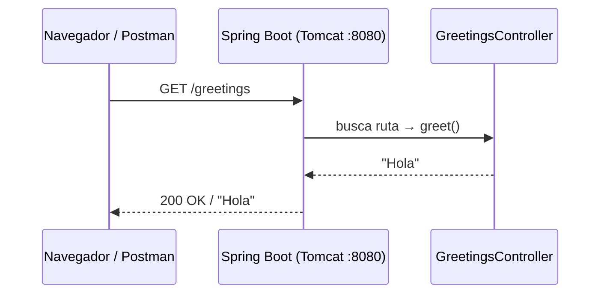

# Lección 03 - Cómo funciona HTTP y por qué tu endpoint responde

Esta sección no es una lista de reglas para memorizar. Es la explicación del mecanismo real detrás de lo que acabas de construir. Un buen desarrollador no solo sabe *cómo* hacer algo, sino *por qué* funciona.

---

## ¿Qué es HTTP?

**HTTP** (HyperText Transfer Protocol) es el protocolo de comunicación que usan el navegador y el servidor para entenderse. Es un protocolo de texto, sin estado, basado en el modelo **petición → respuesta**:

- El **cliente** (navegador, Postman, aplicación frontend) envía una **petición**
- El **servidor** (tu aplicación Spring Boot) procesa esa petición y devuelve una **respuesta**

Cada petición es independiente: el servidor no recuerda peticiones anteriores a menos que uses mecanismos como cookies o tokens. Eso es lo que significa "sin estado" (stateless).

---

## Anatomía de una petición HTTP

Cuando escribes `http://localhost:8080/greetings` en el navegador, este construye y envía una petición que tiene esta forma:

```http
GET /greetings HTTP/1.1
Host: localhost:8080
User-Agent: Mozilla/5.0 ...
Accept: text/html,application/xhtml+xml,...
```

Vamos parte por parte:

### Línea de inicio: método + ruta + versión

```
GET /greetings HTTP/1.1
```

| Parte | Qué es | En nuestro caso |
|---|---|---|
| `GET` | El **método HTTP** — qué tipo de operación se pide | Leer / obtener información |
| `/greetings` | La **ruta** — qué recurso se solicita | El saludo |
| `HTTP/1.1` | La **versión del protocolo** | La más común hoy en día |

### Cabeceras (headers)

```
Host: localhost:8080
```

Las cabeceras son metadatos de la petición: quién la hace, qué formato acepta como respuesta, qué idioma prefiere, etc. Son pares `Clave: Valor`. Algunas las pone el navegador automáticamente; otras las agrega el desarrollador.

### Cuerpo (body)

En una petición `GET` **no hay cuerpo**. El `GET` solo pide información; no envía datos. El cuerpo es relevante en métodos como `POST` o `PUT`, donde el cliente envía datos al servidor (por ejemplo, los datos de un formulario o un objeto JSON).

---

## Anatomía de una respuesta HTTP

El servidor recibe la petición, la procesa y devuelve una respuesta:

```http
HTTP/1.1 200 OK
Content-Type: text/plain;charset=UTF-8
Content-Length: 4

Hola
```

### Línea de estado: versión + código + descripción

```
HTTP/1.1 200 OK
```

| Parte | Qué es |
|---|---|
| `HTTP/1.1` | Versión del protocolo |
| `200` | **Código de estado** — indica si la operación fue exitosa o no |
| `OK` | Descripción textual del código (para humanos) |

### Cabeceras de respuesta

```
Content-Type: text/plain;charset=UTF-8
Content-Length: 4
```

Le dicen al cliente cómo interpretar el cuerpo:
- `Content-Type`: qué tipo de dato viene en el cuerpo (`text/plain` = texto plano, `application/json` = JSON)
- `Content-Length`: cuántos bytes tiene el cuerpo

Spring Boot agrega estas cabeceras automáticamente según el tipo de dato que retorna el método.

### Cuerpo de la respuesta

```
Hola
```

Lo que el método `greet()` retornó. Para un `String` de Java, Spring lo escribe directamente como texto plano.

---

## Los códigos de estado HTTP más importantes

El código de estado es la forma en que el servidor le dice al cliente si todo salió bien y, si no, qué pasó.

| Rango | Categoría | Significado |
|---|---|---|
| `2xx` | ✅ Éxito | La petición fue procesada correctamente |
| `3xx` | ↪️ Redirección | El recurso se movió a otra URL |
| `4xx` | ❌ Error del cliente | La petición tiene algún problema |
| `5xx` | 💥 Error del servidor | El servidor falló al procesar una petición válida |

Los que más vas a usar en este curso:

| Código | Nombre | Cuándo se usa |
|---|---|---|
| `200 OK` | Éxito | La operación funcionó correctamente |
| `201 Created` | Creado | Se creó un nuevo recurso (`POST`) |
| `400 Bad Request` | Petición inválida | El cliente envió datos incorrectos |
| `404 Not Found` | No encontrado | El recurso solicitado no existe |
| `500 Internal Server Error` | Error del servidor | Algo falló en el código del servidor |

> **¿Por qué importan los códigos?** Un cliente bien implementado (una app frontend, un script, un servicio externo) toma decisiones basadas en el código de estado. Si tu API siempre devuelve `200 OK` aunque haya un error, el cliente no puede saber qué pasó realmente.

---

## Los métodos HTTP y su significado

HTTP define varios métodos (también llamados verbos), cada uno con un propósito específico:

| Método | Propósito | Ejemplo |
|---|---|---|
| `GET` | **Leer** un recurso o una colección | `GET /greetings` — obtener el saludo |
| `POST` | **Crear** un nuevo recurso | `POST /tickets` — crear un ticket |
| `PUT` | **Reemplazar** un recurso completo | `PUT /tickets/1` — reemplazar el ticket 1 |
| `PATCH` | **Modificar** parte de un recurso | `PATCH /tickets/1` — actualizar solo el estado |
| `DELETE` | **Eliminar** un recurso | `DELETE /tickets/1` — eliminar el ticket 1 |

En esta lección solo usamos `GET`. Es el más simple y el más seguro: solo lee, nunca modifica nada.

> **Seguro e idempotente:** `GET` es *seguro* (no tiene efectos secundarios en el servidor) e *idempotente* (hacer la misma petición 10 veces produce el mismo resultado que hacerla una sola vez). Estas propiedades son importantes para cachés y reintentos automáticos.

---

## ¿Cómo sabe Spring qué método ejecutar?

Cuando Spring Boot arranca, escanea todas las clases anotadas con `@RestController`. Para cada una, lee las anotaciones `@RequestMapping`, `@GetMapping`, `@PostMapping`, etc. y construye una **tabla de rutas** interna:

```
GET  /greetings  →  GreetingsController.greet()
```

Cuando llega una petición HTTP, Spring consulta esa tabla y ejecuta el método correspondiente. Si no encuentra ningún método que coincida con el método HTTP y la ruta, Spring devuelve automáticamente un `404 Not Found`.

Este mecanismo se llama **routing** o **mapeo de URLs**.

### ¿Qué pasa si la ruta no existe?

Prueba esto: levanta la aplicación y accede a:

```
http://localhost:8080/hola
```

Spring devuelve `404 Not Found` porque no hay ningún método registrado para `GET /hola`. Eso es correcto: la API solo conoce lo que tú le enseñas.

### ¿Qué pasa si usas el método HTTP incorrecto?

Prueba hacer un `POST /greetings` desde Postman. Spring devuelve `405 Method Not Allowed`, porque hay un método registrado para esa ruta, pero no acepta el verbo `POST`.

---

## ¿Cómo mapea Spring la URL con tu código?

El mapeo funciona en dos niveles, uno en la clase y otro en el método:

```java
@RestController
@RequestMapping("/greetings")   ← nivel 1: prefijo de la clase
public class GreetingsController {

    @GetMapping                  ← nivel 2: método HTTP (GET) + ruta adicional (ninguna)
    public String greet() {
        return "Hola";
    }
}
```

La URL final resulta de **concatenar** el `@RequestMapping` de la clase con la ruta del método:

```
/greetings  +  (vacío)  =  GET /greetings
```

Si el método tuviera `@GetMapping("/formal")`, la URL sería `GET /greetings/formal`.

Esto permite organizar múltiples endpoints relacionados bajo un mismo prefijo:

```java
@RestController
@RequestMapping("/greetings")
public class GreetingsController {

    @GetMapping               // GET /greetings
    public String greet() { return "Hola"; }

    @GetMapping("/formal")    // GET /greetings/formal
    public String formal() { return "Buenos días"; }
}
```

---

## ¿Por qué el puerto es 8080?

Spring Boot incluye un servidor HTTP embebido (**Tomcat** por defecto) que arranca junto con la aplicación. El puerto `8080` es su valor predeterminado.

El número de puerto identifica qué servicio dentro de una máquina debe recibir la conexión. Algunos puertos tienen usos estándar:

| Puerto | Uso estándar |
|---|---|
| `80` | HTTP en producción |
| `443` | HTTPS en producción |
| `8080` | Servidores de desarrollo (convención) |
| `5432` | PostgreSQL |
| `3306` | MySQL |

Para cambiar el puerto de tu aplicación, agrega esto en `application.properties`:

```properties
server.port=9090
```

Después de reiniciar, tu endpoint estaría en `http://localhost:9090/greetings`.

---

## ¿Qué significa `localhost`?

`localhost` es un nombre especial que siempre apunta a **tu propia máquina**. Es equivalente a la dirección IP `127.0.0.1`. Cuando el servidor y el cliente están en la misma máquina (como en desarrollo), usas `localhost` para conectarte al servidor que levantaste tú mismo.

En producción, en lugar de `localhost` usarías el nombre de dominio real del servidor (por ejemplo, `api.miempresa.com`).

---

## El ciclo completo en una imagen


```
┌─────────────────────────────────────────────────────────┐
│                     TU MÁQUINA                          │
│                                                         │
│  ┌─────────────┐    GET /greetings    ┌───────────────┐ │
│  │  Navegador  │ ───────────────────▶ │  Spring Boot  │ │
│  │  o Postman  │                      │  (puerto 8080)│ │
│  │             │ ◀─────────────────── │               │ │
│  └─────────────┘    200 OK / "Hola"   │  Tomcat       │ │
│                                       │  GreetingsCtrl│ │
│                                       └───────────────┘ │
└─────────────────────────────────────────────────────────┘
```

1. El cliente construye y envía la petición HTTP
2. Tomcat recibe la petición en el puerto 8080
3. Spring busca en su tabla de rutas: `GET /greetings → GreetingsController.greet()`
4. Ejecuta el método y obtiene `"Hola"`
5. Construye la respuesta HTTP con código `200 OK` y cuerpo `Hola`
6. Envía la respuesta al cliente

