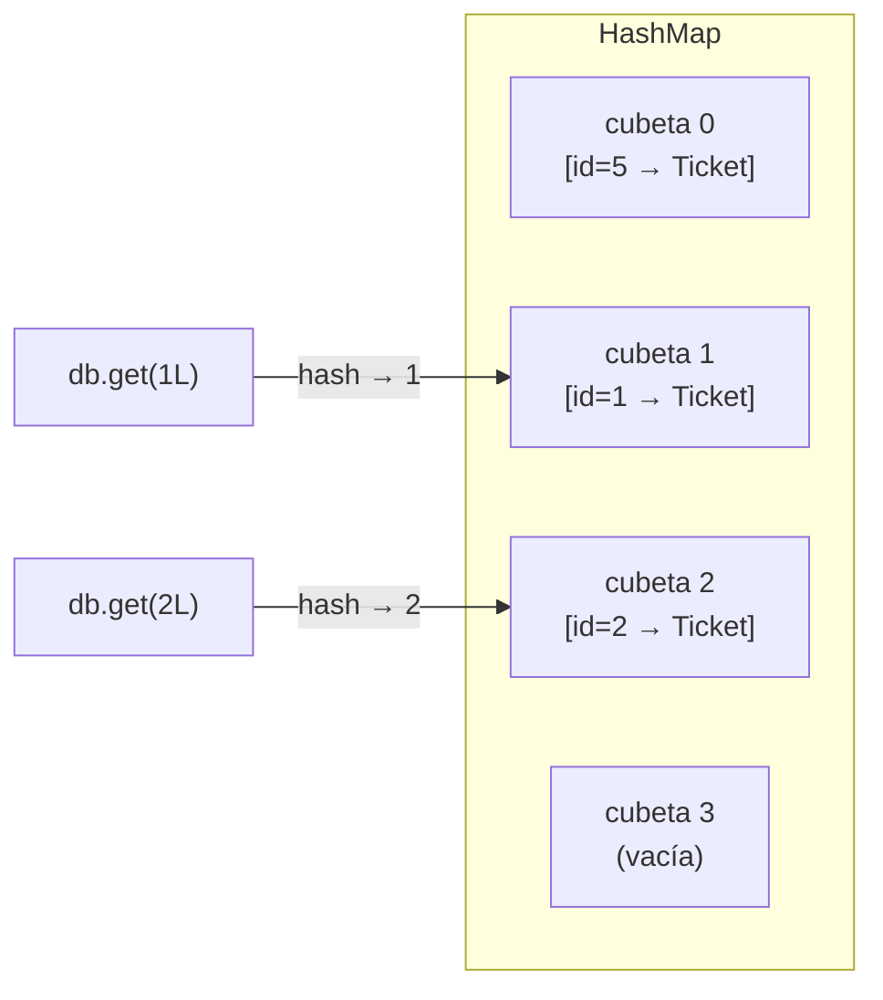
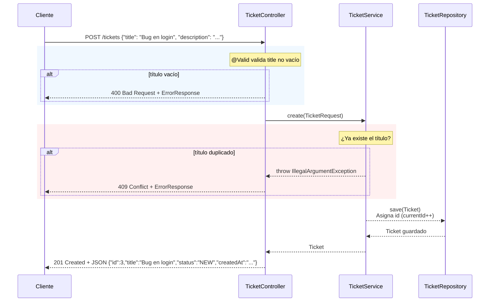

# Lección 09 - Map vs List, y el refinamiento del patrón CSR

## ¿Por qué importa la estructura de datos?

El código que tu API ejecuta se puede medir en términos de eficiencia. No toda solución que "funciona" es igualmente buena: el número de operaciones que realiza importa, especialmente cuando los datos crecen.

---

## La diferencia entre List y Map

| Operación | `List<Ticket>` | `Map<Long, Ticket>` |
|---|---|---|
| Buscar por ID | O(n) — recorre hasta encontrarlo | O(1) — va directo por hash |
| Insertar | O(1) — agrega al final | O(1) — inserta por clave |
| Actualizar por ID | O(n) — primero busca, luego modifica | O(1) — `get(id)` + modificación |
| Eliminar por ID | O(n) — `removeIf` recorre la lista | O(1) — `remove(id)` |
| Recorrer todos | O(n) — inevitable | O(n) — inevitable |
| Filtrar | O(n) — inevitable | O(n) — inevitable |

La conclusión: cuando el acceso por ID es la operación más frecuente (como en un API REST con `GET /tickets/{id}`, `PUT /tickets/{id}`, `DELETE /tickets/{id}`), el `Map` gana claramente.

---

## Cómo funciona un `HashMap` internamente (simplificado)

Un `HashMap` mantiene internamente un arreglo de "cubetas" (buckets). Cuando guardas un par clave-valor:

1. Java calcula el `hashCode()` de la clave (en nuestro caso, el `Long id`)
2. Ese hash determina en qué cubeta del arreglo se almacena
3. Al buscar con `get(id)`, Java recalcula el hash y va directamente a esa cubeta



No hay recorrido. No hay comparaciones. Un cálculo de hash y una posición de memoria.

---

## El puente hacia JPA

Cuando en el futuro migres tu aplicación a una base de datos real con JPA, no escribirás `findById()` a mano. Spring Data JPA lo provee directamente:

```java
// Con JPA, el repositorio es solo una interfaz:
public interface TicketRepository extends JpaRepository<Ticket, Long> {
    // findById ya viene incluido → SELECT * FROM tickets WHERE id = ?
    // La base de datos tiene un índice PRIMARY KEY → O(log n) o O(1) según el motor
}
```

El Map de esta lección te enseña el **concepto** de acceso por clave que JPA aplica con índices de base de datos. El puente es directo.

---

## El patrón CSR bien aplicado: análisis del estado final

Después de las lecciones 07, 08 y 09, tu aplicación tiene una arquitectura CSR madura. Veamos qué hace cada capa y por qué:

### Controller — la capa de presentación

**Responsabilidades:**
- Recibir la petición HTTP y extraer parámetros (`@PathVariable`, `@RequestParam`, `@RequestBody`)
- Validar la entrada con `@Valid`
- Transformar el resultado del Service en una `ResponseEntity` con el código HTTP correcto
- Manejar las excepciones que el Service lanza y convertirlas en respuestas de error

**Lo que NO hace:**
- No tiene `if` de reglas de negocio ("¿el título está duplicado?")
- No accede al Repository directamente
- No construye objetos de dominio (`new Ticket()` no aparece en el Controller)

```java
// Controller limpio: solo HTTP → Service → HTTP
@PostMapping
public ResponseEntity<?> create(@Valid @RequestBody TicketRequest request) {
    try {
        return ResponseEntity.status(CREATED).body(service.create(request));
    } catch (IllegalArgumentException e) {
        return ResponseEntity.status(CONFLICT).body(new ErrorResponse(e.getMessage()));
    }
}
```

### Service — la capa de negocio

**Responsabilidades:**
- Aplicar las reglas de negocio (no duplicar títulos, asignar estado inicial, calcular fechas)
- Coordinar entre Repository y otras fuentes de datos si las hay
- Decidir qué datos construye el servidor vs qué llega del cliente
- Lanzar excepciones con mensajes claros cuando algo viola una regla

**Lo que NO hace:**
- No sabe que existe HTTP (no usa `HttpStatus`, no maneja `ResponseEntity`)
- No construye respuestas JSON
- No accede a la base de datos directamente

```java
// Service: solo lógica de negocio
public Ticket create(TicketRequest request) {
    if (repository.existsByTitle(request.getTitle())) {
        throw new IllegalArgumentException("Ya existe un ticket con el título '" + request.getTitle() + "'");
    }
    Ticket ticket = new Ticket();
    ticket.setTitle(request.getTitle());
    ticket.setStatus("NEW");
    ticket.setCreatedAt(LocalDateTime.now());
    return repository.save(ticket);
}
```

### Repository — la capa de datos

**Responsabilidades:**
- Almacenar y recuperar datos
- Proveer operaciones básicas de acceso: `save`, `findById`, `getAll`, `update`, `delete`
- Implementar la estrategia de acceso más eficiente para cada operación

**Lo que NO hace:**
- No tiene reglas de negocio ("no duplicados" no va aquí)
- No sabe que existe HTTP
- No decide qué campos asigna el servidor (eso es el Service)

```java
// Repository: solo gestión del almacenamiento
public Optional<Ticket> findById(Long id) {
    return Optional.ofNullable(db.get(id)); // O(1), sin lógica de negocio
}
```

---

## Señales de que algo está en la capa equivocada

| Si ves esto... | Está en la capa equivocada | Debería estar en... |
|---|---|---|
| `if (ticket.getTitle() == null)` en el Controller | Controller | Service o DTO (@NotBlank) |
| `HttpStatus.CONFLICT` en el Service | Service | Controller |
| `db.get(id)` directamente en el Controller | Controller | Repository |
| `LocalDateTime.now()` en el Repository | Repository | Service |
| `new Ticket()` en el Controller | Controller | Service |
| `throw new IllegalArgumentException` en el Repository (por regla de negocio) | Repository | Service |

---

## El flujo completo de una petición `POST /tickets` con todo lo aprendido



Cada capa hace exactamente lo que le corresponde. Ninguna hace más.

