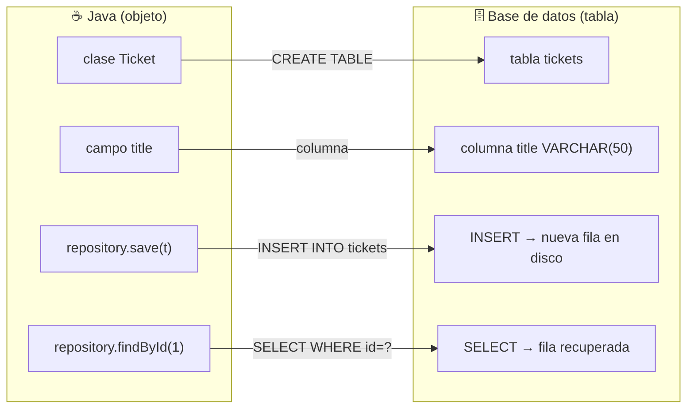
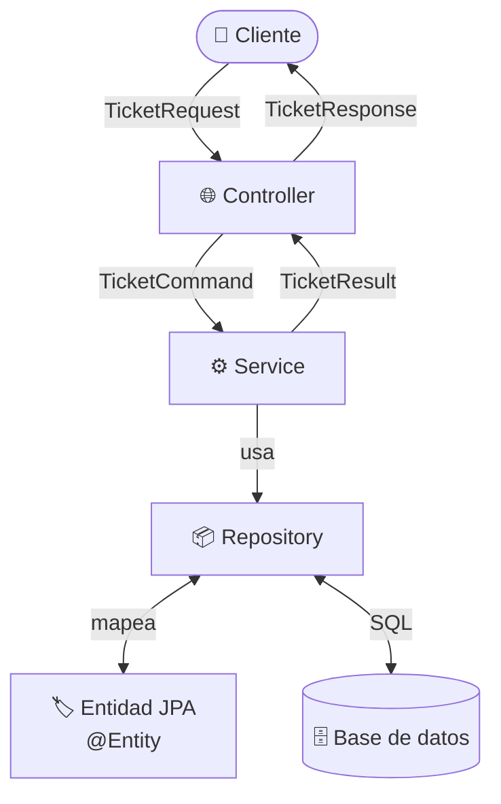
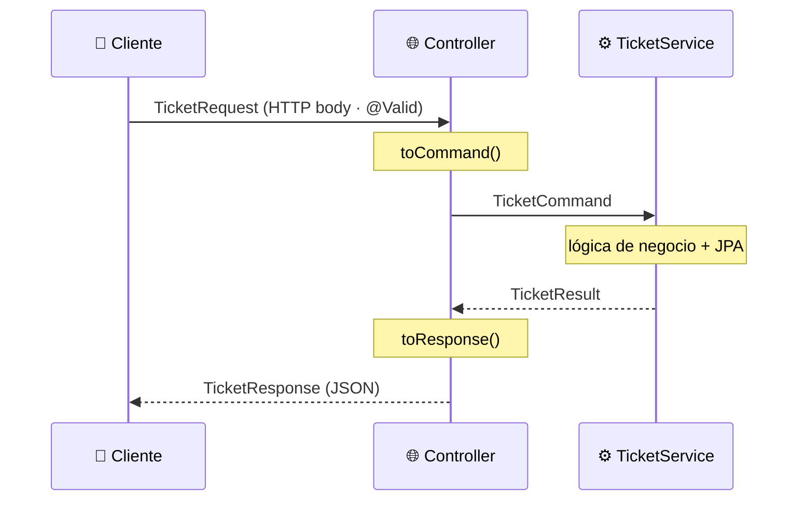

# Lección 10 — JPA y ORM: del Map a la base de datos

## ¿De dónde venimos?

En la lección 09 refactorizaste el repositorio para usar `Map<Long, Ticket>` con acceso O(1). Tu API:

- Almacena tickets en memoria con búsqueda eficiente por clave
- Filtra por estado con `?status=`
- Sigue el patrón CSR con responsabilidades bien delimitadas

Pero hay un problema crítico: **cuando la aplicación se reinicia, todos los datos desaparecen**. El `HashMap` vive en la memoria del proceso y muere con él.

Para que los datos sobrevivan reinicios necesitas una base de datos real. Eso es exactamente lo que esta lección resuelve.

---

## ¿Qué es JPA y qué problema resuelve?

**JPA** (Jakarta Persistence API) es la especificación de Java para mapear objetos a tablas de base de datos.

**Hibernate** es la implementación más usada de JPA. Spring Boot lo incluye automáticamente cuando agregas la dependencia correspondiente.

El problema que resuelve se llama "desajuste de impedancia": el código Java trabaja con **objetos**, las bases de datos almacenan **filas en tablas**. JPA actúa como **traductor automático**:



No escribes SQL. JPA lo genera por ti según las anotaciones que agregas a tus clases.

---

## ¿Por qué no retornar entidades directamente?

En una aplicación con capas (Controller → Service → Repository → Model), existe una regla de oro: **nunca exponer entidades JPA fuera del Service**.



**¿Por qué?**

| Problema | Solución |
|----------|----------|
| Ciclos en JSON (A→B→A) | DTOs rompemos la cadena |
| Datos sensibles expuestos | DTO filtra qué se retorna |
| Acoplamiento con BD | La entidad solo existe en repository |
| Cambios en BD rompen API | DTOs son contracts estables |

---

## DTOs: los cuatro roles del flujo de datos

Para resolver esto, usamos **DTOs** (Data Transfer Objects). En una API con JPA hay cuatro roles bien diferenciados:

| DTO | Nombre | Dirección | Quién lo usa |
|-----|--------|-----------|--------------|
| `*Request` | Input HTTP | Cliente → Controller | Controller: valida con `@Valid` |
| `*Command` | Input Service | Controller → Service | Service: recibe para operar |
| `*Result` | Output Service | Service → Controller | Service: retorna datos planos |
| `*Response` | Output HTTP | Controller → Cliente | Controller: serializa a JSON |



| Capa | Input | Output |
|------|-------|--------|
| Controller | Recibe `*Request` del cliente | Retorna `*Response` al cliente |
| Service | Recibe `*Command` | Retorna `*Result` |
| Repository | Entidad JPA | Entidad JPA |

**Regla:**
- Cliente → Controller: `*Request`
- Controller → Service: `*Command`
- Service → Controller: `*Result`
- Controller → Cliente: `*Response`

---

## ¿Qué vas a construir?

Al terminar esta lección tendrás:

1. La dependencia `spring-boot-starter-data-jpa` agregada al `pom.xml`
2. La clase `Ticket` anotada como entidad JPA (`@Entity`, `@Id`, `@GeneratedValue`, `@Column`)
3. `TicketRepository` convertido de **clase** a **interfaz** que extiende `JpaRepository`
4. `TicketService` actualizado para usar los métodos que Spring Data JPA provee automáticamente
5. La aplicación funcionando con base de datos H2 (en memoria)
6. DTOs bien estructurados: `TicketCommand` (input al Service), `TicketResult` (output del Service) y `TicketResponse` (output HTTP)
7. Un `DataInitializer` que siembra tickets iniciales usando JPA al arrancar la aplicación

### Lo que vas a poder explicar

- ¿Qué hace `@Entity` en una clase?
- ¿Qué es `@Id` y por qué no puede faltar en una entidad?
- ¿Qué genera `@GeneratedValue(strategy = GenerationType.IDENTITY)`?
- ¿Qué métodos vienen incluidos en `JpaRepository<Ticket, Long>`?
- ¿Por qué el repositorio ahora es una **interfaz** y no una clase?
- ¿Por qué no retornar entidades JPA directamente?
- ¿Cuál es la diferencia entre `*Command`, `*Result` y `*Response`?

---

## Nuevo requerimiento

| Requerimiento | Descripción |
|---|---|
| **REQ-15** | Los tickets deben persistirse en base de datos real: los datos sobreviven reinicios de la aplicación |

---

## La estructura que tienes al comenzar

```
src/main/java/cl/duoc/fullstack/tickets/
├── controller/
│   └── TicketController.java
├── dto/
│   └── TicketRequest.java
├── model/
│   ├── Ticket.java              ← POJO Lombok, sin anotaciones JPA
│   └── ErrorResponse.java
├── respository/
│   └── TicketRepository.java   ← clase con Map<Long, Ticket>
├── service/
│   └── TicketService.java
└── TicketsApplication.java
```

La estructura al terminar:

```
src/main/java/cl/duoc/fullstack/tickets/
├── config/
│   └── DataInitializer.java    ← siembra datos iniciales con JPA
├── controller/
│   └── TicketController.java   ← recibe Request, retorna Response
├── dto/
│   ├── TicketCommand.java      ← input al Service
│   ├── TicketRequest.java      ← input HTTP (sin cambios, @Valid)
│   ├── TicketResponse.java     ← output HTTP al cliente
│   └── TicketResult.java       ← output del Service
├── model/
│   ├── Ticket.java             ← @Entity, solo vive en repository
│   └── ErrorResponse.java
├── respository/
│   └── TicketRepository.java   ← interfaz JpaRepository
├── service/
│   └── TicketService.java      ← recibe Command, retorna Result
└── TicketsApplication.java
```

---

## ¿Qué NO cubre esta lección?

| Tema | ¿Cuándo se ve? |
|---|---|
| MySQL (XAMPP) | Lección 11 |
| Configurar Supabase (PostgreSQL en la nube) | Lección 11 |
| Relaciones entre tablas (`@ManyToOne`, `@OneToMany`) | Lección 12 |
| Tabla de historial de cambios | Lección 13 |
| Paginación (`Pageable`) | Fuera del alcance del curso |
| JPQL para consultas complejas (subconsultas, JOINs, agregaciones) | Fuera del alcance del curso |
| `@Modifying` + `@Query` para bulk update/delete básico | **Sí se ve** — en `03_jpa_y_orm.md` |
