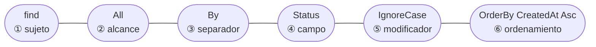
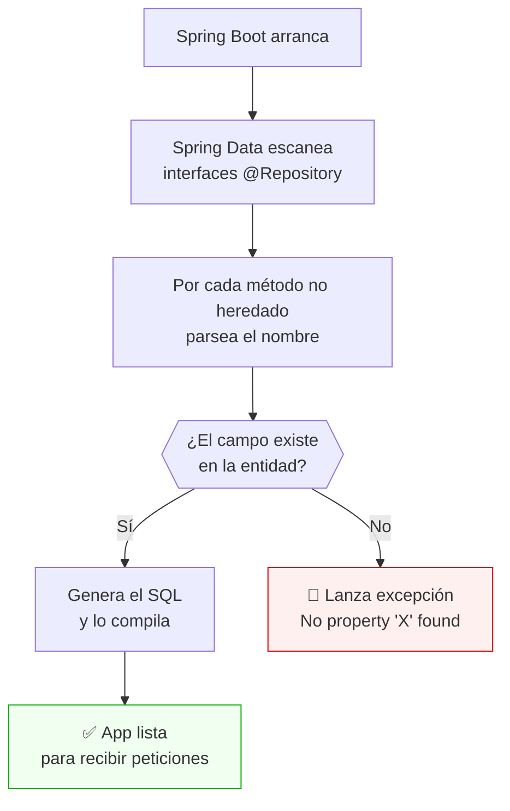
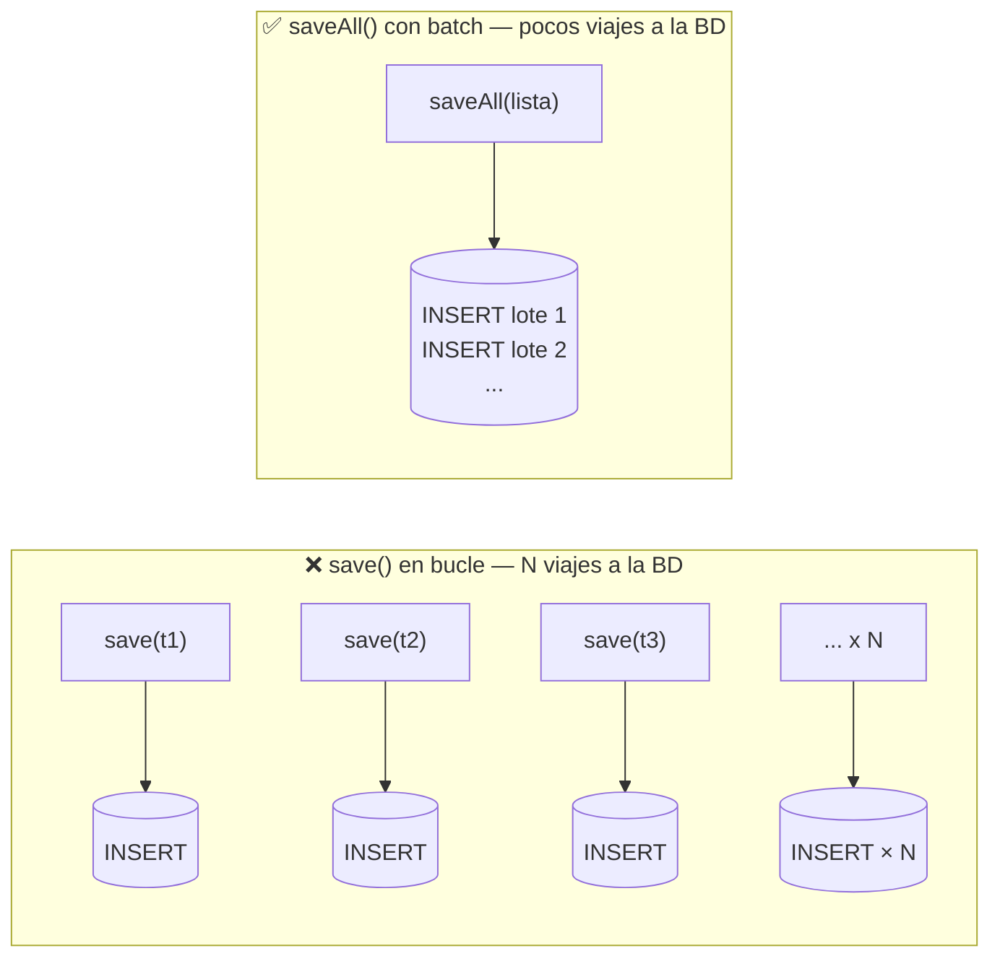
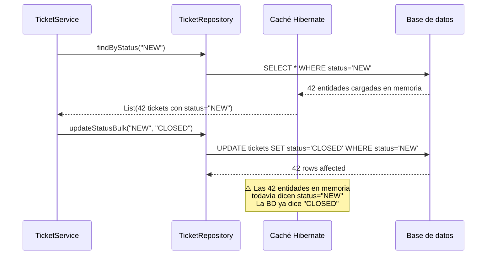
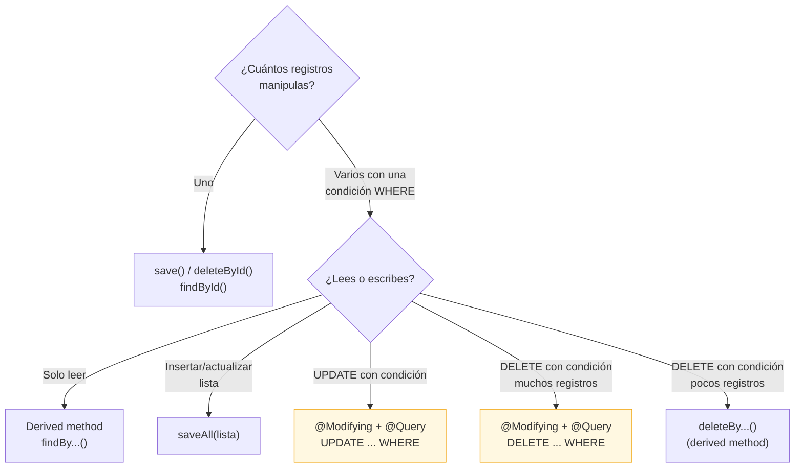
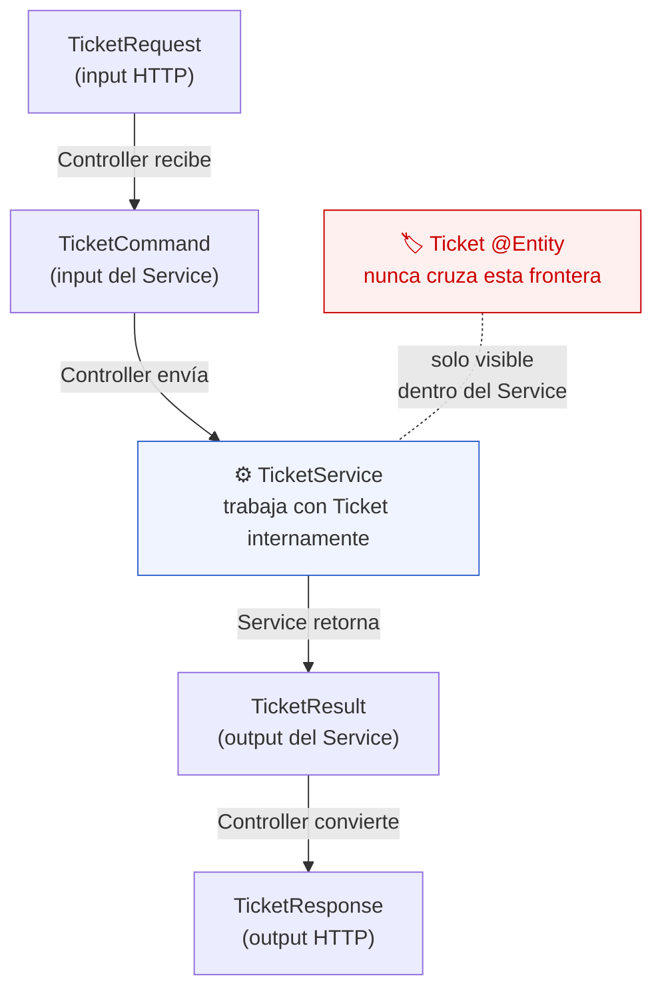
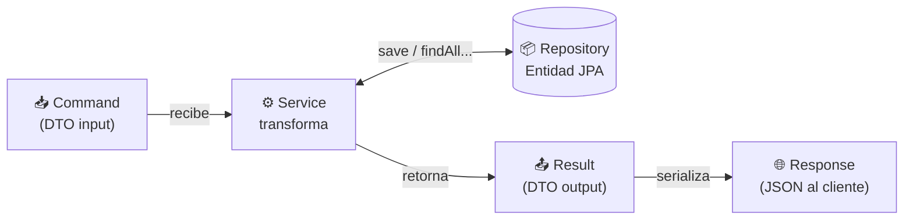

# Lección 10 — JPA, ORM y anotaciones esenciales

## ¿Qué es un ORM?

**ORM** significa *Object-Relational Mapping* (Mapeo Objeto-Relacional). Es la técnica de traducir automáticamente entre dos mundos que hablan idiomas distintos:

| Mundo Java (orientado a objetos) | Mundo SQL (relacional) |
|---|---|
| Clase | Tabla |
| Objeto (instancia) | Fila |
| Campo / atributo | Columna |
| Tipo `String` | `VARCHAR` |
| Tipo `Long` | `BIGINT` |
| Tipo `LocalDateTime` | `DATETIME` |
| Referencia entre objetos (`ticket.user`) | Clave foránea (`ticket.user_id`) |

Sin ORM, escribirías SQL a mano para cada operación. Con JPA + Hibernate, describes tus clases con anotaciones y el framework genera el SQL por ti.

---

## Las anotaciones que debes conocer

### `@Entity`

```java
@Entity
public class Ticket { ... }
```

Le dice a JPA: "esta clase representa una tabla en la base de datos". Cada instancia del objeto corresponde a una fila en esa tabla.

**Regla:** toda clase anotada con `@Entity` debe tener un constructor sin argumentos (lo provee `@NoArgsConstructor` de Lombok).

---

### `@Table`

```java
@Entity
@Table(name = "tickets")
public class Ticket { ... }
```

Define el nombre exacto de la tabla en la base de datos. Si omites `@Table`, JPA usa el nombre de la clase en minúsculas (`ticket`). Es buena práctica explicitarlo siempre para evitar sorpresas.

---

### `@Id`

```java
@Id
private Long id;
```

Marca el campo que es la **clave primaria** de la tabla. Toda entidad JPA debe tener exactamente un `@Id`. Sin él, JPA lanza una excepción al arrancar.

---

### `@GeneratedValue`

```java
@Id
@GeneratedValue(strategy = GenerationType.IDENTITY)
private Long id;
```

Le dice a JPA que la base de datos genera el valor del ID automáticamente. `IDENTITY` usa el mecanismo nativo de la base de datos:

- **MySQL**: `AUTO_INCREMENT`
- **PostgreSQL**: `SERIAL` o `GENERATED ALWAYS AS IDENTITY`

Con esto, nunca asignas el ID manualmente. Cuando llamas a `repository.save(ticket)`, la base de datos asigna el próximo ID disponible y JPA lo inyecta de vuelta en el objeto.

**Estrategias disponibles:**

| Estrategia | Cómo funciona |
|---|---|
| `IDENTITY` | Usa AUTO_INCREMENT / SERIAL de la base de datos. La más simple, la más usada |
| `SEQUENCE` | Usa una secuencia de la base de datos (PostgreSQL lo soporta nativamente) |
| `AUTO` | JPA elige la estrategia según la base de datos. Menos predecible |

Para este curso, siempre usa `IDENTITY`.

---

### `@Column`

```java
@Column(name = "created_at", nullable = false, length = 50)
private String title;
```

Personaliza la columna en la base de datos. Los atributos más usados:

| Atributo | Qué hace | Valor por defecto |
|---|---|---|
| `name` | Nombre de la columna en SQL | Nombre del campo en Java |
| `nullable` | Si la columna acepta `NULL` | `true` |
| `length` | Longitud máxima para `VARCHAR` | `255` |
| `unique` | Si los valores deben ser únicos | `false` |
| `columnDefinition` | Define el tipo SQL exacto | (lo elige Hibernate) |

Si omites `@Column`, JPA crea la columna con el nombre del campo y valores por defecto.

---

## Qué viene incluido en `JpaRepository`

Cuando tu repositorio extiende `JpaRepository<Ticket, Long>`, obtienes estos métodos sin escribir nada:

| Método | SQL equivalente |
|---|---|
| `save(ticket)` | `INSERT` o `UPDATE` según si tiene ID |
| `findById(id)` | `SELECT * FROM tickets WHERE id = ?` |
| `findAll()` | `SELECT * FROM tickets` |
| `existsById(id)` | `SELECT COUNT(*) WHERE id = ?` |
| `deleteById(id)` | `DELETE FROM tickets WHERE id = ?` |
| `count()` | `SELECT COUNT(*) FROM tickets` |

Además, puedes agregar métodos propios siguiendo una convención de nombres que Spring Data interpreta automáticamente:

```java
// Spring Data genera: SELECT * FROM tickets WHERE status = ? (insensible a mayúsculas)
List<Ticket> findByStatusIgnoreCase(String status);

// Spring Data genera: SELECT COUNT(*) WHERE LOWER(title) = LOWER(?)
boolean existsByTitleIgnoreCase(String title);

// Spring Data genera: SELECT * FROM tickets ORDER BY created_at ASC
List<Ticket> findAllByOrderByCreatedAtAsc();

// Spring Data genera: SELECT * FROM tickets WHERE status = ? ORDER BY created_at DESC
List<Ticket> findByStatusOrderByCreatedAtDesc(String status);
```

La convención es: `findBy` + `NombreDeCampo` + (modificadores opcionales como `IgnoreCase`, `OrderBy`, etc.). A continuación se explica en detalle cómo funciona esta convención.

---

## Derived Query Methods — cómo Spring Data lee el nombre del método

Cuando la aplicación arranca, Spring Data escanea cada método de cada repositorio y los que no están en `JpaRepository` los pasa por un **analizador de nombres**. Este analizador descompone el nombre en partes, valida que los campos existan en la entidad y genera el SQL. Si algo no cuadra, la aplicación **no arranca** — el error aparece antes de que llegue la primera petición HTTP. Eso es una ventaja: los errores de consulta se detectan en compilación/arranque, no en producción.

### La anatomía de un nombre derivado

Un nombre de método tiene hasta cuatro partes:



**`findAllByStatusIgnoreCaseOrderByCreatedAtAsc`**
→ `SELECT * FROM tickets WHERE LOWER(status) = LOWER(?) ORDER BY created_at ASC`

Cada parte es opcional excepto el sujeto y el separador `By` (cuando hay condición).

---

### ① Los sujetos — qué retorna el método

El sujeto define el tipo de operación y el tipo de retorno.

| Sujeto | Tipo de retorno | SQL generado |
|--------|----------------|--------------|
| `find...By` | `List<T>` o `Optional<T>` | `SELECT ...` |
| `read...By` | igual que `find` | alias de `find` |
| `get...By` | igual que `find` | alias de `find` |
| `count...By` | `long` | `SELECT COUNT(*)` |
| `exists...By` | `boolean` | `SELECT COUNT(*) > 0` |
| `delete...By` | `void` o `long` | `DELETE FROM ...` |

```java
List<Ticket> findByStatus(String status);         // SELECT ...
long         countByStatus(String status);        // SELECT COUNT(*)
boolean      existsByTitleIgnoreCase(String t);   // SELECT COUNT(*) > 0
long         deleteByStatus(String status);       // DELETE FROM ...
```

---

### ② El alcance (opcional) — cuántos registros

Entre el sujeto y `By` puedes agregar un alcance. El más común es nada (retorna todos los que coinciden) o `Top`/`First` para limitar:

```java
// Todos los que coinciden
List<Ticket> findByStatus(String status);

// Solo el primero (el más reciente)
Optional<Ticket> findFirstByStatusOrderByCreatedAtDesc(String status);

// Solo los 3 primeros
List<Ticket> findTop3ByStatusOrderByCreatedAtAsc(String status);
```

`Top` y `First` son equivalentes — ambos agregan `LIMIT N` al SQL. El número va pegado: `Top3`, `Top10`, `First1`.

---

### ③ El separador `By`

`By` es el pivote: todo lo que va antes define **qué** y **cuánto** retorna; todo lo que va después define el `WHERE`. Sin predicado después del `By`, Spring Data no agrega condición (equivale a `findAll()`).

```java
// sin condición — equivale a findAll() con orden
List<Ticket> findAllByOrderByCreatedAtAsc();
//           ↑ By sin campo antes del OrderBy = sin WHERE
```

---

### ④ Los campos — el nombre Java, no el SQL

El nombre del campo en el método **debe coincidir exactamente** con el nombre del campo en la clase Java (con la primera letra en mayúscula). Spring Data usa reflexión sobre la entidad para validar esto al arrancar.

```java
// Entidad: private LocalDateTime createdAt;

findAllByOrderByCreatedAtAsc()     // ✅ "createdAt" → "CreatedAt"
findAllByOrderByCreationDateAsc()  // ❌ no existe "creationDate" en Ticket
// → No property 'creationDate' found for type 'Ticket'
```

> El nombre de la **columna SQL** (`created_at`) es irrelevante aquí. Spring Data trabaja con el nombre del **campo Java** (`createdAt`).

---

### ⑤ Los modificadores de condición

Después del nombre del campo puedes agregar uno o más modificadores:

| Modificador | SQL generado | Ejemplo |
|---|---|---|
| *(ninguno)* | `= ?` | `findByStatus(String s)` |
| `IgnoreCase` | `LOWER(campo) = LOWER(?)` | `findByStatusIgnoreCase(String s)` |
| `Not` | `!= ?` | `findByStatusNot(String s)` |
| `Containing` | `LIKE '%?%'` | `findByTitleContaining(String t)` |
| `StartingWith` | `LIKE '?%'` | `findByTitleStartingWith(String t)` |
| `EndingWith` | `LIKE '%?'` | `findByTitleEndingWith(String t)` |
| `In` | `IN (?, ?, ...)` | `findByStatusIn(List<String> l)` |
| `IsNull` | `IS NULL` | `findByEffectiveResolutionDateIsNull()` |
| `IsNotNull` | `IS NOT NULL` | `findByEffectiveResolutionDateIsNotNull()` |
| `LessThan` | `< ?` | `findByCreatedAtLessThan(LocalDateTime dt)` |
| `GreaterThan` | `> ?` | `findByCreatedAtGreaterThan(LocalDateTime dt)` |
| `Between` | `BETWEEN ? AND ?` | `findByCreatedAtBetween(LocalDateTime a, LocalDateTime b)` |

Los modificadores se **apilan**: `ContainingIgnoreCase` combina `Containing` con `IgnoreCase`:

```java
// WHERE LOWER(title) LIKE LOWER('%?%')
List<Ticket> findByTitleContainingIgnoreCase(String keyword);
```

---

### Combinar condiciones: `And` y `Or`

Puedes encadenar múltiples campos con `And` u `Or`. Los parámetros del método van en el **mismo orden** que los campos en el nombre:

```java
// WHERE status = ? AND created_at > ?
List<Ticket> findByStatusAndCreatedAtGreaterThan(
    String status, LocalDateTime from);

// WHERE status = ? OR LOWER(title) LIKE LOWER('%?%')
List<Ticket> findByStatusOrTitleContainingIgnoreCase(
    String status, String keyword);

// WHERE status = ? AND effective_resolution_date IS NULL
List<Ticket> findByStatusAndEffectiveResolutionDateIsNull(String status);
```

> **Regla:** los parámetros se asignan por **posición**, no por nombre. Si el método tiene `AndCreatedAtBetween`, necesitas dos parámetros `LocalDateTime` en ese orden.

---

### ⑥ El ordenamiento

`OrderBy` + campo + `Asc`/`Desc` al final del nombre agrega `ORDER BY` al SQL. Puedes encadenar varios campos de orden:

```java
// ORDER BY created_at ASC
List<Ticket> findAllByOrderByCreatedAtAsc();

// WHERE status = ? ORDER BY created_at DESC
List<Ticket> findByStatusOrderByCreatedAtDesc(String status);

// ORDER BY status ASC, THEN created_at DESC
List<Ticket> findAllByOrderByStatusAscCreatedAtDesc();
```

---

### Cómo Spring Data valida todo esto al arrancar



Esto convierte los errores de consulta en **errores de arranque**, no en errores de producción. Si escribiste mal el nombre de un campo, lo sabes antes de que llegue la primera petición.

---

### Cuándo los derived methods no son suficientes

Los derived methods cubren la mayoría de los casos. Hay dos situaciones donde no alcanzan:

1. **El nombre se vuelve ilegible** — más de ~60 caracteres es señal de que necesitas `@Query` con JPQL.
2. **Operaciones masivas con condición** — `save()` siempre trabaja de a un registro; para actualizar o eliminar muchos registros a la vez con una sola sentencia SQL se necesita `@Modifying`. Ambos casos se explican en la siguiente sección.

```java
// 🟡 Límite razonable de derived method — todavía legible
List<Ticket> findByStatusAndEffectiveResolutionDateIsNullOrderByCreatedAtAsc(String s);

// 🔴 Demasiado largo — mejor usar @Query (lección posterior)
List<Ticket> findByStatusAndTitleContainingIgnoreCaseAndCreatedAtBetweenOrderByCreatedAtDesc(
    String status, String keyword, LocalDateTime from, LocalDateTime to);
```

---

## Operaciones masivas — `saveAll`, `@Modifying` y bulk update

`save()` trabaja de a un registro. La pregunta natural es: ¿qué pasa si necesito insertar 500 tickets de una importación, o cerrar todos los tickets con estado `NEW` de una vez?

### `saveAll()` — insertar o actualizar muchos registros

`JpaRepository` ya incluye `saveAll(Iterable<T>)`. La diferencia con un bucle de `save()` no es solo sintáctica: con la configuración correcta Hibernate agrupa los `INSERT` en lotes, reduciendo drásticamente las idas a la base de datos.



```java
// ❌ N llamadas individuales — N round-trips a la BD
for (Ticket t : ticketsImportados) {
    repository.save(t);
}

// ✅ Una sola llamada — Hibernate puede agrupar los INSERTs
repository.saveAll(ticketsImportados);
```

Para activar el batching real de Hibernate, agrega a `application.yml`:

```yaml
jpa:
  properties:
    hibernate:
      jdbc:
        batch_size: 50        # agrupa hasta 50 INSERTs por viaje
      order_inserts: true     # reordena para que el batch sea efectivo
      order_updates: true
```

> **¿Por qué `batch_size` no activa solo?**
> `GenerationType.IDENTITY` (AUTO_INCREMENT) desactiva el batching en Hibernate porque la BD asigna el ID después de cada INSERT y Hibernate necesita ese ID para construir el objeto. Si el rendimiento de inserciones masivas es crítico, existe `GenerationType.SEQUENCE` (PostgreSQL), que permite batching nativo. Fuera del alcance de este curso, pero es útil saberlo.

---

### `@Modifying` — actualizar o eliminar muchos registros con una condición

Ni `save()` ni los derived methods permiten ejecutar un `UPDATE ... WHERE` o `DELETE ... WHERE` en una sola sentencia SQL sin cargar las entidades primero. Para eso existe la combinación `@Query` + `@Modifying`.

```java
@Repository
public interface TicketRepository extends JpaRepository<Ticket, Long> {

  // Cierra todos los tickets NEW de un golpe
  @Modifying
  @Transactional
  @Query("UPDATE Ticket t SET t.status = :newStatus WHERE t.status = :oldStatus")
  int updateStatusBulk(@Param("oldStatus") String oldStatus,
                       @Param("newStatus") String newStatus);

  // Elimina todos los tickets cerrados de un golpe
  @Modifying
  @Transactional
  @Query("DELETE FROM Ticket t WHERE t.status = :status")
  int deleteBulkByStatus(@Param("status") String status);
}
```

Retorna `int` = número de filas afectadas.

> **JPQL vs SQL:** la `@Query` de arriba usa **JPQL** (Java Persistence Query Language). Escribe el nombre de la **clase Java** (`Ticket`, `t.status`) no el nombre de la **tabla SQL** (`tickets`, `status`). JPA traduce a SQL según el dialecto de la base de datos.

---

### Por qué `@Modifying` es necesario

Sin `@Modifying`, Spring Data asume que cualquier `@Query` es un SELECT y lanza una excepción al intentar ejecutar un UPDATE o DELETE. Las tres anotaciones trabajan juntas:

| Anotación | Qué hace |
|---|---|
| `@Query("UPDATE ...")` | Define el JPQL a ejecutar |
| `@Modifying` | Le dice a Spring Data que es una operación de escritura, no lectura |
| `@Transactional` | Envuelve la operación en una transacción; sin ella Hibernate lanza `TransactionRequiredException` |

---

### El problema invisible: la caché de Hibernate

Aquí viene el punto que más confunde. Cuando ejecutas una operación masiva con `@Modifying`, la base de datos se actualiza correctamente. Pero Hibernate mantiene en memoria una **caché de primer nivel** (el contexto de persistencia) con las entidades que ya cargó en esa sesión. Esas entidades **no se actualizan automáticamente** con el resultado del bulk update.



Para resolverlo, agrega `clearAutomatically = true` en `@Modifying`:

```java
@Modifying(clearAutomatically = true)
@Transactional
@Query("UPDATE Ticket t SET t.status = :newStatus WHERE t.status = :oldStatus")
int updateStatusBulk(@Param("oldStatus") String old, @Param("newStatus") String nuevo);
```

`clearAutomatically = true` vacía la caché de primer nivel después del UPDATE. Las siguientes consultas van a la BD y obtienen los datos actualizados.

> **Regla práctica:** si después de un bulk update vas a hacer un `findBy...` en el mismo contexto de transacción, usa `clearAutomatically = true`. Si son operaciones independientes (peticiones HTTP distintas), no es necesario.

---

### El problema del `deleteBy` derivado: carga antes de borrar

Los derived methods de tipo `deleteBy...` tienen un comportamiento que sorprende:

```java
// Parece un DELETE simple...
long deleteByStatus(String status);
```

Pero lo que Hibernate hace internamente es:
1. `SELECT * FROM tickets WHERE status = ?` — carga todas las entidades
2. Para cada entidad: `DELETE FROM tickets WHERE id = ?` — N deletes individuales

Para datasets grandes, esto es un problema de rendimiento (N+1 de eliminación). La alternativa es el bulk delete con `@Modifying`:

```java
// Un único DELETE en la BD — sin cargar entidades
@Modifying(clearAutomatically = true)
@Transactional
@Query("DELETE FROM Ticket t WHERE t.status = :status")
int deleteBulkByStatus(@Param("status") String status);
```

---

### Resumen: cuándo usar cada enfoque



| Operación | Herramienta | Retorna |
|---|---|---|
| Guardar uno | `save(entity)` | `T` (la entidad guardada) |
| Guardar muchos | `saveAll(list)` | `List<T>` |
| Buscar con condición | `findBy...()` | `List<T>` / `Optional<T>` |
| Contar con condición | `countBy...()` | `long` |
| Eliminar uno | `deleteById(id)` | `void` |
| Eliminar con condición (pocos) | `deleteBy...()` | `long` |
| Eliminar con condición (muchos) | `@Modifying @Query DELETE` | `int` (filas afectadas) |
| Actualizar con condición | `@Modifying @Query UPDATE` | `int` (filas afectadas) |

---

## `show-sql: true` — aprende leyendo el SQL generado

En `application.yml` configuraste:

```yaml
jpa:
  show-sql: true
  properties:
    hibernate:
      format_sql: true
```

Esto muestra en consola el SQL que JPA genera para cada operación. Es invaluable para aprender:

```sql
-- Al llamar a repository.save(ticket) con un ticket nuevo:
insert
into
    tickets
    (created_at, description, effective_resolution_date, estimated_resolution_date, status, title)
values
    (?, ?, ?, ?, ?, ?)

-- Al llamar a repository.findById(1L):
select
    t1_0.id,
    t1_0.created_at,
    ...
from
    tickets t1_0
where
    t1_0.id=?
```

En producción desactivarías `show-sql` para no exponer la estructura de la base de datos en los logs.

---

## El puente desde el Map al JPA

El Map que usabas antes y JPA comparten el mismo concepto fundamental: acceso por clave primaria.

| Concepto | Con `Map<Long, Ticket>` | Con JPA |
|---|---|---|
| Guardar | `db.put(id, ticket)` | `repository.save(ticket)` |
| Buscar por ID | `db.get(id)` | `repository.findById(id)` |
| Eliminar | `db.remove(id)` | `repository.deleteById(id)` |
| ¿Existe? | `db.containsKey(id)` | `repository.existsById(id)` |
| Listar todos | `new ArrayList<>(db.values())` | `repository.findAll()` |
| Dónde viven los datos | RAM (se pierden al reiniciar) | Disco (persisten para siempre) |

El cambio conceptual es mínimo. El beneficio es enorme.

---

## El patrón DTO — "profe, es otra clase con los mismos datos... ¿para qué?"

Esta es la pregunta más frecuente cuando se introduce el patrón. La respuesta corta es: **hoy se ven iguales, pero no son lo mismo, y en cuanto el proyecto crece dejan de parecerse**.

### Dos mundos, dos contratos

Una entidad JPA (`Ticket`) es el **reflejo de la base de datos**. Su forma la dictan las tablas, las relaciones, los índices. Cambia cuando la base de datos cambia.

Un DTO (`TicketResponse`) es el **contrato con el cliente de la API**. Su forma la dictan los consumidores: el frontend, la app móvil, los integradores. Cambia cuando ellos necesitan algo diferente.

Son dos contratos distintos que hoy coinciden, pero que divergen con el tiempo. Mezclarlos es juntar dos mundos que hablan idiomas diferentes.

---

### El momento en que dejan de ser iguales

Supongamos que en la lección 12 agregas el campo `createdBy` al ticket (quién lo creó). En la entidad, ese campo es un objeto `User` completo:

```java
// Entidad JPA — lo que vive en la base de datos
@Entity
public class Ticket {
  @ManyToOne
  @JoinColumn(name = "created_by_id")
  private User createdBy;  // objeto completo con id, email, password, roles...
}
```

Pero al cliente de la API no le interesa el objeto `User` completo — solo quiere un nombre para mostrarlo en pantalla:

```java
// DTO — lo que el cliente necesita ver
public record TicketResponse(
    Long id,
    String title,
    String status,
    String createdByName  // solo el nombre, no el User completo
) {}
```

Si hubieras retornado la entidad directamente, el cliente recibiría el objeto `User` entero (incluyendo datos que no debería ver), o peor: un error de serialización porque `User` tiene una lista de tickets que apunta de vuelta a `Ticket` → ciclo infinito → `StackOverflowError`.

El DTO corta ese problema en su raíz.

---

### Las cuatro razones reales

| Pregunta | Sin DTO | Con DTO |
|---|---|---|
| ¿Qué pasa si agrego una relación JPA? | La serialización se rompe o expone datos no deseados | El DTO no cambia: el Service extrae solo lo necesario |
| ¿Qué pasa si hay un campo sensible en la entidad (contraseña, token)? | Se expone al cliente | El DTO simplemente no lo incluye |
| ¿Qué pasa si el cliente necesita un campo calculado? | La entidad no puede tenerlo sin contaminar la capa de persistencia | El Service lo calcula y lo pone en el DTO |
| ¿Qué pasa si cambio el nombre de una columna en la BD? | Rompe la API pública | Solo cambia la entidad y el `toResult()` en el Service; el DTO no cambia |

---

### La regla de diseño

> **La entidad pertenece al repositorio. Nadie fuera del Service debería conocerla.**

Si el Controller importa `Ticket`, algo está mal. Si el Controller importa `TicketResponse`, todo está bien.



---

### ¿Y si de verdad son iguales para siempre?

En proyectos simples o prototipos, puede pasar. Pero el costo de tener el DTO es mínimo (una clase de pocas líneas), mientras que el costo de *no tenerlo* cuando la entidad crece es refactorizar toda la API. La separación de capas se paga sola en el primer cambio de schema.

---

## El patrón `*Result` — por qué no retornamos entidades JPA

Cuando desarrollas una API REST, el Service retorna datos al Controller, quien los pone en `ResponseEntity`. **NUNCA retorno una entidad JPA directamente**. ¿Por qué?

### El problema: entidad JPA vs mundo exterior

Una entidad JPA como `Ticket` tiene muchas responsabilidades que no queremos exponer:

```java
@Entity
public class Ticket {
  @Id
  @GeneratedValue(strategy = GenerationType.IDENTITY)
  private Long id;           // 🔴 JPA internals

  @ManyToOne(fetch = LAZY)
  @JoinColumn(name = "created_by_id")
  private User createdBy;     // 🔴 Relación JPA — serialization circular

  @Entity
  public class User {
    @OneToMany(mappedBy = "createdBy")
    private List<Ticket> ticketsCreated; // 🔴 Relación inversa
  }
}
```

| Problema | Qué pasa |
|---|---|
| Proxies JPA lazy | Al serializar a JSON, falla si el proxy no está inicializado |
| Serialización circular | `Ticket` → `User` → `Ticket` → ... → `StackOverflowError` |
| Exposición de internals | El cliente ve campos como `hibernateLazyInitializer` |
| Acoplamiento con BD | Cambiar la entidad rompe la API pública |

### La solución: transformar a `*Result`

Creamos un DTO de salida (data transfer object) que solo contiene datos:

```java
public record TicketResult(
    Long id,
    String title,
    String description,
    String status,
    // Solo datos planos, sin relaciones JPA
    String createdBy,
    String assignedTo
) {}
```

El Service transforma la entidad a Result:

```java
public List<TicketResult> getTickets() {
  return repository.findAll().stream()
      .map(ticket -> new TicketResult(
          ticket.getId(),
          ticket.getTitle(),
          ticket.getDescription(),
          ticket.getStatus(),
          ticket.getCreatedBy(),   // String, no User
          ticket.getAssignedTo()      // String, no User
      ))
      .toList();
}
```

### El flujo completo



| Capa | Qué usa | Por qué |
|---|---|---|
| Controller | Recibe `*Request` del cliente | Valida input con `@Valid` |
| Controller | Convierte a `*Command` | Desacopla HTTP del Service |
| Service | Recibe `*Command`, retorna `*Result` | Trabaja con datos planos, sin HTTP |
| Controller | Convierte `*Result` a `*Response` | Formatea la salida HTTP |
| HTTP Response | Serializa `*Response` a JSON | El cliente recibe datos limpios |

### ¿Cuándo usar el patrón completo?

A partir de esta lección, el flujo completo por endpoint es:

```
Request → Command → Service → Result → Response
```

- `GET /tickets` → `List<TicketResult>` en Service → `List<TicketResponse>` al cliente
- `GET /tickets/{id}` → `Optional<TicketResult>` en Service → `TicketResponse` al cliente
- `POST /tickets` → `TicketCommand` al Service → `TicketResult` → `TicketResponse` al cliente
- `PUT /tickets/{id}` → `TicketCommand` al Service → `TicketResult` → `TicketResponse` al cliente

El `*Request` y `*Response` son los bordes HTTP; el `*Command` y `*Result` son el contrato interno con el Service.
