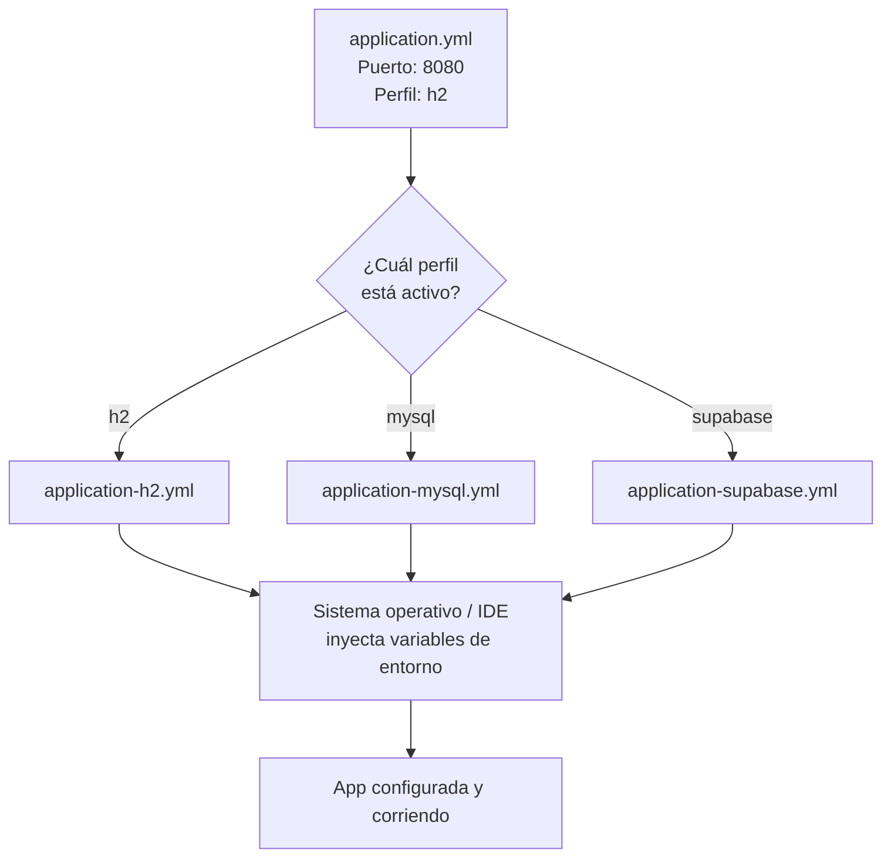

# 📋 Resumen: Archivos de Configuración

## Estructura de Archivos

```
Tickets/
├── src/main/resources/
│   ├── application.yml              ← Configuración base (todos los perfiles)
│   ├── application-h2.yml           ← Perfil: BD en memoria (desarrollo/tests)
│   ├── application-mysql.yml        ← Perfil: MySQL local (XAMPP)
│   └── application-supabase.yml     ← Perfil: Supabase PostgreSQL en nube
├── .env.example                     ← Plantilla de variables (commitear ✅)
├── .env                             ← Variables reales (NO commitear ❌)
└── .gitignore                       ← Contiene .env
```

---

## 1. `application.yml` — Base

**Uso:** Configuración común a todos los perfiles. Define el perfil activo por defecto.

```yaml
spring:
  application:
    name: Tickets
  profiles:
    active: h2                      # Perfil por defecto
  jpa:
    hibernate:
      ddl-auto: update              # Actualiza el esquema automáticamente
    show-sql: false

server:
  port: 8080
  servlet:
    context-path: "/ticket-app"
```

**Cuándo cambiar:**
- Cambiar puerto del servidor
- Cambiar contexto de la aplicación
- Cambiar el perfil activo por defecto

---

## 2. `application-h2.yml` — Perfil H2 (BD en memoria)

**Uso:** Desarrollo rápido, tests. La BD se reinicia cada vez que arrancas la app.

```yaml
spring:
  datasource:
    url: jdbc:h2:mem:ticketsdb
    driver-class-name: org.h2.Driver
    username: sa
    password:
  h2:
    console:
      enabled: true                 # Acceso a H2 Console en http://localhost:8080/h2-console
  jpa:
    database-platform: org.hibernate.dialect.H2Dialect
    properties:
      hibernate:
        format_sql: true
```

**Activar:**
```bash
./mvnw spring-boot:run
```
(Es el perfil por defecto)

---

## 3. `application-mysql.yml` — Perfil MySQL

**Uso:** Base de datos persistente local (XAMPP).

```yaml
spring:
  datasource:
    url: ${MYSQL_URL:jdbc:mysql://localhost:3306/tickets_db?useSSL=false&serverTimezone=America/Santiago}
    driver-class-name: com.mysql.cj.jdbc.Driver
    username: ${MYSQL_USERNAME:root}
    password: ${MYSQL_PASSWORD:}
  jpa:
    database-platform: org.hibernate.dialect.MySQL8Dialect
    properties:
      hibernate:
        format_sql: true
```

**Variables de entorno:**
```env
MYSQL_URL=jdbc:mysql://localhost:3306/tickets_db?useSSL=false&serverTimezone=America/Santiago
MYSQL_USERNAME=root
MYSQL_PASSWORD=
```

**Activar:**
```bash
# Línea de comandos
./mvnw spring-boot:run -Dspring-boot.run.arguments="--spring.profiles.active=mysql"

# Variable de entorno
export SPRING_PROFILES_ACTIVE=mysql    # Linux/macOS
$env:SPRING_PROFILES_ACTIVE="mysql"    # Windows PowerShell
./mvnw spring-boot:run

# IntelliJ: Ver guía 06_guia_intellij_env.md
```

---

## 4. `application-supabase.yml` — Perfil Supabase

**Uso:** Base de datos PostgreSQL en la nube (Supabase).

```yaml
spring:
  datasource:
    url: jdbc:postgresql://${DB_HOST}:${DB_PORT}/${DB_NAME}
    driver-class-name: org.postgresql.Driver
    username: ${DB_USER}
    password: ${DB_PASSWORD}
  jpa:
    database-platform: org.hibernate.dialect.PostgreSQL10Dialect
    properties:
      hibernate:
        format_sql: true
```

**Variables de entorno (obligatorias):**
```env
DB_HOST=db.xxxxxxxxxxxx.supabase.co
DB_PORT=5432
DB_NAME=postgres
DB_USER=postgres
DB_PASSWORD=tu-contraseña-supabase
```

**Activar:**
```bash
export SPRING_PROFILES_ACTIVE=supabase     # Linux/macOS
$env:SPRING_PROFILES_ACTIVE="supabase"     # Windows PowerShell
./mvnw spring-boot:run
```

---

## 5. `.env.example` — Plantilla

**Uso:** Referencia pública. Se sube al repositorio para que otros sepan qué variables configurar.

```env
# Environment variables for Tickets application
# Copy this file to .env and fill in your values

# MySQL Configuration
MYSQL_URL=jdbc:mysql://localhost:3306/tickets_db?useSSL=false&serverTimezone=America/Santiago
MYSQL_USERNAME=root
MYSQL_PASSWORD=

# Supabase Configuration
DB_HOST=db.xxxxxxxxxxxx.supabase.co
DB_PORT=5432
DB_NAME=postgres
DB_USER=postgres
DB_PASSWORD=your-supabase-password

# Active Profile (h2, mysql, supabase)
SPRING_PROFILES_ACTIVE=h2
```

---

## 6. `.env` — Valores Reales (Local)

**Uso:** Tu configuración local con valores reales. **NUNCA comitear.**

```env
MYSQL_USERNAME=root
MYSQL_PASSWORD=mi_password_local
DB_USER=postgres
DB_PASSWORD=mi_password_supabase_real
SPRING_PROFILES_ACTIVE=mysql
```

**Protegido en `.gitignore`:**
```gitignore
.env
.env.local
.env.*.local
```

---

## Matriz: Cuándo Usar Cada Archivo

| Situación | Perfil | Variables | Comentario |
|-----------|--------|-----------|-----------|
| Desarrollo inicial, tests | **h2** | - | BD en memoria, se resetea cada vez |
| Desarrollo persistente, local | **mysql** | `MYSQL_URL`, `MYSQL_USERNAME`, `MYSQL_PASSWORD` | Requiere XAMPP corriendo |
| Producción, equipo | **supabase** | `DB_HOST`, `DB_PORT`, `DB_NAME`, `DB_USER`, `DB_PASSWORD` | BD en la nube, múltiples usuarios |

---

## Flujo de Carga de Configuración


├─ ${MYSQL_URL} = "jdbc:mysql://..."
├─ ${DB_HOST} = "db.xxxx.supabase.co"
└─ ...
│
▼
Spring Boot arranca con la configuración
correcta para ese perfil
```

---

## Checklist de Configuración

- ✅ Creaste `.env` copiando `.env.example`
- ✅ Llenaste las credenciales en `.env`
- ✅ `.env` está en `.gitignore`
- ✅ Configuraste las variables en IntelliJ (plugin EnvFile o manualmente)
- ✅ Instalaste el driver MySQL o PostgreSQL en `pom.xml`
- ✅ Creaste la base de datos en XAMPP o Supabase
- ✅ Activaste el perfil correcto
- ✅ Ejecutaste la app y verificaste los logs

---

*[← Volver a Lección 11](01_objetivo_y_alcance.md)*
