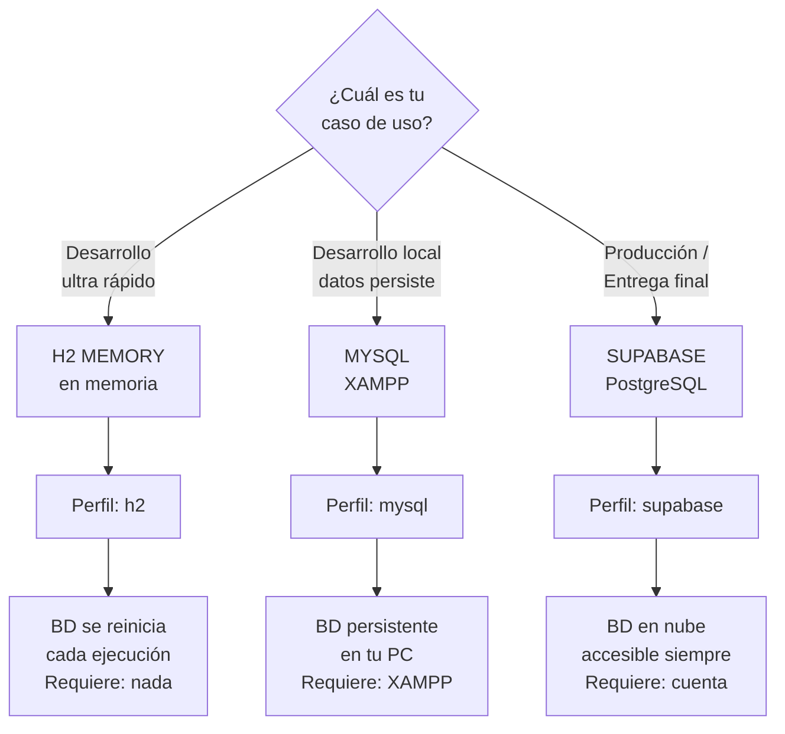
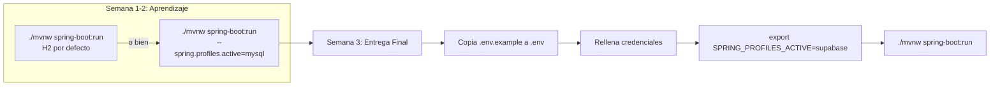

# 🗺️ Mapa de Decisiones: Qué Perfil Usar



---

## 🎯 Por Etapa del Proyecto



---

## 🔀 Cambiar de Perfil en 3 Formas

### Forma 1️⃣: Línea de Comandos
```bash
./mvnw spring-boot:run \
  -Dspring-boot.run.arguments="--spring.profiles.active=mysql"
```

### Forma 2️⃣: Variable de Entorno (Recomendado)
```bash
# Windows (PowerShell)
$env:SPRING_PROFILES_ACTIVE="mysql"
./mvnw spring-boot:run

# Linux/macOS
export SPRING_PROFILES_ACTIVE=mysql
./mvnw spring-boot:run
```

### Forma 3️⃣: Archivo `.env` + IntelliJ
1. Crea `.env` con `SPRING_PROFILES_ACTIVE=mysql`
2. Instala plugin **EnvFile** en IntelliJ
3. Configura Run Configuration para cargar `.env`
4. Ejecuta (botón ▶)

---

## 📊 Matriz de Compatibilidad

| Característica | H2 | MySQL | Supabase |
|---|:---:|:---:|:---:|
| BD en memoria | ✅ | ❌ | ❌ |
| Datos persistentes | ❌ | ✅ | ✅ |
| Requiere software adicional | ❌ | XAMPP | Cuenta online |
| Acceso desde otro PC | ❌ | ❌ | ✅ |
| Gratis | ✅ | ✅ | ✅ (limits) |
| Para producción | ❌ | ✅ | ✅ |
| Requiere variables de entorno | ❌ | ❌ | ✅ |

---

## 🛠️ Troubleshooting Rápido

### "No puedo conectarme a MySQL"
```bash
# Verifica que XAMPP está corriendo
# Verifica que la BD "tickets_db" existe en phpMyAdmin
# Verifica application-mysql.yml tiene URL correcta
```

### "Variables de entorno no cargan"
```bash
# En IntelliJ: Instala plugin EnvFile
# O define manualmente en Edit Configurations → Environment variables
# O usa: spring-dotenv (ver pom.xml)
```

### "Supabase connection refused"
```bash
# Verifica que DB_HOST, DB_USER, DB_PASSWORD son correctos
# Verifica que la IP de tu PC está en IP whitelist de Supabase (Settings)
```

---

*Para más detalles, ve a [Guión Paso a Paso](02_guion_paso_a_paso.md)*
