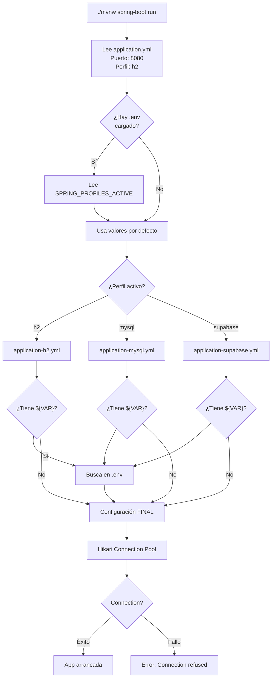
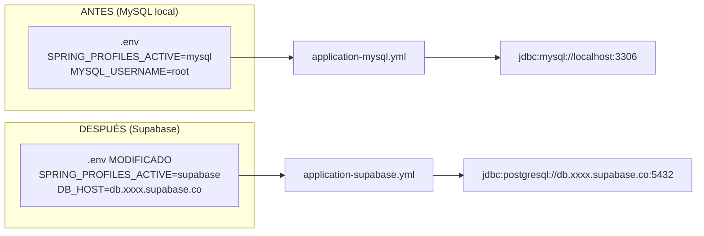
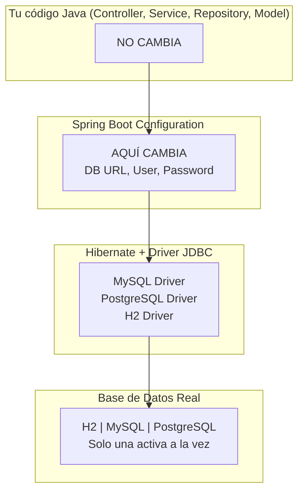
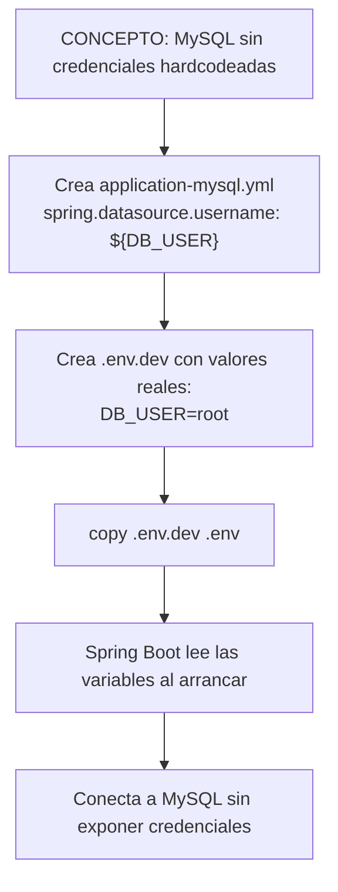

# 🔗 Flujo Completo: Cómo Todo se Conecta

## 1️⃣ Flujo de Carga al Arrancar Spring Boot



---

## 2️⃣ Ejemplo Práctico: Cambiar de MySQL a Supabase



---

## 3️⃣ Dónde Entra cada Concepto



---

## 4️⃣ Checklist: Verificación en Cada Paso

| Paso | Verificación |
|------|----------------|
| 1 | `application.yml`, `-h2.yml`, `-mysql.yml`, `-supabase.yml` existen |
| 2 | `.env.example` existe, `.env` local NO en Git, `.gitignore` protege `.env*` |
| 3 | Plugin EnvFile instalado o variables de entorno definidas |
| 4 | Logs muestran perfil activo y `HikariPool-1 - Start completed.` |
| 5 | `.env` NO en repositorio, `.env.example` SÍ |

---

## 5️⃣ Traducción: De Concepto a Acción



---

## 6️⃣ Flujo de Diagnóstico: Si Algo No Funciona

```
🔴 Error: "Connection refused"
• ¿Verificaste que la BD está corriendo? (XAMPP, Supabase, H2)
• ¿Verificaste las credenciales? (Host, Puerto, User/Password)
• ¿Verificaste que cargó el perfil? (busca en logs)

🔴 Error: "Variables vacías"
• ¿Instalaste plugin EnvFile?
• ¿Configuraste Run Configuration para usar .env?
• O define manualmente en Environment variables

🔴 Logs dicen "The following profiles are active: []"
• Verifica application.yml tiene spring.profiles.active
• O pasa --spring.profiles.active=mysql

✅ Logs dicen "HikariPool-1 - Connection is working..."
→ TODO FUNCIONA
```

## 6️⃣ Flujo de Diagnóstico: Si Algo No Funciona

```
🔴 Error: "Connection refused"
├─ ¿Verificaste que la BD está corriendo?
│  ├─ MySQL: XAMPP iniciado ✓
│  ├─ Supabase: Accesible desde Internet ✓
│  └─ H2: Siempre está disponible ✓
│
├─ ¿Verificaste las credenciales?
│  ├─ Host: correcto
│  ├─ Puerto: 3306 (MySQL), 5432 (Supabase)
│  └─ Usuario/password: sin typos
│
└─ ¿Verificaste que cargó el perfil?
   └─ Busca en logs: "The following profiles are active: ..."

🔴 Error: "Variables vacías"
├─ ¿Instalaste plugin EnvFile?
├─ ¿Configuraste tu Run Configuration para usar .env?
├─ O define manualmente en Edit Configurations → Environment variables
└─ O usa librería spring-dotenv en pom.xml

🔴 Logs dicen "The following profiles are active: []"
├─ Verifica application.yml tiene spring.profiles.active
└─ O pasa -Dspring-boot.run.arguments="--spring.profiles.active=mysql"

✅ Logs dicen "HikariPool-1 - Start completed."
└─ ¡TODO FUNCIONA! Accede a http://localhost:8080/ticket-app/tickets
```

---

*[← Volver a Lección 11](01_objetivo_y_alcance.md)*
