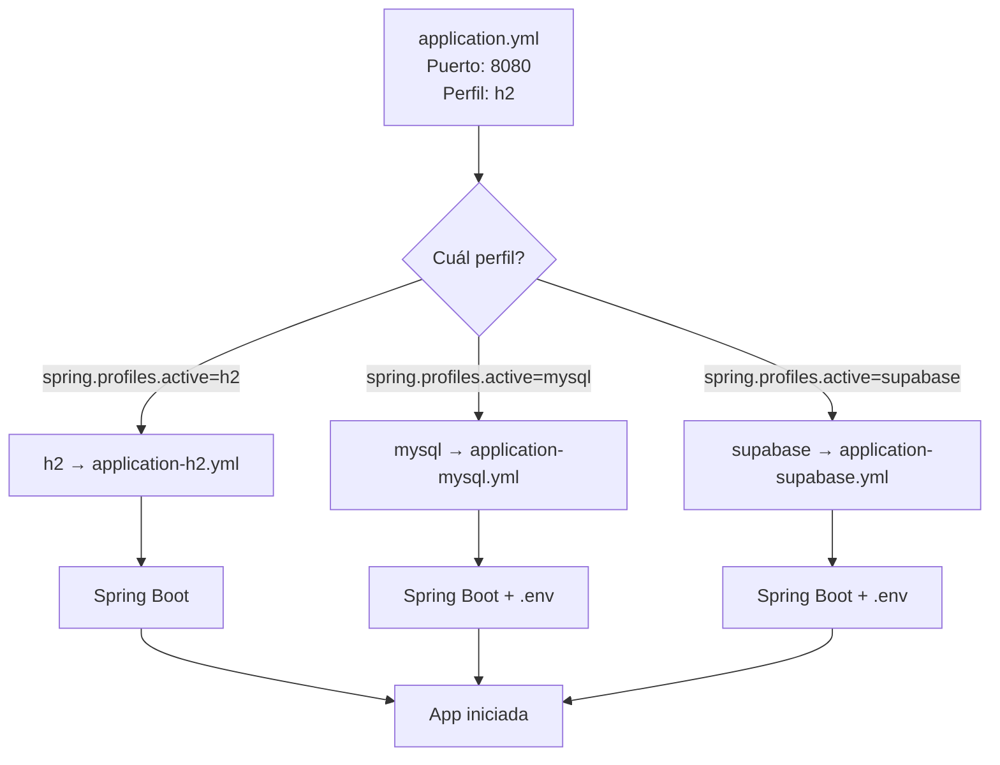

# 📚 Lección 11 — Configurar Bases de Datos Reales con Perfiles de Spring Boot

> Aprende a usar **perfiles de Spring Boot** para manejar múltiples configuraciones de base de datos (H2, MySQL, Supabase) y **variables de entorno** para proteger credenciales.

---

## 🎯 ¿Qué Aprenderás?

✅ Configurar múltiples bases de datos con perfiles de Spring Boot  
✅ Manejar variables de entorno de forma segura con `.env`  
✅ Conectar a H2 (en memoria), MySQL (local) y Supabase (en la nube)  
✅ Cambiar entre perfiles sin modificar el código Java  
✅ Cargar variables de entorno desde IntelliJ IDEA  

---

## 📖 Documentos

| Documento | Duración | Para |
|-----------|----------|------|
| **[01. Objetivo y Alcance](01_objetivo_y_alcance.md)** | 5 min | Entender qué aprenderás |
| **[02. Guión Paso a Paso](02_guion_paso_a_paso.md)** ⭐ | 30 min | Instrucciones prácticas |
| **[03. MySQL vs PostgreSQL](03_mysql_vs_postgresql.md)** | 10 min | Entender diferencias |
| **[06. Guía IntelliJ](06_guia_intellij_env.md)** | 5 min | Cargar `.env` en IDE |
| **[07. Resumen de Archivos](07_resumen_archivos.md)** | 5 min | Referencia rápida |
| **[08. Mapa de Decisiones](08_mapa_de_decisiones.md)** | 5 min | Decisiones visuales |
| **[04. Checklist](04_checklist_rubrica_minima.md)** | 5 min | Verificar completitud |
| **[05. Actividad Individual](05_actividad_individual.md)** | - | Tu tarea |

---

## 🚀 Quick Start (2 min)

### Opción 1: H2 (el más fácil, sin instalar nada)
```bash
cd Tickets
./mvnw spring-boot:run
```
✅ Accede a http://localhost:8080/ticket-app/tickets

### Opción 2: MySQL Local
```bash
cd Tickets
./mvnw spring-boot:run \
  -Dspring-boot.run.arguments="--spring.profiles.active=mysql"
```

### Opción 3: Supabase (en la nube)
```bash
cd Tickets
# 1. Copia .env.example a .env
cp .env.example .env
# 2. Edita .env con tus credenciales de Supabase
# 3. Ejecuta:
export SPRING_PROFILES_ACTIVE=supabase
./mvnw spring-boot:run
```

---

## 📂 Estructura de Archivos

```
Tickets/
├── src/main/resources/
│   ├── application.yml              ← Base común (todos los perfiles)
│   ├── application-h2.yml           ← BD en memoria
│   ├── application-mysql.yml        ← MySQL local con variables de entorno
│   └── application-supabase.yml     ← Supabase PostgreSQL
│
├── .env.example                     ← Plantilla (subir a Git ✅)
├── .env                             ← Tu config local (NO subir a Git ❌)
└── .gitignore                       ← Incluye .env
```

---

## 🎯 Los Tres Perfiles

| Perfil | BD | Dónde | Cuándo Usar | Arranca | Requiere |
|--------|-----|-------|------------|---------|----------|
| **h2** | En memoria | Tu PC | Tests, desarrollo rápido | `./mvnw spring-boot:run` | - |
| **mysql** | MySQL | Tu PC | Desarrollo con datos | `-Dspring-boot.run.arguments="--spring.profiles.active=mysql"` | XAMPP |
| **supabase** | PostgreSQL | Nube | Entrega final, equipo | `export SPRING_PROFILES_ACTIVE=supabase; ./mvnw spring-boot:run` | Variables de entorno |

---

## 🔐 Variables de Entorno

```env
# .env (tu configuración local, NO commitar)

# Para MySQL
MYSQL_URL=jdbc:mysql://localhost:3306/tickets_db?useSSL=false&serverTimezone=America/Santiago
MYSQL_USERNAME=root
MYSQL_PASSWORD=

# Para Supabase
DB_HOST=db.xxxxxxxxxxxx.supabase.co
DB_PORT=5432
DB_NAME=postgres
DB_USER=postgres
DB_PASSWORD=tu-password-real

# Perfil activo
SPRING_PROFILES_ACTIVE=mysql
```

**Protección:**
- ✅ `.env.example` → commitear (plantilla)
- ❌ `.env` → NO commitear (credenciales reales)
- ✅ `.gitignore` → contiene `.env`

---

## 💡 Cómo Funcionan los Perfiles



---

## 🧪 Verificación

Después de arrancar, deberías ver en los logs:

```
The following profiles are active: mysql
HikariPool-1 - Starting...
HikariPool-1 - Connection is working...
```

Luego accede a: **http://localhost:8080/ticket-app/tickets**

---

## 🛠️ Para IntelliJ IDEA

1. Instala plugin **EnvFile**
2. Ve a **[Guía IntelliJ](06_guia_intellij_env.md)**
3. Configura tu Run Configuration
4. Ejecuta (botón ▶)

---

## 📝 Tu Actividad

Ve a **[Actividad Individual](05_actividad_individual.md)** para tu tarea.

---

## 🤔 Dudas Frecuentes

**P: ¿Cuál perfil debo usar en desarrollo?**  
R: H2 para empezar (rápido), luego MySQL si necesitas datos persistentes.

**P: ¿Y si no puedo conectar a Supabase?**  
R: Ve a **[Mapa de Decisiones](08_mapa_de_decisiones.md)** → Troubleshooting

**P: ¿Debo commitear `.env`?**  
R: **Nunca.** Commitea `.env.example`, protege `.env` en `.gitignore`.

**P: ¿Puedo usar esta configuración en producción?**  
R: Sí, Supabase está listo para producción. Para más control, usa Docker/Kubernetes.

---

**[← Volver a Lecciones](../)**
