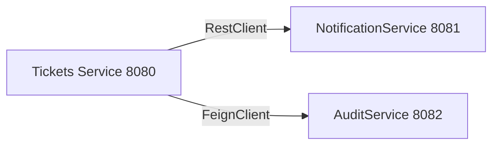

# Lección 14 — Comunicación entre Microservicios

## ¿De dónde venimos?

En la lección 13 implementaste un historial persistente de cambios en el ticket. Tu aplicación Tickets funciona perfectamente como **monolito**: un único proyecto que gestiona tickets, usuarios e historial de cambios.

Pero en equipos grandes, surge una necesidad: **dividir la aplicación en microservicios independientes**. En esta lección usaremos dos servicios reales: **NotificationService** (envío de notificaciones, puerto 8081) y **AuditService** (registro de auditoría, puerto 8082). Por ejemplo:

Cada microservicio es una **aplicación independiente** en un puerto diferente. Se comunican vía HTTP/REST.

---

## Los enfoques de comunicación

| Enfoque | Tool | Ventajas | Desventajas | Cuándo |
|---------|------|----------|------------|--------|
| **RestClient** ✅ | Spring Web 6.1+ | Moderno, limpio, sin dependencias | Requiere Spring 6.1+ | Estándar recomendado |
| **FeignClient** | Spring Cloud | Automático, declarativo | Más dependencias | Múltiples llamadas |
| **RestTemplate** ⚠️ | Spring Web | Flexible, control total | Verboso, deprecado | Legacy/excepciones |

Esta lección cubre **todos**, pero con **RestClient como estándar moderno**.

---

## ¿Qué vas a construir?

Al terminar esta lección podrás:

1. Implementar comunicación HTTP entre dos aplicaciones Spring Boot
2. Usar **RestClient** (Spring 6.1+) para llamadas HTTP modernas
3. Usar **FeignClient** como alternativa para múltiples llamadas automáticas
4. Conocer **RestTemplate** (deprecado) para mantenimiento de código legacy
5. Manejar **timeouts y reintentos**
6. Implementar **fallbacks** (qué hacer si el servicio cae)
7. Debuggear problemas de comunicación

### Lo que vas a poder explicar

- ¿Cuándo usar RestClient vs FeignClient vs RestTemplate?
- ¿Qué son los microservicios y por qué importan?
- ¿Cómo manejar errores si un microservicio cae?
- ¿Qué es un circuit breaker y por qué es importante?
- ¿Cómo registrar logs de llamadas HTTP?

---

## Estructura de la Lección

1. **[Este documento](01_objetivo_y_alcance.md)** — Objetivo y alcance
2. **[Organización de Repositorios](02_organizacion_repositorios.md)** — Monorepo, polyrepo y Maven multi-módulo
3. **[Ejecución Local](03_ejecucion_local.md)** — Correr 10 servicios con poca RAM (JVM flags, Docker, nativo)
4. **[Despliegue Distribuido](04_despliegue_externo.md)** — Red local, PaaS/nube y comparativa de estrategias
5. **[Guión Paso a Paso](05_guion_paso_a_paso.md)** — Instrucciones prácticas
6. **[RestClient vs RestTemplate vs FeignClient](06_resttemplate_vs_feign.md)** — Comparación
7. **[Ejemplos Prácticos](07_ejemplos_practicos.md)** — Código listo
8. **[Manejo de Errores](08_manejo_errores.md)** — Timeouts, reintentos, fallbacks
9. **[Debugging](09_debugging.md)** — Logs y troubleshooting
10. **[Checklist](10_checklist_rubrica_minima.md)** — Verificación
11. **[Actividad Individual](11_actividad_individual.md)** — Tu tarea

---

## Requisitos Previos

- ✅ Lecciones 10-13 completadas
- ✅ Entiendes Spring Boot básico
- ✅ Conoces HTTP/REST
- ✅ Tienes **NotificationService** (puerto 8081) y **AuditService** (puerto 8082) corriendo
- ✅ Spring framework 6.1+ / Springboot 3.2+ (para RestClient)
