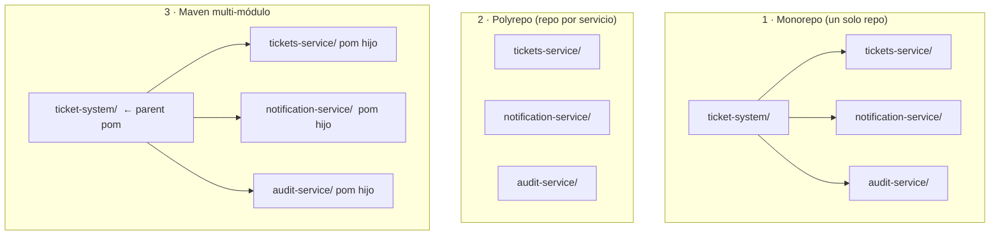

# Lección 14 — Organización de Repositorios

Antes de escribir una sola línea de código de integración, hay una pregunta que casi todos los equipos se hacen: **¿cómo organizo mis microservicios?** ¿Un solo repositorio con todos? ¿Uno por servicio? ¿O los junto en un proyecto Maven multi-módulo?

---

## ¿Un repo o varios?

Hay tres patrones habituales:



### Comparativa

| Aspecto | Monorepo | Polyrepo | Multi-módulo Maven |
|---------|----------|----------|--------------------|
| **Configuración** | Mínima | Un repo por servicio | Media |
| **Versión compartida** | Manual | No existe | Desde el parent pom |
| **Dependencias comunes** | Copiadas en cada pom | Copiadas | Declaradas una vez |
| **CI/CD** | Un pipeline | Un pipeline por servicio | Un pipeline con perfiles |
| **Aislamiento de cambios** | Bajo | Alto | Medio |
| **Ideal para** | Aprender / evaluaciones | Producción real | Proyectos medianos |

> **En este curso** usamos el patrón **monorepo con proyectos independientes** (cada servicio tiene su propia carpeta con su propio `pom.xml`). Eso simplifica el trabajo pedagógico: clonas un solo repositorio y tienes todo.

---

## Maven Multi-módulo: qué es y cómo crearlo

Un proyecto multi-módulo tiene un **parent `pom.xml`** que agrupa varios módulos. Cada módulo hereda las versiones y dependencias del parent, eliminando duplicación.

### Estructura resultado

```
ticket-system/               ← parent (solo pom.xml, sin src/)
├── pom.xml
├── tickets-service/
│   └── pom.xml              ← hijo: hereda del parent
├── notification-service/
│   └── pom.xml
└── audit-service/
    └── pom.xml
```

### Opción A: A mano

**1. Crear el parent `pom.xml`** en la raíz del proyecto:

```xml
<!-- ticket-system/pom.xml -->
<project>
    <modelVersion>4.0.0</modelVersion>

    <groupId>cl.duoc.fullstack</groupId>
    <artifactId>ticket-system</artifactId>
    <version>1.0.0</version>
    <packaging>pom</packaging>   <!-- ← obligatorio en el parent -->

    <!-- Lista de módulos que componen el sistema -->
    <modules>
        <module>tickets-service</module>
        <module>notification-service</module>
        <module>audit-service</module>
    </modules>

    <parent>
        <groupId>org.springframework.boot</groupId>
        <artifactId>spring-boot-starter-parent</artifactId>
        <version>4.0.5</version>
        <relativePath/>
    </parent>

    <properties>
        <java.version>21</java.version>
    </properties>
</project>
```

**2. En cada módulo hijo**, reemplazar el `<parent>` de Spring Boot por el parent propio:

```xml
<!-- ticket-system/tickets-service/pom.xml -->
<project>
    <modelVersion>4.0.0</modelVersion>

    <!-- Apunta al parent local, no a Spring Boot directamente -->
    <parent>
        <groupId>cl.duoc.fullstack</groupId>
        <artifactId>ticket-system</artifactId>
        <version>1.0.0</version>
        <relativePath>../pom.xml</relativePath>   <!-- ← ruta relativa al parent -->
    </parent>

    <artifactId>tickets-service</artifactId>
    <packaging>jar</packaging>

    <dependencies>
        <dependency>
            <groupId>org.springframework.boot</groupId>
            <artifactId>spring-boot-starter-web</artifactId>
            <!-- versión heredada del parent, no se repite -->
        </dependency>
    </dependencies>
</project>
```

**3. Compilar todo desde la raíz:**

```bash
cd ticket-system
mvnw.cmd package -DskipTests        # compila todos los módulos en orden
mvnw.cmd package -pl tickets-service -am   # solo un módulo y sus dependencias
```

### Opción B: Con IntelliJ IDEA

1. **Crear proyecto padre**: `File → New → Project → Maven` → marcar *Create from archetype: pom* o simplemente borrar el `<packaging>jar</packaging>` y agregar `<packaging>pom</packaging>`.
2. **Agregar módulos**: clic derecho sobre el proyecto raíz → `New → Module → Spring Initializr`.
3. IntelliJ agrega automáticamente el `<module>` en el parent y el `<parent>` en el hijo.

> **Ventaja de IntelliJ**: maneja la configuración del `<relativePath>` solo y sincroniza los cambios del parent automáticamente.

---

*[← Volver a Lección 14](01_objetivo_y_alcance.md) · [Siguiente: Ejecución local →](03_ejecucion_local.md)*
