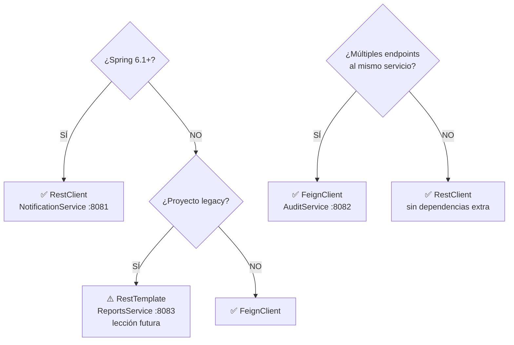

# Lección 14 — RestClient vs RestTemplate vs FeignClient

## Tabla Comparativa

| Aspecto | RestClient | RestTemplate | FeignClient |
|---------|-----------|-------------|-------------|
| **Complejidad** | Baja | Media | Baja |
| **Dependencias** | Spring Web 6.1+ | Spring Web (ya incluido) | Spring Cloud |
| **Configuración** | Mínima | Manual | Automática |
| **Código** | Moderno | Verboso | Declarativo |
| **Casos de Uso** | Estándar moderno | Legacy | Múltiples llamadas |
| **Timeout** | Fácil | Manual | Configuración |
| **Reintentos** | Integrado | Manual | Automático |
| **Fallback** | Manual | Manual | Anotación |
| **Estado** | ✅ Recomendado | ⚠️ Deprecated | ✅ Alternativa |

---

## Ejemplo 1: RestClient (Recomendado - Spring 6.1+)

```java
@Service
public class NotificationClient {
    private final RestClient restClient;
    
    // Constructor explícito: recibe el builder de Spring y lo personaliza con la URL del servicio.
    // No usar @RequiredArgsConstructor aquí porque ya tenemos constructor explícito.
    public NotificationClient(RestClient.Builder builder) {
        this.restClient = builder
            .baseUrl("http://localhost:8081")  // NotificationService
            .build();
    }
    
    // Enviar notificación a NotificationService (fire-and-forget)
    public void send(String title, String message, String type, String recipient) {
        NotificationRequest req = new NotificationRequest(title, message, type, recipient);
        
        try {
            restClient.post()
                .uri("/api/notifications")
                .body(req)
                .retrieve()
                .toBodilessEntity();
        } catch (Exception e) {
            log.error("Error enviando notificación", e);
        }
    }
}
```

---

## Ejemplo 2: RestTemplate (Legacy - No recomendado)

> Ilustra el patrón con **ReportsService** (puerto 8083, lección futura). No debe usarse en proyectos nuevos.

```java
@Service
@Slf4j
public class ReportsClient {
    private final RestTemplate restTemplate;
    
    public ReportsClient(RestTemplate restTemplate) {
        this.restTemplate = restTemplate;
    }
    
    // Solicitar generación de reporte a ReportsService (puerto 8083)
    public void generateReport(Long ticketId, String type) {
        String url = "http://localhost:8083/api/reports";
        
        ReportRequest req = new ReportRequest(ticketId, type);
        
        try {
            restTemplate.postForObject(url, req, Void.class);
        } catch (Exception e) {
            log.error("Error solicitando reporte", e);
        }
    }
}
```

---

## Ejemplo 3: FeignClient (Alternativa - Múltiples Llamadas)

```java
@FeignClient(
    name = "audit-service",                    // clave para configuración en application.yml
    url = "http://localhost:8082",             // AuditService
    fallback = AuditServiceClientFallback.class
)
public interface AuditServiceClient {
    
    @PostMapping("/api/audit")
    AuditEvent logEvent(@RequestBody AuditRequest request);
    
    @GetMapping("/api/audit/ticket/{ticketId}")
    List<AuditEvent> getAuditByTicket(@PathVariable Long ticketId);
}
```

**Uso:**
```java
@Service
@RequiredArgsConstructor
public class TicketService {
    
    private final AuditServiceClient auditClient;
    
    public TicketResult updateById(Long id, TicketRequest request) {
        // ... actualizar ticket
        Ticket saved = ticketRepository.save(ticket);
        
        // Registrar auditoría en AuditService (limpio y automático via Feign)
        auditClient.logEvent(new AuditRequest(
            "STATUS_CHANGE", "Ticket", saved.getId(), null, "system",
            "Estado actualizado"
        ));
        
        return toResult(saved);
    }
    
    public List<AuditEvent> getAuditTrail(Long ticketId) {
        return auditClient.getAuditByTicket(ticketId);
    }
}
```

---

## Decisión: ¿Cuándo usar cada uno?



---

## Ventajas de Cada Uno

### RestClient ✅ RECOMENDADO
✅ Estándar moderno (Spring 6.1+)  
✅ API fluida y moderna  
✅ Sin dependencias adicionales  
✅ Máximo control  
✅ Debugging fácil  
✅ Timeouts y reintentos integrados  

### RestTemplate ⚠️ DEPRECATED
❌ Deprecado desde Spring 6.0  
❌ No usar en proyectos nuevos  
✅ Aún funciona en código legacy  
✅ Sin dependencias adicionales  
❌ Código repetitivo  
❌ Manejo manual de errores  

### FeignClient ✅ ALTERNATIVA
✅ Código muy limpio y declarativo  
✅ Automático (serialización, errores)  
✅ Fallbacks integrados  
✅ Ideal para múltiples servicios  
❌ Dependencia adicional (Spring Cloud)  
❌ Menos control  
❌ Mayor complejidad si no está acostumbrado  

---

*[← Volver a Lección 14](01_objetivo_y_alcance.md)*
