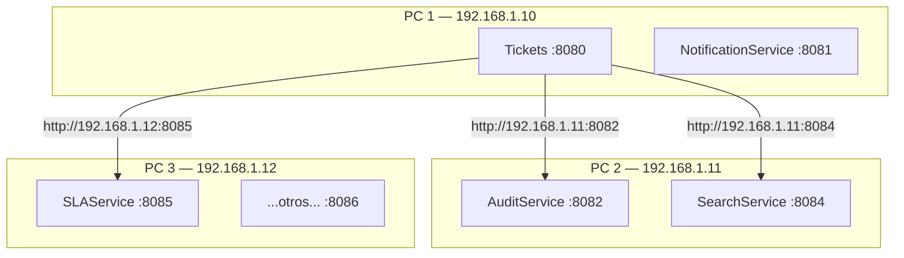
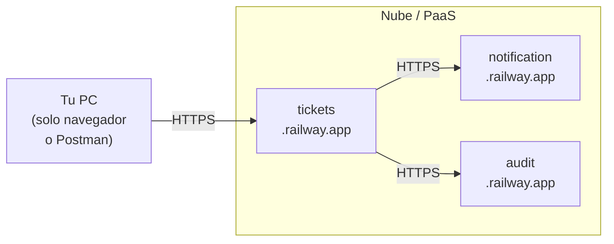

# Lección 14 — Despliegue Distribuido y en la Nube

Cuando una sola PC no es suficiente — o quieres acceder a los servicios desde cualquier lugar — hay dos opciones: repartir los servicios entre varias máquinas de la misma red, o desplegarlos en un proveedor de nube.

---

## Solución 5: Distribución en múltiples máquinas de la misma red

Si tienes compañeros disponibles o varias computadoras en la misma red WiFi o LAN, puedes **repartir los servicios entre máquinas**. Cada PC corre solo 2-3 servicios y los demás se comunican por la IP de red local.



**Cómo configurarlo:**

1. Averigua la IP local de cada PC:
   ```bash
   # Windows
   ipconfig | findstr "IPv4"
   # Mac / Linux
   ip a | grep "inet "
   ```

2. Actualiza las URLs en `application.yml` de cada servicio para apuntar a la IP correcta:
   ```yaml
   # application.yml de Tickets (corre en PC1)
   services:
     audit:
       url: http://192.168.1.11:8082    # AuditService corre en PC2
     search:
       url: http://192.168.1.11:8084
     sla:
       url: http://192.168.1.12:8085
   ```

3. Verifica que el **firewall** del PC remoto permita conexiones entrantes en ese puerto. En Windows: `Configuración → Firewall → Reglas de entrada → Nuevo puerto`.

**Problema frecuente:** las IPs cambian al reconectar a la red. **Solución:** usa variables de entorno para las URLs en lugar de escribirlas fijas en el YAML:

```yaml
# application.yml — patrón con fallback a localhost
services:
  audit:
    url: ${AUDIT_SERVICE_URL:http://localhost:8082}
  search:
    url: ${SEARCH_SERVICE_URL:http://localhost:8084}
```

Cuando el servicio corre en la misma PC no hace falta configurar nada. Cuando corre en otra máquina, defines la variable de entorno antes de arrancar:

```bash
# Windows (CMD)
set AUDIT_SERVICE_URL=http://192.168.1.11:8082
mvnw.cmd spring-boot:run
```

> Esta distribución replica exactamente cómo funciona un entorno de producción real: microservicios desplegados en distintos servidores que se comunican por red.

---

## Solución 6: Despliegue en la nube / PaaS

Si tu PC tiene poca RAM o quieres acceder a los servicios desde cualquier lugar, puedes desplegar en un **PaaS** (*Platform as a Service*) — plataformas que administran la infraestructura y solo te piden el código o el contenedor.



**Opciones con free tier para aplicaciones Spring Boot:**

| Plataforma | Free tier | Requiere Docker | Notas |
|---|---|---|---|
| [Railway](https://railway.app) | ✅ (con límites) | Opcional | Muy fácil, detecta Spring Boot automáticamente |
| [Render](https://render.com) | ✅ (duerme tras inactividad) | Opcional | Puede tardar en arrancar tras inactividad |
| [Fly.io](https://fly.io) | ✅ (3 VMs pequeñas) | ✅ Requerido | Control más fino, buen para microservicios |
| [DigitalOcean App Platform](https://www.digitalocean.com/products/app-platform) | ❌ (desde $5/mes) | Opcional | Sencillo y confiable |
| [Azure Container Apps](https://azure.microsoft.com/products/container-apps) | ✅ (créditos de estudiante) | ✅ Requerido | Alumnos DUOC pueden tener acceso via Azure for Students |

**Lo que cambia en tu código al pasar a la nube:**

Las URLs dejan de ser `http://localhost:XXXX` y pasan a ser `https://mi-servicio.railway.app`. La forma más limpia de manejarlo es con variables de entorno para no tocar el código:

```yaml
# application.yml — el mismo archivo funciona local y en la nube
services:
  audit:
    url: ${AUDIT_SERVICE_URL:http://localhost:8082}   # usa env var si existe, si no localhost
  notification:
    url: ${NOTIFICATION_SERVICE_URL:http://localhost:8081}
```

En el PaaS configuras la variable `AUDIT_SERVICE_URL=https://mi-audit.railway.app` desde el panel web del proveedor, y el código no cambia.

> **Para la evaluación:** no es necesario desplegar en la nube — los servicios corriendo localmente son suficientes. Esta opción es útil si quieres mostrar el trabajo funcionando desde cualquier dispositivo o si tu PC no tiene suficiente RAM.

---

## Comparativa de todas las estrategias

| Estrategia | RAM local estimada (10 servicios) | Complejidad | Requiere |
|------------|-----------------------------------|-------------|----------|
| Sin optimizar | ~3.5 GB | Ninguna | 16 GB+ de RAM |
| Flags JVM + lazy init | ~1 GB | Baja | Solo Java/Maven ✅ |
| Docker Compose | ~800 MB | Media | Docker instalado + Dockerfile por servicio |
| Compilación nativa | ~600 MB | Alta | GraalVM + build largo |
| Red local (varias PCs) | ~1 GB (distribuido) | Media | Red WiFi/LAN compartida |
| PaaS / nube | 0 MB local | Media–Alta | Cuenta en el proveedor |

**Recomendación para la segunda evaluación:** empieza con *Flags JVM + lazy init* — cero dependencias adicionales y reduce el consumo a ~1 GB. Solo si necesitas más, explora Docker o la distribución en red.

---

*[← Ejecución local](03_ejecucion_local.md) · [Siguiente: Guión paso a paso →](05_guion_paso_a_paso.md)*
