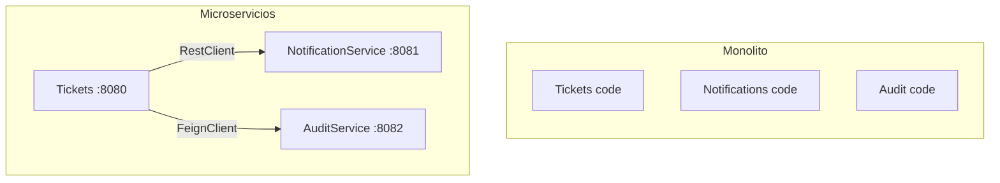

# Lección 14 — Comunicación entre Microservicios

**Aprende a comunicar dos microservicios independientes usando RestClient, FeignClient o RestTemplate. Implementa resilencia, timeouts y fallbacks.**

---

## 📚 Contenidos

| Documento | Duración | Para |
|-----------|----------|------|
| **01. Objetivo y Alcance** | 5 min | Entender qué aprenderás |
| **02. Guión Paso a Paso** ⭐ | 20 min | Instrucciones prácticas |
| **03. RestClient vs RestTemplate vs FeignClient** | 10 min | Comparación y decisión |
| **04. Ejemplos Prácticos** | 15 min | Código completo |
| **05. Manejo de Errores** | 10 min | Timeouts, fallbacks, resilencia |
| **06. Debugging** | 10 min | Logs y troubleshooting |
| **07. Checklist** | 5 min | Verificación |
| **08. Actividad Individual** | - | Tu tarea |

---

## 🎯 Quick Start (10 min)

### Con RestClient (Recomendado — NotificationService)

```java
// NotificationClient.java
@Service
public class NotificationClient {
    private final RestClient restClient;
    
    public NotificationClient(RestClient.Builder builder) {
        this.restClient = builder
            .baseUrl("http://localhost:8081")
            .build();
    }
    
    public void send(String title, String message, String type, String recipient) {
        restClient.post()
            .uri("/api/notifications")
            .body(new NotificationRequest(title, message, type, recipient))
            .retrieve()
            .toBodilessEntity();
    }
}
```

### Con FeignClient (Alternativa — AuditService)

```java
// 1. Habilitar
@SpringBootApplication
@EnableFeignClients
public class TicketsApplication {}

// 2. Crear cliente
@FeignClient(name = "audit-service", url = "http://localhost:8082",
             fallback = AuditServiceClientFallback.class)
public interface AuditServiceClient {
    @PostMapping("/api/audit")
    AuditEvent logEvent(@RequestBody AuditRequest request);
    
    @GetMapping("/api/audit/ticket/{ticketId}")
    List<AuditEvent> getAuditByTicket(@PathVariable Long ticketId);
}

// 3. Inyectar y usar
@Service
@RequiredArgsConstructor
public class TicketService {
    private final AuditServiceClient auditClient;
    
    public void afterCreate(Ticket saved) {
        auditClient.logEvent(new AuditRequest(
            "TICKET_CREATED", "Ticket", saved.getId(), null, "system", null
        ));
    }
}
```

### Con RestTemplate (Legacy — ReportsService, no recomendado)

> ⚠️ ReportsService aún no está implementado; se desarrollará en una lección posterior. Este ejemplo muestra el patrón legacy de RestTemplate.

```java
// 1. Registrar bean
@Bean
@Deprecated(since = "6.0", forRemoval = true)
public RestTemplate restTemplate() {
    return new RestTemplate();
}

// 2. ReportsClient.java
@Service
public class ReportsClient {
    private final RestTemplate restTemplate;
    
    public ReportsClient(RestTemplate restTemplate) {
        this.restTemplate = restTemplate;
    }
    
    public void generateReport(Long ticketId, String type) {
        restTemplate.postForObject(
            "http://localhost:8083/api/reports",
            new ReportRequest(ticketId, type),
            Void.class
        );
    }
}
```

---

## 🔑 Conceptos Clave

### Microservicios

Arquitectura donde una aplicación se divide en múltiples servicios independientes:



### RestClient vs RestTemplate vs FeignClient

| Aspecto | RestClient | RestTemplate | FeignClient |
|---------|-----------|-------------|-------------|
| **Líneas de código** | Pocas | Muchas | Pocas |
| **Aprendizaje** | Fácil | Fácil | Intermedio |
| **Automático** | Parcial | No | Sí |
| **Ideal para** | Estándar moderno | Legacy | Múltiples llamadas |
| **Estado** | ✅ Recomendado | ⚠️ Deprecated | ✅ Alternativa |

---

## 📂 Estructura

```
src/main/java/
├── clients/
│   ├── NotificationClient.java             (RestClient → NotificationService :8081)
│   ├── AuditServiceClient.java             (FeignClient → AuditService :8082)
│   ├── AuditServiceClientFallback.java     (Fallback para FeignClient)
│   └── ReportsClient.java                  (RestTemplate legacy → ReportsService :8083)
├── services/
│   └── TicketService.java                  (usa clientes)
└── TicketsApplication.java                 (@EnableFeignClients)
```

---

## ✅ Checklist

- [ ] Dependencia de cliente HTTP elegida (RestClient / RestTemplate / FeignClient)
- [ ] Cliente HTTP creado
- [ ] Fallback para errores (si aplica)
- [ ] Timeouts configurados
- [ ] Integrado en TicketService
- [ ] API responde con datos enriquecidos
- [ ] Tests con mocks

---

## 🚀 Sigue el Guión

Comienza con **[02. Guión Paso a Paso](02_guion_paso_a_paso.md)** para instrucciones detalladas.

---

*Lección 14 de 18 - [← Volver a Lecciones](../)*
