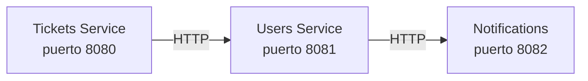

# Lección 13 — Comunicación entre Microservicios

## ¿De dónde venimos?

En la lección 12 aprendiste a versionear cambios de BD con Flyway. Tu aplicación Tickets funciona perfectamente como **monolito**: todo el código está en un proyecto.

Pero en equipos grandes, surge una necesidad: **dividir la aplicación en microservicios independientes**. Por ejemplo:

Cada microservicio es una **aplicación independiente** en un puerto diferente. Se comunican vía HTTP/REST.

---

## Los enfoques de comunicación

| Enfoque | Tool | Ventajas | Desventajas | Cuándo |
|---------|------|----------|------------|--------|
| **RestClient** ✅ | Spring Web 6.1+ | Moderno, limpio, sin dependencias | Requiere Spring 6.1+ | Estándar recomendado |
| **FeignClient** | Spring Cloud | Automático, declarativo | Más dependencias | Múltiples llamadas |
| **RestTemplate** ⚠️ | Spring Web | Flexible, control total | Verboso, deprecado | Legacy/excepciones |

Esta lección cubre **todos**, pero con **RestClient como estándar moderno**.

---

## ¿Qué vas a construir?

Al terminar esta lección podrás:

1. Implementar comunicación HTTP entre dos aplicaciones Spring Boot
2. Usar **RestClient** (Spring 6.1+) para llamadas HTTP modernas
3. Usar **FeignClient** como alternativa para múltiples llamadas automáticas
4. Conocer **RestTemplate** (deprecado) para mantenimiento de código legacy
5. Manejar **timeouts y reintentos**
6. Implementar **fallbacks** (qué hacer si el servicio cae)
7. Debuggear problemas de comunicación

### Lo que vas a poder explicar

- ¿Cuándo usar RestClient vs FeignClient vs RestTemplate?
- ¿Qué son los microservicios y por qué importan?
- ¿Cómo manejar errores si un microservicio cae?
- ¿Qué es un circuit breaker y por qué es importante?
- ¿Cómo registrar logs de llamadas HTTP?

---

## Estructura de la Lección

1. **[Este documento](01_objetivo_y_alcance.md)** — Objetivo y alcance
2. **[Guión Paso a Paso](02_guion_paso_a_paso.md)** — Instrucciones prácticas
3. **[RestClient vs RestTemplate vs FeignClient](03_resttemplate_vs_feign.md)** — Comparación
4. **[Ejemplos Prácticos](04_ejemplos_practicos.md)** — Código listo
5. **[Manejo de Errores](05_manejo_errores.md)** — Timeouts, reintentos, fallbacks
6. **[Debugging](06_debugging.md)** — Logs y troubleshooting
7. **[Checklist](07_checklist_rubrica_minima.md)** — Verificación
8. **[Actividad Individual](08_actividad_individual.md)** — Tu tarea

---

## Requisitos Previos

- ✅ Lecciones 11-12 completadas
- ✅ Entiendes Spring Boot básico
- ✅ Conoces HTTP/REST
- ✅ Tienes 2 aplicaciones Spring Boot (o emularás con clases mock)
- ✅ Spring Boot 6.1+ (para RestClient)
