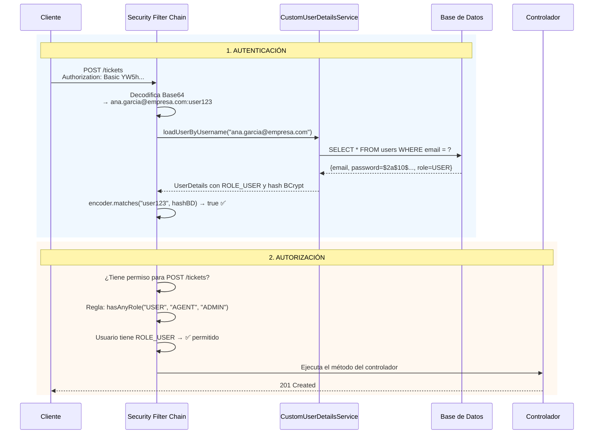

# Lección 16 — Autenticación vs Autorización

## La confusión más común en seguridad

- **Autenticación:** ¿Quién eres? → verifica identidad
- **Autorización:** ¿Qué puedes hacer? → verifica permisos

Son dos pasos **secuenciales**: primero se autentica, después se autoriza. No puedes autorizar a alguien que no se ha autenticado.

---

## Comparativa

| Aspecto | Autenticación | Autorización |
|--------|---------------|--------------|
| **Pregunta** | ¿Quién eres? | ¿Qué puedes hacer? |
| **Respuesta** | Usuario validado | Rol/permiso asignado |
| **Ejemplo** | Email `admin@empresa.com` + contraseña `pass123` correcta | Usuario ADMIN puede eliminar tickets |
| **Si falla** | `401 Unauthorized` | `403 Forbidden` |
| **En Spring Security** | `UserDetailsService` + `PasswordEncoder` | Reglas en `SecurityConfig` o `@PreAuthorize` |

---

## Cómo funciona HTTP Basic Auth

En cada petición, el cliente envía las credenciales en el header `Authorization`:

```
Authorization: Basic <base64(email:contraseña)>
```

Por ejemplo, para `admin@empresa.com:pass123`:
```
echo -n "admin@empresa.com:pass123" | base64
→ YWRtaW5AZW1wcmVzYS5jb206cGFzczEyMw==
```

Spring Security intercepta la petición con `BasicAuthenticationFilter`, decodifica el Base64, llama a `CustomUserDetailsService.loadUserByUsername(email)`, compara la contraseña con el hash BCrypt de la BD usando `PasswordEncoder.matches(...)` y, si coincide, construye un `Authentication` autenticado.

> **Nota de seguridad:** Base64 NO es cifrado. Las credenciales son recuperables si alguien intercepta el header. En producción, siempre usa HTTPS para que el header viaje cifrado.

---

## Arquitectura: el Security Filter Chain

Spring Security funciona como una **cadena de filtros** que intercepta cada petición HTTP antes de que llegue al controlador.

```
Petición HTTP
      │
      ▼
┌─────────────────────────────────────────────────────┐
│               Security Filter Chain                 │
│                                                     │
│  1. SecurityContextHolderFilter                     │
│     └─ Prepara el contexto de seguridad             │
│                                                     │
│  2. BasicAuthenticationFilter                       │
│     └─ Lee el header Authorization: Basic ...       │
│     └─ Llama a CustomUserDetailsService             │
│     └─ Verifica contraseña con BCryptPasswordEncoder│
│     └─ Si es válido → guarda Authentication         │
│                                                     │
│  3. ExceptionTranslationFilter                      │
│     └─ Captura errores de autenticación → 401       │
│     └─ Captura errores de autorización → 403        │
│                                                     │
│  4. AuthorizationFilter                             │
│     └─ Verifica las reglas de tu SecurityConfig     │
│     └─ .permitAll() → pasa sin autenticación        │
│     └─ .hasRole("ADMIN") → verifica el rol          │
│                                                     │
└─────────────────────────────────────────────────────┘
      │
      ▼ (si todos los filtros pasan)
   Controlador Spring MVC
      │
      ▼
   Respuesta HTTP
```

**Puntos clave de este flujo:**
1. Los filtros se ejecutan en orden, antes de que tu código de controlador corra
2. Si un filtro rechaza la petición, los siguientes filtros **no se ejecutan**
3. Tu `SecurityConfig` activa filtros como `BasicAuthenticationFilter` con `httpBasic(...)` y define reglas que aplicará `AuthorizationFilter`

---

## Flujo interno con HTTP Basic

Este es el camino completo de una petición protegida:

```text
Cliente
  Authorization: Basic base64(email:password)
        |
        v
BasicAuthenticationFilter
        |
        v
AuthenticationManager
        |
        v
DaoAuthenticationProvider
        |
        v
CustomUserDetailsService.loadUserByUsername(email)
        |
        v
PasswordEncoder.matches(passwordPlano, hashBCrypt)
        |
        v
SecurityContext: Authentication autenticado con ROLE_...
        |
        v
AuthorizationFilter / @PreAuthorize
        |
        v
Controlador
```

Responsabilidades principales:

- `BasicAuthenticationFilter`: captura el header `Authorization: Basic ...`. Este filtro lo aporta Spring Security; no se implementa manualmente.
- `CustomUserDetailsService`: carga el usuario desde `UserRepository.findByEmail(email)`.
- `PasswordEncoder`: compara la contraseña enviada contra el hash BCrypt guardado.
- `SecurityContext`: guarda el usuario autenticado durante la petición actual.
- `AuthorizationFilter`: aplica las reglas de `SecurityConfig`.
- `@PreAuthorize`: aplica reglas a nivel de método cuando `@EnableMethodSecurity` está habilitado.

Respuestas esperadas:

- `401 Unauthorized`: no se pudo autenticar. Falta header, el header es inválido, el usuario no existe, la contraseña es incorrecta o el usuario está inactivo.
- `403 Forbidden`: el usuario sí se autenticó, pero su rol no tiene permiso para ejecutar el endpoint.

---

## STATELESS vs STATEFUL

### STATEFUL (sesiones HTTP — no lo que usamos aquí)

En aplicaciones web tradicionales, el servidor guarda la sesión del usuario:

```
Login:
  Cliente → POST /login (usuario:contraseña)
  Servidor → crea Session ID → guarda en memoria
  Servidor → devuelve Cookie: JSESSIONID=abc123

Petición posterior:
  Cliente → GET /dashboard (Cookie: JSESSIONID=abc123)
  Servidor → busca la sesión abc123 → el usuario está autenticado ✅
```

**Problema para APIs REST:** Las cookies de sesión no funcionan bien con clientes móviles, microservicios, ni con múltiples instancias del servidor.

### STATELESS (lo que usamos en esta lección)

Con `SessionCreationPolicy.STATELESS`, el servidor **nunca guarda estado**:

```
Cada petición:
  Cliente → GET /tickets (Authorization: Basic YWRtaW5...)
  Servidor → verifica el header Authorization → autentica → responde
  (No guarda nada en memoria)

Siguiente petición:
  Cliente → POST /tickets (Authorization: Basic YWRtaW5...)
  Servidor → verifica el header Authorization otra vez → autentica → responde
```

**Ventajas para APIs REST:**
- Funciona igual con cualquier cliente (web, móvil, Postman, microservicio)
- No hay problemas al escalar horizontalmente (múltiples instancias)
- Más fácil de testear

---

## Flujo completo: autenticación + autorización



---

## Roles en Spring Security

Spring Security usa el prefijo `ROLE_` internamente. En la implementación base de esta lección usamos `.roles(...)` para entregar el rol sin prefijo y dejar que Spring agregue `ROLE_` automáticamente:

```java
// Al construir UserDetails (en CustomUserDetailsService)
return org.springframework.security.core.userdetails.User
    .withUsername(user.getEmail())
    .password(user.getPassword())
    .roles(user.getRole().name())
    .disabled(!user.isActive())
    .build();

// En SecurityConfig (Spring agrega ROLE_ automáticamente)
.hasRole("ADMIN")        // Busca "ROLE_ADMIN" en el UserDetails
.hasAnyRole("USER", "AGENT", "ADMIN")  // Busca cualquiera de los tres

// En anotaciones de controladores
@PreAuthorize("hasRole('ADMIN')")       // Busca "ROLE_ADMIN"
@PreAuthorize("hasAnyRole('USER','AGENT','ADMIN')")
```

También existe esta alternativa:

```java
.authorities("ROLE_" + user.getRole().name())
```

> **Regla práctica:** en `.roles(...)`, `.hasRole(...)` y `@PreAuthorize("hasRole(...)")`, escribe el rol **sin** el prefijo `ROLE_`. Si usas `.authorities(...)` o `hasAuthority(...)`, escribe el valor completo, por ejemplo `ROLE_ADMIN`.

---

## Autorización por datos del recurso

Algunas reglas no dependen solo del rol. También dependen del recurso que se quiere modificar.

Ejemplo para editar tickets:

| Rol | Regla |
|-----|-------|
| `USER` | Puede editar solo tickets donde `ticket.createdBy.email` sea igual a `authentication.name` |
| `AGENT` | Puede editar solo tickets donde `ticket.assignedTo.email` sea igual a `authentication.name` |
| `ADMIN` | Puede editar cualquier ticket |

Esta autorización se conoce como autorización por recurso, por propiedad o por datos. `hasRole('USER')` no alcanza, porque solo responde si el usuario tiene el rol, pero no sabe si el ticket fue creado por él.

Para estos casos se usa un bean invocado desde `@PreAuthorize`:

```java
@PutMapping("/by-id/{id}")
@PreAuthorize("@ticketSecurity.canEdit(#id, authentication)")
public ResponseEntity<Object> updateTicketById(
    @PathVariable Long id,
    @Valid @RequestBody TicketRequest request) {
    // ...
}
```

La regla queda dividida en dos niveles:

| Nivel | Pregunta | Herramienta |
|-------|----------|-------------|
| Ruta y rol | ¿Este rol puede intentar editar tickets? | `SecurityConfig` con `hasAnyRole(...)` |
| Recurso específico | ¿Este usuario puede editar este ticket? | `@PreAuthorize` con `@ticketSecurity.canEdit(...)` |

Si el usuario está autenticado pero intenta editar un ticket ajeno o no asignado, Spring Security debe responder `403 Forbidden`.

---

## Escenarios reales

### Escenario 1: Crear ticket

```
GET  /tickets/by-id/1          → Público ✅ (sin auth → 200 OK)
POST /tickets (sin auth)        → ❌ 401 Unauthorized
POST /tickets (USER)            → ✅ ROLE_USER puede crear → 201 Created
POST /tickets (AGENT)           → ✅ ROLE_AGENT puede crear → 201 Created
POST /tickets (ADMIN)           → ✅ ROLE_ADMIN puede crear → 201 Created
```

### Escenario 2: Eliminar ticket

```
DELETE /tickets/by-id/1 (sin auth) → ❌ 401 Unauthorized
DELETE /tickets/by-id/1 (USER)     → ❌ ROLE_USER no puede eliminar → 403 Forbidden
DELETE /tickets/by-id/1 (AGENT)    → ❌ ROLE_AGENT no puede eliminar → 403 Forbidden
DELETE /tickets/by-id/1 (ADMIN)    → ✅ ROLE_ADMIN puede eliminar → 204 No Content
```

### Escenario 3: Editar ticket

```
PUT /tickets/by-id/1 (sin auth)             → ❌ 401 Unauthorized
PUT /tickets/by-id/1 (USER creador)         → ✅ ROLE_USER puede editar → 200 OK
PUT /tickets/by-id/1 (USER no creador)      → ❌ ROLE_USER autenticado, pero no es dueño → 403 Forbidden
PUT /tickets/by-id/1 (AGENT asignado)       → ✅ ROLE_AGENT puede editar → 200 OK
PUT /tickets/by-id/1 (AGENT no asignado)    → ❌ ROLE_AGENT autenticado, pero no está asignado → 403 Forbidden
PUT /tickets/by-id/1 (ADMIN)                → ✅ ROLE_ADMIN puede editar → 200 OK
```

### Escenario 4: Gestionar categorías

```
GET    /categories (sin auth)    → ✅ Público → 200 OK
POST   /categories (sin auth)    → ❌ 401 Unauthorized
POST   /categories (USER)        → ❌ 403 Forbidden (no tiene permiso)
POST   /categories (AGENT)       → ❌ 403 Forbidden (no tiene permiso)
POST   /categories (ADMIN)       → ✅ 201 Created
```

---

## Tabla completa de permisos

| Endpoint | Método | Sin auth | USER | AGENT | ADMIN |
|----------|--------|:--------:|:----:|:-----:|:-----:|
| `/tickets` | GET | ✅ 200 | ✅ 200 | ✅ 200 | ✅ 200 |
| `/tickets/by-id/{id}` | GET | ✅ 200 | ✅ 200 | ✅ 200 | ✅ 200 |
| `/tickets` | POST | ❌ 401 | ✅ 201 | ✅ 201 | ✅ 201 |
| `/tickets/by-id/{id}` propio/asignado | PUT | ❌ 401 | ✅ 200 | ✅ 200 | ✅ 200 |
| `/tickets/by-id/{id}` ajeno/no asignado | PUT | ❌ 401 | ❌ 403 | ❌ 403 | ✅ 200 |
| `/tickets/by-id/{id}` | DELETE | ❌ 401 | ❌ 403 | ❌ 403 | ✅ 204 |
| `/tickets/{id}/history` | GET | ❌ 401 | ❌ 403 | ❌ 403 | ✅ 200 |
| `/categories` | GET | ✅ 200 | ✅ 200 | ✅ 200 | ✅ 200 |
| `/categories` | POST | ❌ 401 | ❌ 403 | ❌ 403 | ✅ 201 |
| `/categories/by-id/{id}` | PUT/DELETE | ❌ 401 | ❌ 403 | ❌ 403 | ✅ 200/204 |
