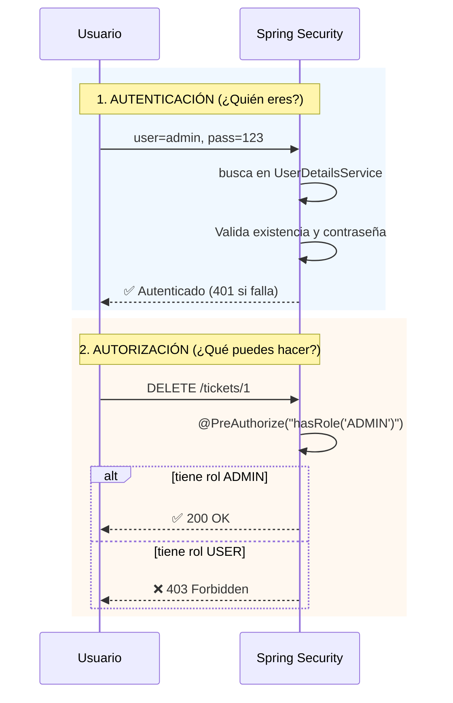

# Lección 16 - Autenticación vs Autorización

## La confusión común

- **Autenticación:** ¿Quién eres? (verificar identidad)
- **Autorización:** ¿Qué puedes hacer? (verificar permisos)

Confundirlas genera vulnerabilidades.

---

## Comparativa

| Aspecto | Autenticación | Autorización |
|--------|---------------|--------------|
| **Pregunta** | ¿Quién eres? | ¿Qué puedes hacer? |
| **Respuesta** | Usuario validado | Rol/permiso asignado |
| **Ejemplo** | Usuario "admin" con contraseña correcta | Usuario "admin" con rol ADMIN puede eliminar |
| **Falla = ?** | 401 Unauthorized | 403 Forbidden |
| **En Spring** | `UserDetailsService` + `PasswordEncoder` | `@PreAuthorize`, `@Secured`, roles |

---

## Flujo en tu aplicación



---

## Anotaciones en Spring Security

### `@PreAuthorize` — Antes de ejecutar el método

```java
@PostMapping
@PreAuthorize("hasRole('ADMIN')")
public ResponseEntity<?> create(@RequestBody Ticket ticket) {
    // Solo ADMIN llega aquí
}
```

### `@Secured` — Alternativa (menos flexible)

```java
@PostMapping
@Secured("ROLE_ADMIN")  // Nota: requiere prefijo "ROLE_"
public ResponseEntity<?> create(@RequestBody Ticket ticket) {
    // ...
}
```

**Diferencia:** `@PreAuthorize` es más potente (SpEL), `@Secured` es más simple.

---

## Roles en Spring Security

Spring Security antepone `ROLE_` internamente. En código:

```java
// En SecurityConfig
.roles("ADMIN")  // Spring lo convierte a: ROLE_ADMIN

// En controller
@PreAuthorize("hasRole('ADMIN')")  // Busca ROLE_ADMIN
// o equivalentemente:
@PreAuthorize("hasRole('ROLE_ADMIN')")
```

**Buena práctica:** Siempre usa nombres descriptivos (ADMIN, USER, MANAGER, VIEWER).

---

## Escenarios reales

### Escenario 1: Crear ticket (requiere ADMIN)

```
GET /tickets/by-id/1         → Permitido (público)
POST /tickets                → ❌ sin auth → 401
POST /tickets (admin)        → ✅ con ADMIN → 201
POST /tickets (user)         → ❌ USER rol insuficiente → 403
```

### Escenario 2: Actualizar ticket (requiere ADMIN)

```
PUT /tickets/by-id/1 (admin) → ✅ 200 OK
PUT /tickets/by-id/1 (user)  → ❌ 403 Forbidden
```

### Escenario 3: Eliminar ticket (requiere ADMIN)

```
DELETE /tickets/by-id/1 (admin) → ✅ 200 OK (ticket eliminado)
DELETE /tickets/by-id/1 (user)  → ❌ 403 Forbidden
```
