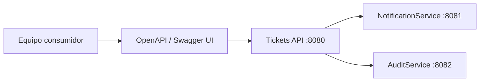

# Lección 19 — Objetivo y Alcance

## ¿De dónde venimos?

Ya construiste una API REST de Tickets, agregaste persistencia, seguridad, logging, manejo global de errores y comunicación con microservicios de apoyo.

El siguiente problema aparece cuando otros servicios o equipos necesitan consumir tu API: **leer el código fuente no debería ser obligatorio para entender cómo integrarse**.

OpenAPI Specification permite convertir tu API en un contrato claro.



---

## Objetivo

Al terminar esta lección podrás:

1. Explicar qué es OpenAPI Specification
2. Diferenciar OpenAPI de Swagger
3. Agregar Swagger UI a un proyecto Spring Boot
4. Documentar endpoints con anotaciones
5. Documentar DTOs, códigos HTTP y errores
6. Usar la documentación como contrato entre microservicios

---

## ¿Qué queda fuera?

Esta lección no cubre:

- Generación automática de clientes en otros lenguajes
- Publicación de documentación en portales externos
- Versionado avanzado de contratos
- Validación automática de contratos en CI/CD

Esos temas pueden abordarse después, cuando el proyecto tenga pipeline de integración.

---

## Requisitos previos

- Proyecto Tickets ejecutando en `http://localhost:8080/ticket-app`
- Conocer controladores REST con `@RestController`
- Conocer DTOs de request y response
- Conocer códigos HTTP básicos
- Tener claro que el paquete `respository/` está escrito así intencionalmente

---

## Resultado esperado

Al finalizar, tu API debe exponer:

```text
GET /ticket-app/v3/api-docs
GET /ticket-app/swagger-ui/index.html
```

Y Swagger UI debe mostrar, como mínimo:

- `GET /tickets`
- `GET /tickets/by-id/{id}`
- `POST /tickets`
- `PUT /tickets/by-id/{id}`
- `DELETE /tickets/by-id/{id}`

