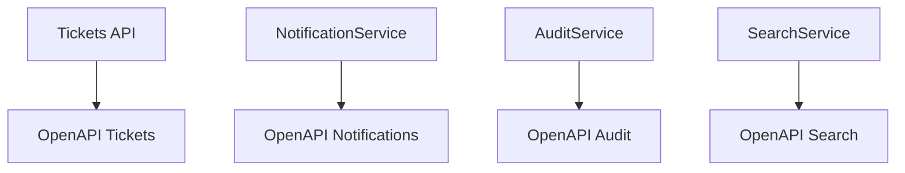

# OAS, Beneficios y Swagger

## ¿Qué es OpenAPI Specification (OAS)?

OpenAPI Specification es un estándar para describir APIs HTTP de forma estructurada.

Una especificación OpenAPI responde preguntas como:

- ¿Cuál es el nombre de la API?
- ¿Qué endpoints existen?
- ¿Qué método HTTP usa cada endpoint?
- ¿Qué parámetros recibe?
- ¿Qué body espera?
- ¿Qué estructura tienen las respuestas?
- ¿Qué errores pueden ocurrir?

Ejemplo mínimo:

```yaml
openapi: 3.0.3
info:
  title: Tickets API
  version: 1.0.0
paths:
  /tickets:
    get:
      summary: Lista todos los tickets
      responses:
        "200":
          description: Lista de tickets obtenida correctamente
```

---

## ¿Por qué importa en microservicios?

En un monolito, todo está en el mismo proyecto. En microservicios, cada servicio puede ser mantenido por un equipo distinto.



Si cada servicio publica su contrato, los demás pueden integrarse sin adivinar.

---

## Beneficios

| Beneficio | Explicación |
|-----------|-------------|
| **Contrato claro** | Define cómo se usa la API |
| **Menos errores de integración** | El consumidor ve parámetros, formatos y respuestas |
| **Pruebas manuales rápidas** | Swagger UI permite ejecutar requests |
| **Documentación viva** | Se genera desde el código |
| **Onboarding más rápido** | Nuevos integrantes entienden la API antes |
| **Base para clientes automáticos** | Se puede generar código cliente desde el contrato |

---

## ¿Qué es Swagger?

Swagger es un conjunto de herramientas alrededor de OpenAPI.

| Elemento | Qué es |
|----------|--------|
| **OpenAPI Specification** | El estándar |
| **Swagger UI** | Interfaz web para leer y probar la API |
| **Swagger Editor** | Editor visual de especificaciones |
| **Swagger Codegen / OpenAPI Generator** | Herramientas para generar código |

En Spring Boot normalmente usaremos **springdoc-openapi**, que genera el documento OpenAPI y publica Swagger UI.

---

## Mala documentación vs buena documentación

### Mala

```java
@PostMapping("/tickets")
public Ticket create(@RequestBody Ticket ticket) {
    return service.create(ticket);
}
```

El endpoint funciona, pero no explica:

- Qué campos son obligatorios
- Qué pasa si el body es inválido
- Qué código HTTP devuelve
- Qué estructura tiene el error

### Mejor

```java
@Operation(summary = "Crear ticket", description = "Registra un nuevo ticket de soporte")
@ApiResponses({
    @ApiResponse(responseCode = "201", description = "Ticket creado"),
    @ApiResponse(responseCode = "400", description = "Datos inválidos"),
    @ApiResponse(responseCode = "401", description = "No autenticado")
})
@PostMapping
public ResponseEntity<TicketResponse> create(@Valid @RequestBody TicketCreateRequest request) {
    TicketResponse saved = service.create(request);
    return ResponseEntity.status(HttpStatus.CREATED).body(saved);
}
```

---

## Reglas prácticas

- Documenta lo que el consumidor necesita, no la implementación interna
- Usa DTOs para que Swagger no exponga entidades JPA completas
- Incluye códigos de error esperados
- Mantén ejemplos realistas
- No documentes rutas sin el context path: recuerda que la base es `/ticket-app`

