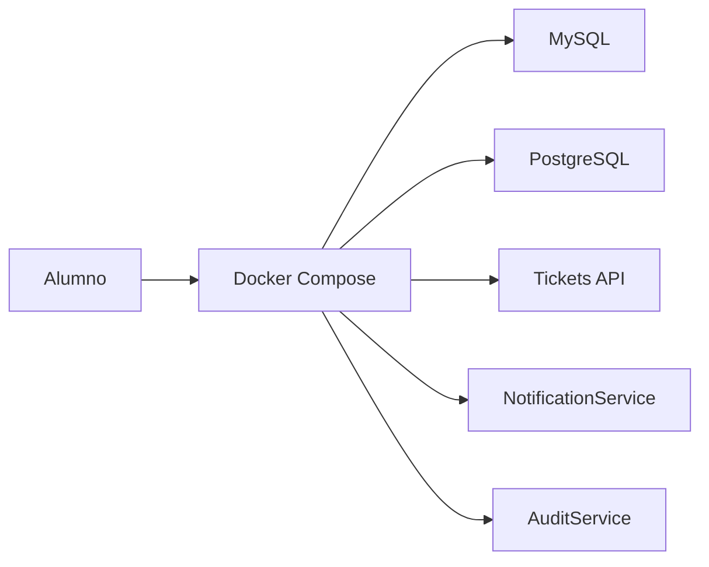

# Lección 20 — Objetivo y Alcance

## ¿De dónde venimos?

Ya tienes proyectos Spring Boot con perfiles, bases de datos, migraciones, seguridad, documentación OpenAPI y microservicios de apoyo.

Ahora el desafío es ejecutar todo de forma consistente.



---

## Objetivo

Al terminar esta lección podrás:

1. Explicar qué es Docker
2. Explicar qué es Docker Compose
3. Diferenciar Docker Engine y Docker Desktop
4. Instalar Docker en Windows, Linux y macOS
5. Levantar bases de datos con Compose
6. Crear un Dockerfile para Spring Boot
7. Configurar variables de entorno para perfiles Spring Boot
8. Ejecutar microservicios conectados en una red Docker

---

## Alcance

Implementaremos:

- Compose para MySQL
- Compose para PostgreSQL
- Dockerfile para Spring Boot
- Variables de entorno para `SPRING_PROFILES_ACTIVE`
- Red Docker para servicios

No implementaremos:

- Kubernetes
- CI/CD con Docker Hub
- Imágenes multiarquitectura avanzadas
- Observabilidad con Prometheus/Grafana

---

## Resultado esperado

Al ejecutar:

```bash
docker compose up -d
docker compose ps
```

Debes ver servicios corriendo, por ejemplo:

```text
mysql        running    0.0.0.0:3306->3306/tcp
postgres     running    0.0.0.0:5432->5432/tcp
```

Y tu proyecto Spring Boot debe poder conectarse usando variables de entorno.

