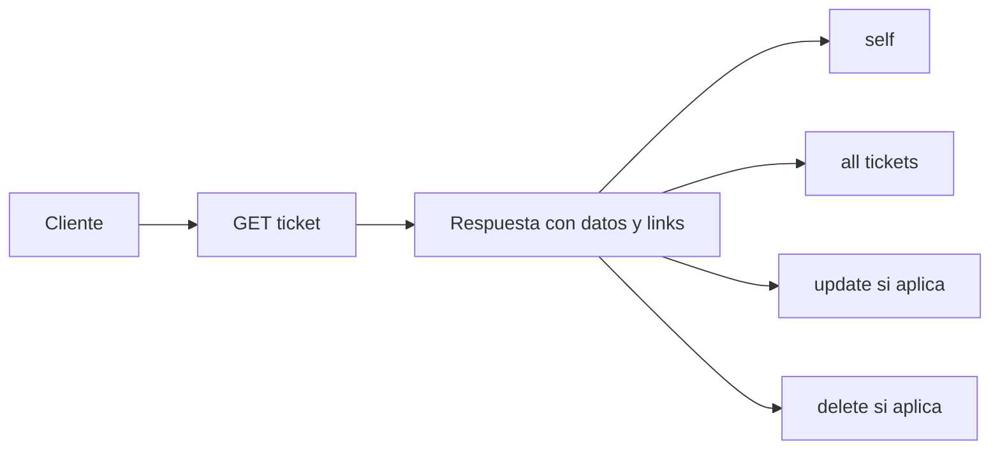

# Lección 20 — Objetivo y Alcance

## ¿De dónde venimos?

En la lección 19 documentaste la API con OpenAPI y Swagger UI. Ahora vamos un paso más allá: la API no solo debe describirse desde fuera, también puede **orientar al consumidor desde sus propias respuestas**.

Eso es HATEOAS.

---

## Objetivo

Al terminar esta lección podrás:

1. Explicar qué es HATEOAS
2. Entender cómo funcionan los enlaces en respuestas REST
3. Agregar Spring HATEOAS al proyecto
4. Construir respuestas con `_links`
5. Documentar esas respuestas en OpenAPI
6. Decidir cuándo HATEOAS aporta valor y cuándo es innecesario

---

## ¿Qué es HATEOAS?

HATEOAS significa **Hypermedia as the Engine of Application State**.

En simple: el servidor incluye links en la respuesta para que el cliente descubra acciones relacionadas.



---

## Alcance

Implementaremos HATEOAS en:

- `GET /tickets`
- `GET /tickets/by-id/{id}`
- Opcionalmente `POST /tickets`

No implementaremos:

- HAL avanzado con paginación
- Cliente frontend que navegue por links
- Versionado avanzado de representaciones

---

## Resultado esperado

Las respuestas de tickets deben incluir `_links`:

```json
{
  "id": 1,
  "title": "Problema con correo",
  "status": "OPEN",
  "_links": {
    "self": { "href": "http://localhost:8080/ticket-app/tickets/by-id/1" },
    "all": { "href": "http://localhost:8080/ticket-app/tickets" },
    "update": { "href": "http://localhost:8080/ticket-app/tickets/by-id/1" }
  }
}
```

