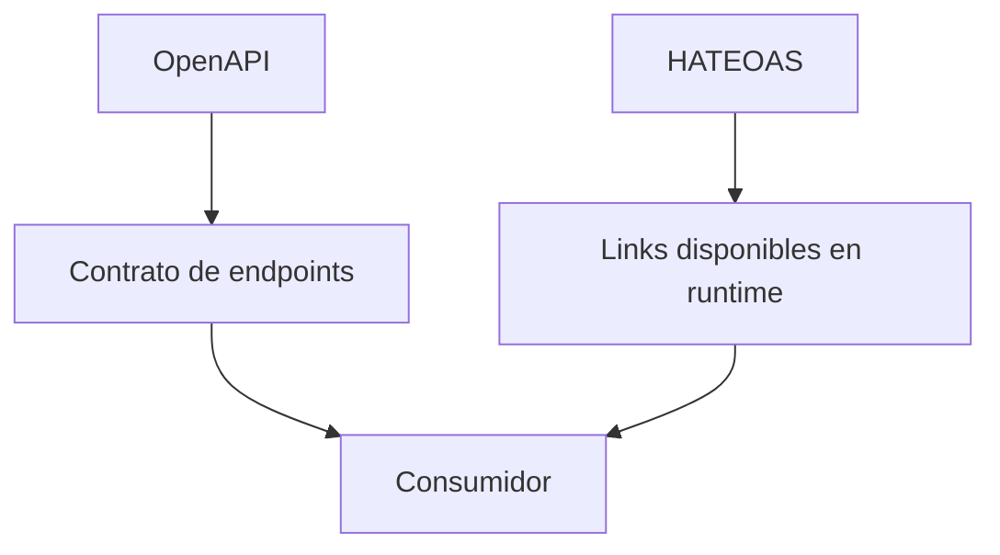

# HATEOAS, Funcionamiento y Beneficios

## ¿Cómo funciona?

Una respuesta HATEOAS combina:

1. Datos del recurso
2. Links relacionados
3. Acciones posibles

Ejemplo:

```json
{
  "id": 3,
  "title": "Error al pagar",
  "status": "OPEN",
  "_links": {
    "self": { "href": "/ticket-app/tickets/by-id/3" },
    "all": { "href": "/ticket-app/tickets" },
    "close": { "href": "/ticket-app/tickets/by-id/3/close" }
  }
}
```

El cliente no necesita conocer todas las rutas de antemano. Puede usar los links publicados por el servidor.

---

## Beneficios

| Beneficio | Explicación |
|-----------|-------------|
| **Descubrimiento** | El cliente ve acciones disponibles |
| **Menos acoplamiento** | El cliente depende menos de URLs hardcodeadas |
| **Mejor documentación viva** | La respuesta muestra relaciones reales |
| **Flujos más claros** | El servidor guía el siguiente paso |
| **Compatibilidad con cambios** | Se pueden agregar links sin romper clientes existentes |

---

## Cuándo usar HATEOAS

Usa HATEOAS cuando:

- La API tiene flujos de negocio con varios pasos
- Hay acciones permitidas según estado
- Consumidores externos necesitan descubrir rutas
- Quieres respuestas autoexplicativas

Puede ser excesivo cuando:

- La API es interna y muy simple
- Solo existe CRUD básico
- El equipo consumidor y proveedor son el mismo
- El payload debe ser mínimo por rendimiento

---

## Links comunes

| Rel | Uso |
|-----|-----|
| `self` | URL del recurso actual |
| `all` | Colección completa |
| `create` | Crear nuevo recurso |
| `update` | Editar recurso actual |
| `delete` | Eliminar recurso actual |
| `assigned-user` | Usuario asignado |
| `history` | Historial o auditoría |

---

## HATEOAS y documentación

OpenAPI documenta el contrato desde fuera.

HATEOAS muestra acciones desde la respuesta.



Ambos se complementan.

